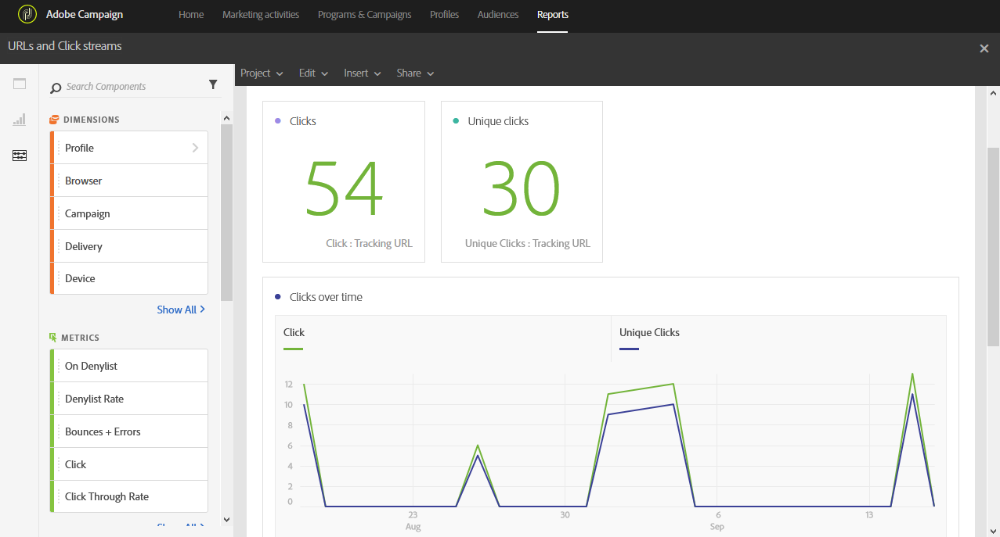

# URL y flujos de clics{#urls-and-click-streams}

La variable **URL y flujos de clics** muestra las direcciones URL en las que se hizo más clic durante una entrega o varios envíos si están vinculados a una campaña o programa.

Cada tabla está representada por números de resumen y gráficos. Puede cambiar cómo se muestran los detalles en sus respectivos ajustes de visualización.

La variable **Vínculos más visitados** contiene los datos disponibles para el comportamiento del destinatario por entrega, como:

* **Haga clic en**: Número de veces que se hizo clic en el contenido en una entrega.
* **Clics únicos**: El número de destinatarios que hicieron clic en el contenido de una entrega.
