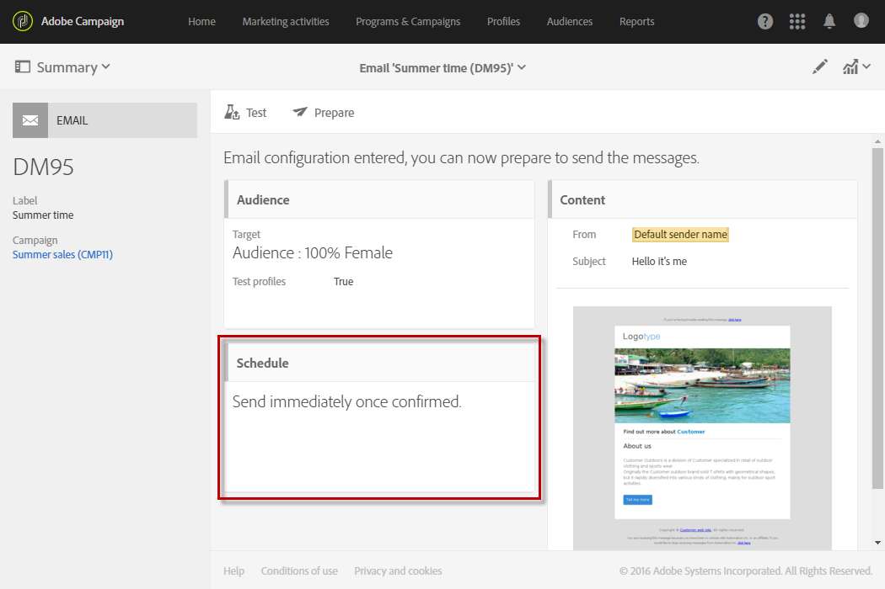

# Acerca de la programación de mensajes{#about-scheduling-messages}

>[!IMPORTANT]
>
>Siempre que realice cambios en la programación de un envío, debe volver a preparar el envío haciendo clic en el botón **Preparar** antes de hacer clic en **Confirmar**.

En el panel de mensajes, el bloque **[!UICONTROL Schedule]** permite definir cuándo se enviarán los mensajes (correo electrónico, SMS o notificaciones push).

Las propiedades de **[!UICONTROL Schedule]** le permiten establecer opciones de envío de correos electrónicos, SMS o notificaciones push:

* **[!UICONTROL Messages to be sent once confirmed]**: los mensajes se envían en cuanto se confirma el envío. Consulte [Confirmando el envío ](../../sending/using/confirming-the-send.md) .

   

* **[!UICONTROL Messages to be sent automatically on the date specified below]**: los mensajes se enviarán en una fecha y a una hora posteriores. Especifique la **fecha de contacto** en el campo **Comenzar a enviar desde**.

   Puede preparar y confirmar el envío, pero los mensajes solo se enviarán a partir de la fecha y hora seleccionadas. La preparación y confirmación del envío se presentan en las secciones [Preparación del envío](../../sending/using/preparing-the-send.md) y [Confirmación del envío](../../sending/using/confirming-the-send.md).

   La lista desplegable **[!UICONTROL Time zone of the contact date]** le permite modificar el huso horario que se tendrá en cuenta para la hora de envío. Por ejemplo, si introduce 9:00 a. m. en el campo **[!UICONTROL Start sending from]** y selecciona Bruselas, Copenhague, Madrid, París (GMT+1) en la lista desplegable **[!UICONTROL Time zone of the contact date]**, todos los destinatarios recibirán el mensaje a las 9:00 a. m. (hora de París). Por lo tanto, un destinatario ubicado en Moscú (GMT+3) recibirá el mensaje a las 11:00 a. m. hora de Moscú.

   Si desea confirmar manualmente el envío, marque la opción **[!UICONTROL Request confirmation before sending messages]**. Esta opción está habilitada de manera predeterminada.

   

>[!IMPORTANT]
>
>Al duplicar un envío, se elimina toda la configuración de programación. A menos que programe una nueva fecha de contacto, el envío duplicado se enviará en cuanto se confirme el envío.

**Temas relacionados**:

* [Optimización del tiempo de envío](../../sending/using/optimizing-the-sending-time.md)
* [Envío de mensajes en el huso horario del destinatario](../../sending/using/sending-messages-at-the-recipient-s-time-zone.md)
* [Cálculo de la fecha de envío](../../sending/using/computing-the-sending-date.md)
