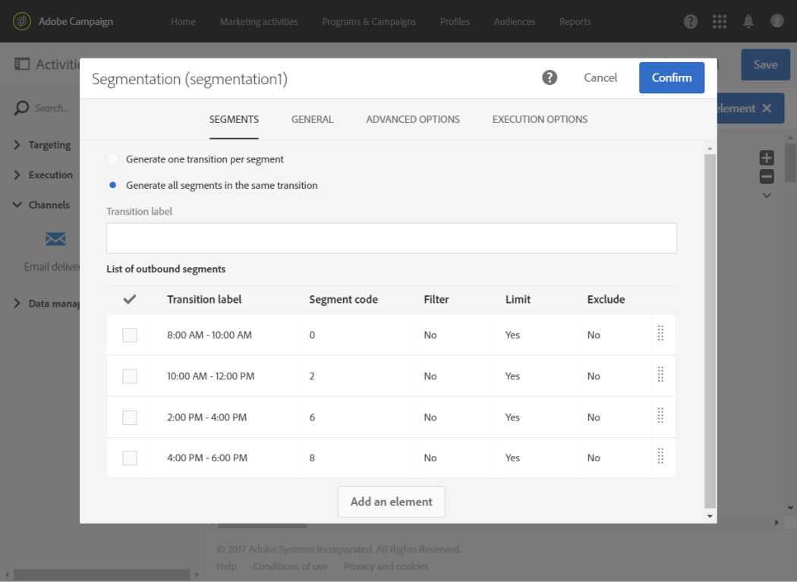

# Cálculo de la fecha de envío{#computing-the-sending-date}

Puede definir una fórmula para enviar el mensaje a cada destinatario en una fecha y hora específicas.

## Personalizar la fórmula de fecha {#customizing-date-formula}

Por ejemplo, puede utilizar la optimización del tiempo de envío durante el proceso de aceleración.

Cuando se envían correos electrónicos utilizando una plataforma nueva, los proveedores de servicios de Internet (ISP) sospechan de las direcciones IP desconocidas. Si se envían, de repente, grandes volúmenes de correos electrónicos, los ISP suelen marcarlos como correo no deseado.

Para evitar que se lo considere correo no deseado, puede aumentar progresivamente el volumen enviado distribuyendo grandes volúmenes de correos electrónicos en diferentes momentos. Esto debería garantizar un desarrollo uniforme de la fase de inicio y permitir reducir la velocidad total de direcciones no válidas.

Por ejemplo, puede segmentar la audiencia de destino aleatoriamente para realizar la entrega en cinco lotes. Enviará un primer lote que representa el 10 % de la audiencia de destinatario el 1 de junio a las 10:00 a. m., un segundo lote 24 horas después con el 15 % de la audiencia, y así sucesivamente.

Puede programarlo mediante un flujo de trabajo.


1. Acceda a la lista de actividad de marketing y cree un nuevo flujo de trabajo. Consulte [Creación de un flujo de trabajo](../../automating/using/building-a-workflow.md#creating-a-workflow).
1. Arrastre y suelte una actividad **Query** en el flujo de trabajo y ábrala. Consulte la sección [Consulta](../../automating/using/query.md).
1. Seleccione una audiencia, por ejemplo, todos sus clientes de Gold y haga clic en **[!UICONTROL Confirm]** para guardar la consulta.
1. Arrastre y suelte una actividad **Segmentation** en el flujo de trabajo y ábrala. Consulte la sección [Segmentación](../../automating/using/segmentation.md).
1. Defina cinco segmentos. Para cada segmento:

   * Rellene el campo **[!UICONTROL Segment code]**: escriba manualmente la fecha y la hora deseadas para enviar el mensaje.

     Por ejemplo, desea enviar el primer lote el 1 de junio a las 10:00 AM GMT+1. Usar el siguiente formato: **`YYYY-MM-DD hh:mm:ss+tz`**.

     

     Para enviar el siguiente lote al día siguiente, ingrese **2017-06-02 10:00:00+01** para el segundo segmento.

     Para los segmentos restantes, defina los lotes siguientes de la siguiente manera:

      * **2017-06-03 10:00:00+01**
      * **2017-06-04 10:00:00+01**
      * **2017-06-05 10:00:00+01**

   * Asegúrese de seleccionar la opción **[!UICONTROL Limit the population of this segment]**.

     En la ficha **[!UICONTROL Limitation]**, seleccione **[!UICONTROL Random sampling]** e introduzca el porcentaje deseado para cada segmento: 10 para el primer lote, 15 para el segundo, etc.

     

1. Una vez definidos todos los segmentos, seleccione **[!UICONTROL Generate all segments in the same transition]** y haga clic en **[!UICONTROL Confirm]**.

   

1. Arrastre y suelte una actividad **Email delivery** en el flujo de trabajo y ábrala. Consulte la sección [Envío de correo electrónico](../../automating/using/email-delivery.md).
1. Haga clic en la sección **[!UICONTROL Schedule]** del panel de correo electrónico y seleccione **[!UICONTROL Messages to be sent automatically on the date specified below]**.
1. En el campo **[!UICONTROL Start sending from]**, defina una fecha de contacto.
1. En el menú desplegable de optimización del tiempo de envío, elija **[!UICONTROL Send at a custom date defined by a formula]**.
1. Haga clic en el botón **[!UICONTROL Edit an expression]** del campo **[!UICONTROL Custom date formula]**.

   

1. Cree la siguiente expresión con la función **[!UICONTROL ToDateTime]** y el campo **[!UICONTROL Segment code]**. También puede escribir directamente la expresión, pero asegúrese de utilizar la sintaxis y la ortografía correctas.

   ```
   ToDateTime([targetData/@segmentCode])
   ```

   La función **[!UICONTROL ToDateTime]** transforma el código de segmento de una cadena de texto a un valor de fecha y hora.

   Confirme la expresión para volver a la pantalla anterior.

   

   En la ventana **[!UICONTROL Schedule]**, la fórmula de fecha personalizada se muestra de la siguiente manera:

   ```
   ToDateTime([targetData/@segmentCode])
   ```

   

1. Confirme la programación, guarde la entrega y ejecute el flujo de trabajo.

La entrega se envía progresivamente a todos los destinatarios objetivo durante cinco días.

>[!NOTE]
>
>Asegúrese de que todas las fechas estén en el futuro al confirmar el envío. De lo contrario, el mensaje se envía en cuanto se confirme el envío.

## Uso de una expresión {#using-an-expression}

La optimización del tiempo de envío también es útil para campañas que implican un centro de llamadas. Puede asegurarse de que todos los mensajes no se reciban al mismo tiempo. Esto permite a su organización procesar el número de llamadas según su capacidad.

Por ejemplo, desea enviar un correo electrónico invitando a sus clientes a ponerse en contacto con un centro de llamadas para obtener una oferta promocional. Para evitar saturar el centro de llamadas, decide segmentar la audiencia de destino aleatoriamente para enviar el correo electrónico en cuatro lotes.

Puede programarlo mediante un flujo de trabajo.


1. Acceda a la lista de actividad de marketing y cree un nuevo flujo de trabajo. Consulte [Creación de un flujo de trabajo](../../automating/using/building-a-workflow.md#creating-a-workflow).
1. Arrastre y suelte una actividad **Query** en el flujo de trabajo y ábrala. Consulte la sección [Consulta](../../automating/using/query.md).
1. Seleccione una audiencia, por ejemplo más de 35 perfiles, y haga clic en **[!UICONTROL Confirm]** para guardar la consulta.
1. Arrastre y suelte una actividad **Segmentation** en el flujo de trabajo y ábrala. Consulte la sección [Segmentación](../../automating/using/segmentation.md).
1. Defina cuatro segmentos. Para cada segmento:

   * Defina los códigos de segmento de la siguiente manera:

      * 8:00 AM - 10:00 AM: **0**. El mensaje se enviará al primer trimestre de la población objetivo a las 8:00 a. m. (fecha de contacto).
      * 10:00 AM - 12:00 PM: **2**. El mensaje se envía al segundo trimestre de la población objetivo a las 10:00 a. m. (fecha de contacto + 2 horas).
      * 2:00 PM - 4:00 PM: **6**. Cerrando el centro de llamadas entre las 12:00 y las 2:00 p.m., el mensaje se enviará al tercer trimestre de la población objetivo a las 2:00 p.m. (fecha de contacto + 6 horas).
      * 4:00 PM - 6:00 PM: **8**. El mensaje se enviará al último trimestre de la población objetivo a las 4:00 p. m. (fecha de contacto + 8 horas).

     >[!NOTE]
     >
     >La fecha de contacto se define en la actividad Entregar correo electrónico más adelante en el flujo de trabajo.

   * Asegúrese de seleccionar la opción **[!UICONTROL Limit the population of this segment]**.
   * En la ficha **[!UICONTROL Limitation]**, seleccione **[!UICONTROL Random sampling]** e introduzca el porcentaje deseado para cada segmento: **25**.

1. Una vez definidos todos los segmentos, seleccione **[!UICONTROL Generate all segments in the same transition]** y haga clic en **[!UICONTROL Confirm]**.

   

1. Arrastre y suelte una actividad **Email delivery** en el flujo de trabajo y ábrala. Consulte la sección [Envío de correo electrónico](../../automating/using/email-delivery.md).
1. Haga clic en la sección **[!UICONTROL Schedule]** del panel de correo electrónico.
1. Seleccione **[!UICONTROL Messages to be sent automatically on the date specified below]**.
1. En el campo **[!UICONTROL Start sending from]**, defina una fecha de contacto.

   En este ejemplo, seleccione 25 de mayo a las 8:00 a.m.

1. En el menú desplegable de optimización del tiempo de envío, elija **[!UICONTROL Send at a custom date defined by a formula]** y haga clic en el botón **[!UICONTROL Edit an expression]**.

   

1. En **[!UICONTROL Expression editor]**, establezca la fecha y los códigos de segmento para calcular los datos de cada cliente.

   En la lista de funciones, seleccione **[!UICONTROL AddHours]**.

   

   En los campos disponibles, seleccione **[!UICONTROL Current delivery]** > **[!UICONTROL Delivery scheduling]** > **[!UICONTROL Contact date]**.

   

   Esto le permite recuperar la fecha y la hora especificadas en el campo **[!UICONTROL Start sending from]**.

   En la lista de funciones, seleccione **[!UICONTROL ToInteger]**. En los campos disponibles, seleccione **[!UICONTROL Additional data]** > **[!UICONTROL Segment code]**.

   

   Esto permite recuperar los números especificados en los códigos de segmento.

   Debe obtener la fórmula siguiente:

   ```
   AddHours([currentDelivery/scheduling/@contactDate], ToInteger([targetData/@segmentCode]))
   ```

1. Confirme para guardar la expresión. Confirme la programación, guarde la entrega y ejecute el flujo de trabajo.

* El primer segmento recibirá el mensaje en la fecha de contacto (25 de mayo a las 8:00 a. m.).
* El segundo segmento recibirá el mensaje dos horas más tarde (25 de mayo a las 10:00 a. m.).
* El tercer segmento recibirá el mensaje seis horas más tarde (25 de mayo a las 2:00 p. m.).
* El cuarto segmento recibirá el mensaje ocho horas más tarde (25 de mayo a las 4:00 p.m.).
