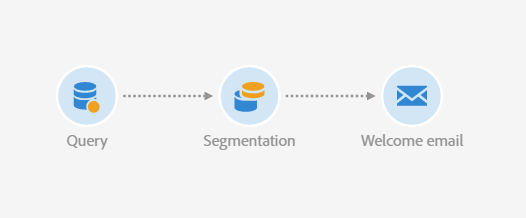
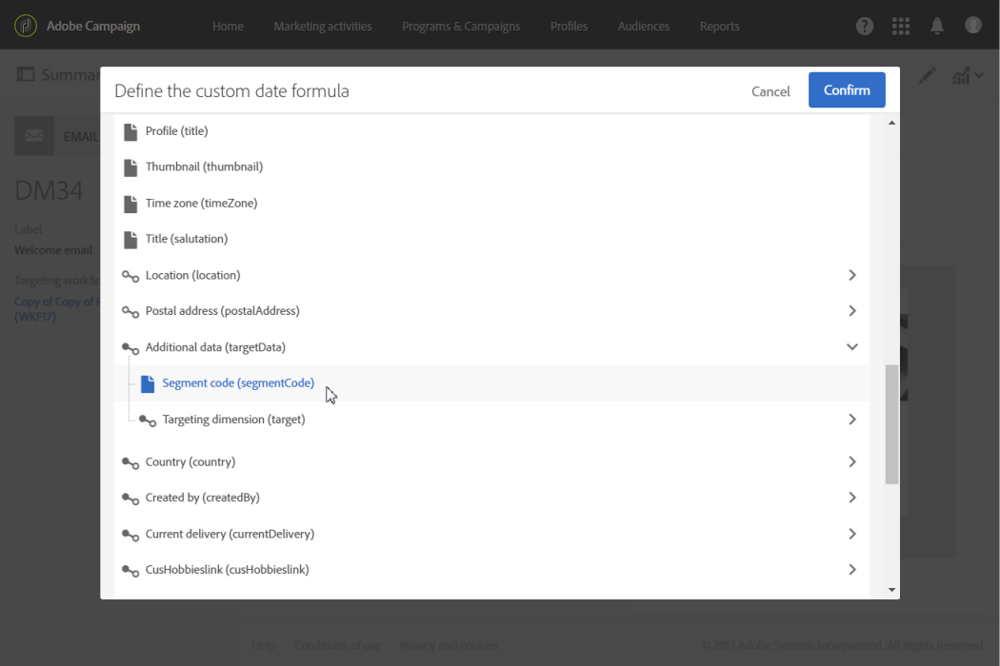

# Computing the sending date{#computing-the-sending-date}

Puede definir una fórmula para enviar el mensaje a cada destinatario en una fecha y hora específicas.

## Customizing date formula {#customizing-date-formula}

Por ejemplo, puede utilizar la optimización de tiempo de envío durante el proceso de subida.

Cuando se envían correos electrónicos mediante una nueva plataforma, los proveedores de servicios de Internet (ISP) sospechan de las direcciones IP que no se reconocen. Si repentinamente se envían grandes volúmenes de correos electrónicos, los ISP los marcan como correo no deseado.

Para evitar que se marque como correo no deseado, puede aumentar de forma progresiva el volumen enviado distribuyendo grandes volúmenes de mensajes de correo electrónico en distintos momentos. Esto debe asegurar un desarrollo suave de la fase de inicio y permitirle reducir la tasa total de direcciones no válidas.

Por ejemplo, puede segmentar la audiencia de destino de forma aleatoria para enviar su entrega en cinco lotes. Enviará un primer lote representando el 10% de la audiencia objetivo el 1 de junio a las 10:00 AM, un segundo lote 24 horas más tarde con el 15% de la audiencia, etc.

Puede programarlo con un flujo de trabajo.



1. Acceda a la lista de actividades de marketing y cree un nuevo flujo de trabajo. See [Creating a workflow](../../automating/using/building-a-workflow.md#creating-a-workflow).
1. Drag and drop a **Query** activity into your workflow and open it. See the [Query](../../automating/using/query.md) section.
1. Select an audience, for example all your Gold customers and click **[!UICONTROL Confirm]** to save the query.
1. Drag and drop a **Segmentation** activity into your workflow and open it. See the [Segmentation](../../automating/using/segmentation.md) section.
1. Defina cinco segmentos. Para cada segmento:

   * Fill in the **[!UICONTROL Segment code]** field: manually enter the desired date and time for sending the message.

      Por ejemplo, desea enviar el primer lote el 1 de junio a las 10:00 GMT +1. Use the following format: **YYYY-MM-DD hh:mm:ss+tz**.

      

      To send the next batch the day after, enter **2017-06-02 10:00:00+01** for the second segment.

      Para los segmentos restantes, defina los siguientes lotes de la siguiente manera:

      * **2017-06-03 10:00:00+01**
      * **2017-06-04 10:00:00+01**
      * **2017-06-05 10:00:00+01**
   * Make sure you select the **[!UICONTROL Limit the population of this segment]** option.

      In the **[!UICONTROL Limitation]** tab, select **[!UICONTROL Random sampling]** and enter the desired percentage for each segment: 10 for the first batch, 15 for the second, and so on.

      


1. Once all segments are defined, select **[!UICONTROL Generate all segments in the same transition]** and click **[!UICONTROL Confirm]**.

   

1. Drag and drop an **Email delivery** activity into your workflow and open it. See the [Email delivery](../../automating/using/email-delivery.md) section.
1. Click the **[!UICONTROL Schedule]** section in the email dashboard and select **[!UICONTROL Messages to be sent automatically on the date specified below]**.
1. In the **[!UICONTROL Start sending from]** field, define a contact date.
1. From the send time optimization drop-down menu, choose **[!UICONTROL Send at a custom date defined by a formula]**.
1. Click the **[!UICONTROL Edit an expression]** button of the **[!UICONTROL Custom date formula]** field.

   

1. Create the following expression using the **[!UICONTROL ToDateTime]** function and the **[!UICONTROL Segment code]** field. También puede escribir directamente la expresión, pero asegúrese de utilizar la ortografía y la ortografía correctas.

   ```
   ToDateTime([targetData/@segmentCode])
   ```

   The **[!UICONTROL ToDateTime]** function transforms the segment code from a text string to a date and time value.

   Confirme la expresión para volver a la pantalla anterior.

   

   In the **[!UICONTROL Schedule]** window, the custom date formula is displayed as follows:

   ```
   ToDateTime([targetData/@segmentCode])
   ```

   

1. Confirme la programación, guarde la entrega y ejecute el flujo de trabajo.

La entrega se enviará de forma progresiva a todos los destinatarios dirigidos a más de cinco días.

>[!NOTE]
>
>Asegúrese de que todas las fechas estén en el futuro al confirmar el envío. De lo contrario, el mensaje se enviará en cuanto se confirma el envío.

## Using an expression {#using-an-expression}

La optimización del tiempo de envío también es útil para campañas relacionadas con un centro de llamadas. Puede asegurarse de que no se reciben todos los mensajes al mismo tiempo. Esto permite a su organización procesar el número de llamadas según su capacidad.

Por ejemplo, desea enviar un mensaje de correo electrónico invite a sus clientes a ponerse en contacto con un centro de llamadas para obtener una oferta promocional. Para evitar la sobrecarga del centro de llamadas, decida segmentar la audiencia de destino de forma aleatoria para enviar su correo electrónico en cuatro lotes.

Puede programarlo con un flujo de trabajo.


1. Acceda a la lista de actividades de marketing y cree un nuevo flujo de trabajo. See [Creating a workflow](../../automating/using/building-a-workflow.md#creating-a-workflow).
1. Drag and drop a **Query** activity into your workflow and open it. See the [Query](../../automating/using/query.md) section.
1. Select an audience, for example over 35 profiles and click **[!UICONTROL Confirm]** to save the query.
1. Drag and drop a **Segmentation** activity into your workflow and open it. See the [Segmentation](../../automating/using/segmentation.md) section.
1. Defina cuatro segmentos. Para cada segmento:

   * Defina los códigos de segmento de la siguiente manera:

      * 8:00 AM - 10:00 AM: **0**. El mensaje se enviará al primer trimestre de la población objetivo a las 8:00 AM (fecha de contacto).
      * 10:00 AM - 12:00 PM: **2**. El mensaje se enviará al segundo trimestre de la población objetivo a las 10:00 AM (fecha de contacto + 2 horas).
      * 2:00 PM - 4:00 PM: **6**. El centro de llamadas se cierra entre las 12:00 y las 2:00 PM, el mensaje se enviará al tercer trimestre de la población objetivo a las 2:00 PM (fecha de contacto + 6 horas).
      * 4:00 PM - 6:00 PM: **8**. El mensaje se enviará al último trimestre de la población objetivo a las 4:00 PM (fecha de contacto + 8 horas).
      >[!NOTE]
      >
      >La fecha de contacto se definirá en la actividad de envío de correo electrónico más adelante en el flujo de trabajo.

   * Make sure you select the **[!UICONTROL Limit the population of this segment]** option.
   * In the **[!UICONTROL Limitation]** tab, select **[!UICONTROL Random sampling]** and enter the desired percentage for each segment: **25**.


1. Once all segments are defined, select **[!UICONTROL Generate all segments in the same transition]** and click **[!UICONTROL Confirm]**.

   

1. Drag and drop an **Email delivery** activity into your workflow and open it. See the [Email delivery](../../automating/using/email-delivery.md) section.
1. Click the **[!UICONTROL Schedule]** section in the email dashboard.
1. Select **[!UICONTROL Messages to be sent automatically on the date specified below]**.
1. In the **[!UICONTROL Start sending from]** field, define a contact date.

   En este ejemplo, seleccione el 25 de mayo a las 8:00 AM.

1. From the send time optimization drop-down menu, choose **[!UICONTROL Send at a custom date defined by a formula]** and click the **[!UICONTROL Edit an expression]** button.

   

1. In the **[!UICONTROL Expression editor]**, set the date and the segment codes to compute the data for each customer.

   In the list of functions, select **[!UICONTROL AddHours]**.

   

   In the available fields, select **[!UICONTROL Current delivery]** &gt; **[!UICONTROL Delivery scheduling]** &gt; **[!UICONTROL Contact date]**.

   

   This enables you to retrieve the date and time specified in the **[!UICONTROL Start sending from]** field.

   In the list of functions, select **[!UICONTROL ToInteger]**. In the available fields, select **[!UICONTROL Additional data]** &gt; **[!UICONTROL Segment code]**.

   

   Esto permite recuperar los números especificados en los códigos de segmentos.

   Debe obtener la fórmula siguiente:

   ```
   AddHours([currentDelivery/scheduling/@contactDate], ToInteger([targetData/@segmentCode]))
   ```

1. Confirme que desea guardar la expresión. Confirme la programación, guarde la entrega y ejecute el flujo de trabajo.

* El primer segmento recibirá el mensaje en la fecha de contacto (25 de mayo a las 8:00 AM).
* El segundo segmento recibirá el mensaje dos horas más tarde (25 de mayo a las 10:00 AM).
* El tercer segmento recibirá el mensaje seis horas más tarde (25 de mayo a las 2:00 PM).
* El cuarto segmento recibirá el mensaje ocho horas más tarde (25 de mayo a las 4:00 PM).

