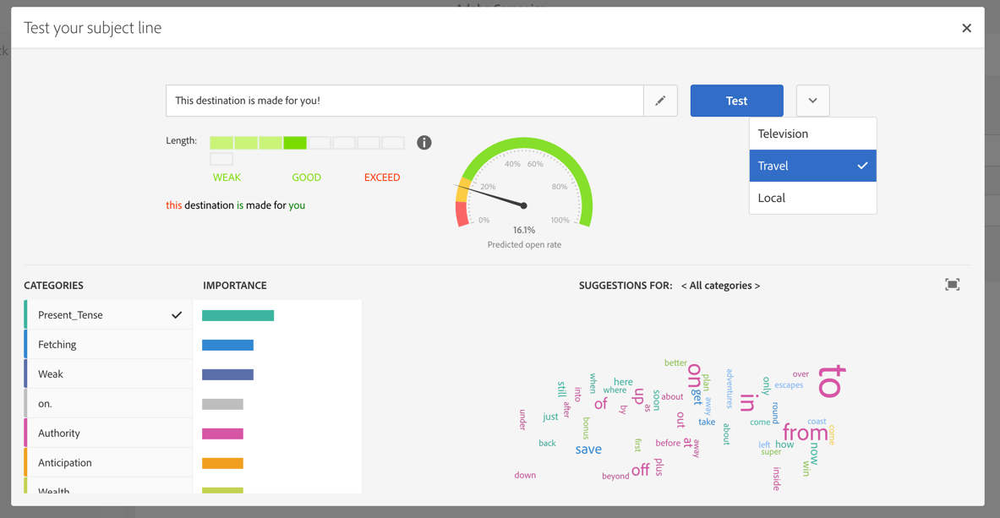

# Control del contenido del correo electrónico{#control-email-content}

Para mejorar la tasa de entrega de correo electrónico y asegurarse de que los mensajes lleguen a los destinatarios, el correo electrónico debe respetar un cierto número de reglas.

* **Nombre y dirección** del remitente: La dirección debe identificar explícitamente al remitente. El dominio debe ser propiedad del remitente y estar registrado en él. No se debe privatizar el registro de dominios.
* **Asunto**: Evite el uso excesivo de mayúsculas y minúsculas y la puntuación, así como las palabras que utilizan con frecuencia los remitentes de spam ("Win", "Free", etc.).
* **Personalice su correo electrónico**: La personalización del correo electrónico aumenta las posibilidades de que se abra el mensaje.
* **Imágenes y texto**: Respete una proporción de texto/imagen adecuada (por ejemplo, texto del 60 % e imágenes del 40 %).
* **Vínculo de cancelación de suscripción y página** de aterrizaje: El vínculo de cancelación de suscripción es esencial. Debe ser visible y válido, y el formulario debe ser funcional.
* **Utilice las herramientas** ofrecidas por Adobe Campaign para optimizar el contenido del correo electrónico (análisis de entrega, análisis antispam).

Para obtener información adicional sobre la edición de contenido de correo electrónico, consulte la descripción general [de](../../designing/using/designing-content-in-adobe-campaign.md) Email Designer y las prácticas recomendadas [de diseño de](../../designing/using/designing-content-in-adobe-campaign.md#content-design-best-practices)mensajes.

## Nombre y dirección del remitente {#sender-name}

Algunos ISP verifican la validez de la dirección del remitente (Desde) antes de aceptar mensajes. Una dirección mal formada puede resultar en que el servidor receptor la rechace. Debe asegurarse de que se proporciona una dirección correcta en el nivel de instancia o en los escenarios utilizados con más frecuencia. Póngase en contacto con el administrador.

Para obtener más información sobre esto, consulte [Personalización del nombre](../../designing/using/personalization.md#personalizing-the-sender)del remitente.

## Subject line {#subject-line}

Al editar un mensaje de correo electrónico, puede probar distintas líneas de asunto y obtener una estimación de su tasa de apertura antes de enviarlo. Para obtener más información sobre esto, consulte [Prueba de la línea de asunto de un correo electrónico](../../sending/using/testing-subject-line-email.md).

Para obtener más información sobre la definición de la línea de asunto de un correo electrónico, consulte [esta sección](../../designing/using/subject-line.md).

## Enviar optimización de tiempo {#send-time-optimization}

Para mejorar la tasa de éxito de los mensajes, puede definir manualmente una hora de envío por destinatario. Cada perfil recibirá el mensaje en la fecha y hora especificadas, siempre que sea posible.

Para obtener más información sobre esto, consulte [Optimización del tiempo](../../sending/using/optimizing-the-sending-time.md)de envío.

## Formulario y vínculo de exclusión {#opt-out}

De forma predeterminada, cuando se analiza el mensaje, una regla de tipología comprueba si se ha incluido un vínculo de exclusión y genera una advertencia si falta.

Debe comprobar que el vínculo de desactivación funciona correctamente antes de cada envío. Por ejemplo, al enviar la prueba, asegúrese de que el vínculo sea válido, de que el formulario esté en línea y de que al validarlo se cambie el valor de las casillas de contacto Ya no están marcadas. Debe realizar esta comprobación sistemáticamente porque siempre es posible el error humano al introducir el vínculo o al cambiar el formulario.

Si se detecta un problema relacionado con la cancelación de la suscripción después de que se inicie la entrega, aún es posible realizar una cancelación de la suscripción manualmente (mediante la función de actualización masiva, por ejemplo) para los destinatarios que hacen clic en el vínculo de exclusión incluso si no pudieron confirmar su elección.

Como regla general, no intente interferir con los destinatarios que deseen optar por la exclusión obligándolos a rellenar campos como, por ejemplo, su dirección de correo electrónico o su nombre. La página de aterrizaje de cancelación de suscripción solo debe tener un botón de validación. La solicitud de confirmación adicional no es fiable: un usuario puede tener dos direcciones de correo electrónico redirigidas al mismo cuadro (por ejemplo: firstname.lastname@club.com y firstname.lastname@internet-club.com). Si el perfil solo puede recordar la primera dirección y desea cancelar la suscripción a través de un mensaje enviado al otro, el formulario lo rechazará porque el identificador cifrado y la dirección de correo electrónico introducidos no coincidirán.

## Análisis antispam {#anti-spam-analysis}

El editor de mensajes de Adobe Campaign integra un análisis **** antispam que le permite puntuar correos electrónicos para determinar si un mensaje corre el riesgo de ser considerado como correo no deseado por las herramientas antispam utilizadas al recibirlo. Para obtener más información sobre esto, consulte [Vista previa de mensajes](../../sending/using/previewing-messages.md).

En el editor de contenido de mensajes, haga clic en **[!UICONTROL Preview]**. Un mensaje le avisa si la comprobación de antispam ha detectado un alto riesgo para este mensaje. Haga clic en **[!UICONTROL Anti-spam analysis]** para ver los detalles.

## Comprobación de la capacidad de respuesta del mensaje {#message-responsiveness}

Antes de enviar el mensaje, puede comprobar cómo se verá el mensaje en diferentes dispositivos. Esto es para asegurarse de que se mostrará de manera óptima en una variedad de clientes web, correos electrónicos web y dispositivos.

Para permitir esto, Adobe Campaign captura el procesamiento y lo pone a disposición en un informe dedicado. Esto le permite obtener una vista previa del mensaje enviado en los diferentes contextos en los que se puede recibir.

Para obtener más información sobre esto, consulte Representación [por correo](../../sending/using/email-rendering.md)electrónico.

