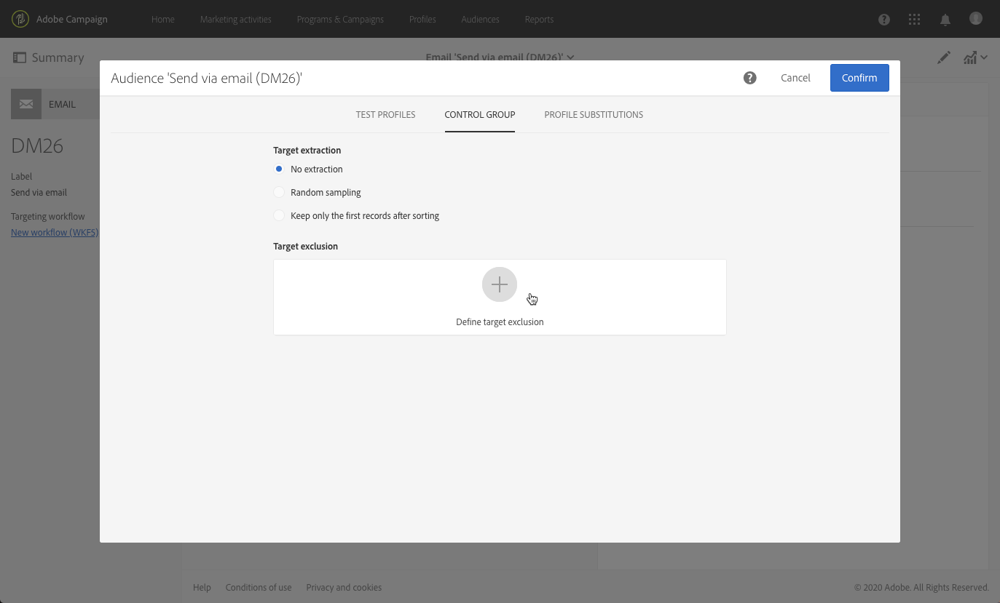

# Adición de un grupo de control {#adding-control-group}

Puede utilizar grupos de control para evitar el envío de mensajes a una parte de la audiencia a fin de medir el impacto de sus campañas.

Para hacerlo en Adobe Campaign, cree un <b>grupo de control</b> al definir el destinatario del envío. Los perfiles se agregan al grupo de control aleatoriamente, se filtran o no, o se basan en criterios.

A continuación, podrá comparar el comportamiento de la población de destinatarios que recibió el mensaje con el comportamiento de los contactos a los que no estaban destinados. En función de los registros de envío, también puede destinar un grupo de control en campañas futuras.

<!--The control group is built when the delivery is prepared.-->

## Información general {#overview}

El grupo de control se puede extraer aleatoriamente del objetivo principal o seleccionarse de una población específica. Por lo tanto, hay dos formas principales de definir un grupo de control:
* **Extraer** varios perfiles del destinatario principal.
* **Excluir** algunos perfiles según los criterios definidos en una consulta.

Puede utilizar ambos métodos al definir un grupo de control.

Todos los perfiles que formen parte del grupo de control en la fase de preparación del envío se eliminarán del destinatario principal. No recibirán el mensaje una vez que se envíe.

## Extracción de la población de destinatarios {#extraction-target-population}

Para definir un grupo de control, puede elegir extraer, aleatoriamente o en función de un orden, un porcentaje o un número fijo de perfiles de la población de destinatarios.

### Extracción de destinatario {#target-extraction}

En primer lugar, defina la forma en que se extraerán los perfiles del destinatario: **aleatoriamente** o en función de un **orden**.

En la sección **[!UICONTROL Target extraction]** , seleccione una de las siguientes opciones:

* **[!UICONTROL Random sampling]**: al preparar el envío, Adobe Campaign extraerá aleatoriamente un número de perfiles correspondiente al porcentaje o al número máximo que se establecerá como [límite de tamaño](#size-limit).

   Por ejemplo, si establece el umbral en 10, en la sección **[!UICONTROL Limits]** , el grupo de control se compone del 10% de los seleccionados aleatoriamente desde la población de destino.<!--Change screenshot to match example)-->

   

* **[!UICONTROL Keep only the first records after sorting]**: esta opción permite definir una limitación basada en uno o varios órdenes de clasificación.

   Por ejemplo:

   * Seleccione el campo **[!UICONTROL Age]** como criterio del orden.
   * Defina 100 como el umbral en la sección **[!UICONTROL Limits]** (consulte [Límite de tamaño](#size-limit)).
   * Deje la opción **[!UICONTROL Descending sort]** marcada.

   Como resultado, el grupo de control estará compuesto por los 100 destinatarios más antiguos.<!--Change screenshot to match example)-->

   

   Puede resultar interesante definir un grupo de control que incluya perfiles que realizan pocas compras o con frecuencia y comparar su comportamiento con el de los destinatarios contactados.

>[!NOTE]
>
>Seleccione **[!UICONTROL No extraction]** si no desea utilizar la opción **[!UICONTROL Target extraction]** .

<!---->

### Límite de tamaño {#size-limit}

Ya sea que haya seleccionado **[!UICONTROL Random sampling]** o **[!UICONTROL Keep only the first records after sorting]**, debe definir cómo va a limitar el número de perfiles que extraiga del destinatario principal. Realice una de las siguientes acciones:

* Seleccione **[!UICONTROL Size (as a % of the initial population)]** y rellene el marco correspondiente.

   Por ejemplo, si establece 10, en función de la opción seleccionada arriba, Adobe Campaign:
   * Extraerá aleatoriamente el 10% de la población de destinatarios.
   * Si seleccionó el campo **[!UICONTROL Age]** como criterio del orden, extraiga el 10% de los perfiles más antiguos de la población de destinatarios.

   >[!NOTE]
   >
   >Si desmarca la opción **[!UICONTROL Descending sort]**, se extraerán un 10% de los perfiles más nuevos.

* Seleccione **[!UICONTROL Maximum size]** y rellene el marco correspondiente.

   Por ejemplo, si establece 100, Adobe Campaign:
   * Extraer aleatoriamente 100 perfiles de la población de destinatarios.
   * Si seleccionó el campo **[!UICONTROL Age]** como criterio del orden, extraiga 100 de los perfiles más antiguos de la población de destinatarios.

   >[!NOTE]
   >
   >Si desmarca la opción **[!UICONTROL Descending sort]** , se extraerán 100 perfiles más nuevos.

## Exclusión de una población específica {#excluding-specific-population}

Otra forma de definir un grupo de control es excluir una población específica del destinatario mediante una consulta.

Para ello:

1. En la sección **[!UICONTROL Target exclusion]** haga clic en **[!UICONTROL Define target exclusion]**.

   

1. Defina los criterios de exclusión mediante el [editor de consultas](../../automating/using/editing-queries.md). También puede seleccionar una [audiencia](../../audiences/using/about-audiences.md) que se haya creado anteriormente.

   

1. Haga clic en **[!UICONTROL Confirm]**.

Los perfiles que coincidan con el resultado de la consulta se excluirán del destino.

<!--For more on using the query editor, see the [Editing queries](../../automating/using/editing-queries.md) section.-->

## Caso de uso: configurar un grupo de control {#control-group-example}

A continuación se muestra un ejemplo que muestra cómo definir un grupo de control mediante ambos métodos: extraer perfiles del destinatario principal y utilizar una consulta para excluir una población específica.

1. Creación de un flujo de trabajo. Los pasos detallados para crear un flujo de trabajo se describen en la sección [Creación de un flujo de trabajo](../../automating/using/building-a-workflow.md).
1. En **[!UICONTROL Activities]** > **[!UICONTROL Targeting]**, arrastre y suelte una actividad de [Consulta](../../automating/using/query.md). Haga doble clic en la actividad y defina el destinatario. <!--For example, in **[!UICONTROL Shortcuts]**, drag and drop **[!UICONTROL Profile]**, select **[!UICONTROL Age]** with the operator **[!UICONTROL Greater than]** and type 25 in the **[!UICONTROL Value]** field.-->

1. En **[!UICONTROL Activities]** > **[!UICONTROL Channels]**, arrastre y suelte una actividad de [envío de correo electrónico](../../automating/using/email-delivery.md) después del segmento de destinatario principal y edítela.
1. Haga clic en el bloque **[!UICONTROL Audience]** del panel de envío.

1. Seleccione la pestaña **[!UICONTROL Control group]** .

   

1. En la sección **[!UICONTROL Target extraction]**, seleccione **[!UICONTROL Keep only the first records after sorting]**.
1. Ordene según la edad y deje la opción de orden **[!UICONTROL Descending]** activada.

   

1. Establezca 100 como el tamaño máximo. Se extraerán los 100 perfiles más antiguos de su destinatario.

1. En la sección **[!UICONTROL Target exclusion]**, defina los perfiles que se excluirán del destinatario, según los criterios de su elección mediante el [editor de consultas](../../automating/using/editing-queries.md). Por ejemplo, “La edad es menor a 20”.

   

   Quedan excluidos los perfiles menores de 20 años.

1. Inicie la [preparación de envío](../../sending/using/preparing-the-send.md) y [confirme el envío](../../sending/using/confirming-the-send.md).

Los perfiles extraídos (los 100 perfiles más antiguos) y los definidos en función de la consulta (perfiles menores de 20 años) se retirarán del destinatario principal. No recibirán el mensaje.

## Comparación de los resultados {#delivery-logs}

Ahora que realizó el envío, ¿qué puede hacer con el grupo de control?

Puede extraer los **registros de envío** para comparar cómo actuó el grupo de control que no recibió la comunicación en comparación con el destinatario efectivo. También puede usar los registros de envío para **compilar otra segmentación**.

>[!IMPORTANT]
>
>Debe tener una [función de administrador](../../administration/using/users-management.md#functional-administrators) y formar parte de la **[!UICONTROL All]** [unidad organizativa](../../administration/using/organizational-units.md) para poder conectarse a Adobe Campaign. Si desea restringir el acceso de un usuario o grupo de usuarios en particular, no lo vincule a las unidades **[!UICONTROL All]** para poder acceder a los registros de envío.

### Comprobación de los registros de envío {#checking-logs}

Para ver qué perfiles se eliminaron del destinatario después de que se enviara el mensaje, consulte **[!UICONTROL Delivery logs]**. Para obtener más información sobre los registros de envío y cómo acceder a ellos, consulte [esta sección](../../sending/using/monitoring-a-delivery.md#delivery-logs).

* En la pestaña **[!UICONTROL Sending logs]** , puede ver los perfiles extraídos y excluidos. Tienen el estatus **[!UICONTROL Ignored]** y **[!UICONTROL Control group]** como la razón del error.

   

* También puede marcar la pestaña **[!UICONTROL Exclusion causes]** para ver el número de perfiles que no se incluyeron en el envío.

   

### Uso de los registros de grupo de control {#using-logs}

Una vez realizado el envío, puede usar los registros de envío para filtrar los perfiles que no recibieron el mensaje. Siga estos pasos:

1. Creación de un flujo de trabajo. Los pasos detallados para crear un flujo de trabajo se describen en la sección [Creación de un flujo de trabajo](../../automating/using/building-a-workflow.md).
1. En **[!UICONTROL Activities]** > **[!UICONTROL Targeting]**, arrastre y suelte una actividad de [Consulta](../../automating/using/query.md).
1. En la pestaña **[!UICONTROL Properties]**, defina **[!UICONTROL Delivery logs]** como **[!UICONTROL Resource]** y **[!UICONTROL Profile]** como **[!UICONTROL Targeting dimension]**.

   

1. En la pestaña **[!UICONTROL Target]**, haga clic en **[!UICONTROL Delivery logs]**.
1. Arrastre y suelte **[!UICONTROL Status]** y seleccione **[!UICONTROL Ignored]** como condición de filtro.

   

1. Haga clic en **[!UICONTROL Confirm]**.

1. En la pestaña **[!UICONTROL Target]**, arrastre y suelte **[!UICONTROL Nature of failure]** y seleccione **[!UICONTROL Control group]** como condición de filtro.

   

1. Haga clic en **[!UICONTROL Confirm]**.

   

A continuación, puede exportar los datos de registro mediante la actividad de **Extraer archivo** seguida de la actividad de **Transferir archivo**, por ejemplo. Esto le permitirá analizar en su propia herramienta de creación de informes los resultados de su campaña sobre el destinatario efectivo en comparación con el grupo de control. Para obtener más información sobre Exportación de registros, consulte [esta sección](../../automating/using/exporting-logs.md).

### Segmentación del grupo de control {#targeting-control-group}

Para realizar una segmentación basada en los perfiles que no recibieron el mensaje, también puede usar los registros de envío. Siga estos pasos:

1. Creación de un flujo de trabajo. Los pasos detallados para crear un flujo de trabajo se describen en la sección [Creación de un flujo de trabajo](../../automating/using/building-a-workflow.md).
1. En **[!UICONTROL Activities]** > **[!UICONTROL Targeting]**, arrastre y suelte primero una actividad de [Consulta](../../automating/using/query.md).
1. En la pestaña **[!UICONTROL Properties]**, asegúrese de que el **[!UICONTROL Profile]** recurso esté seleccionado como **[!UICONTROL Resource]** y **[!UICONTROL Targeting dimension]**.

   

1. En la pestaña **[!UICONTROL Target]**, expanda **[!UICONTROL Delivery]** y arrastre y suelte **[!UICONTROL Delivery logs]**.

   

1. En la ventana **[!UICONTROL Add a rule]**, arrastre y suelte **[!UICONTROL Delivery]**.

   

1. Seleccione el correo electrónico enviado como condición de filtro. Haga clic en **[!UICONTROL Confirm]**.

   

1. De nuevo en la ventana **[!UICONTROL Add a rule]**, arrastre y suelte **[!UICONTROL Status]** y seleccione **[!UICONTROL Ignored]** como condición de filtro. Haga clic en **[!UICONTROL Confirm]**.

   

1. Arrastre y suelte **[!UICONTROL Nature of failure]** y seleccione **[!UICONTROL Control group]** como condición de filtro. Haga clic en **[!UICONTROL Confirm]**.

   

1. Asegúrese de que todas las condiciones estén alineadas con el operador booleano **AND** .

   

1. Haga clic en **[!UICONTROL Confirm]**.

Ahora puede enviar a los perfiles que no recibieron su primer mensaje porque formaban parte del grupo de control y se les envió otro correo electrónico.

En el mismo flujo de trabajo, también puede crear otra consulta para enviarles a los destinatarios de los perfiles que recibieron el correo electrónico y enviarles un mensaje diferente.

