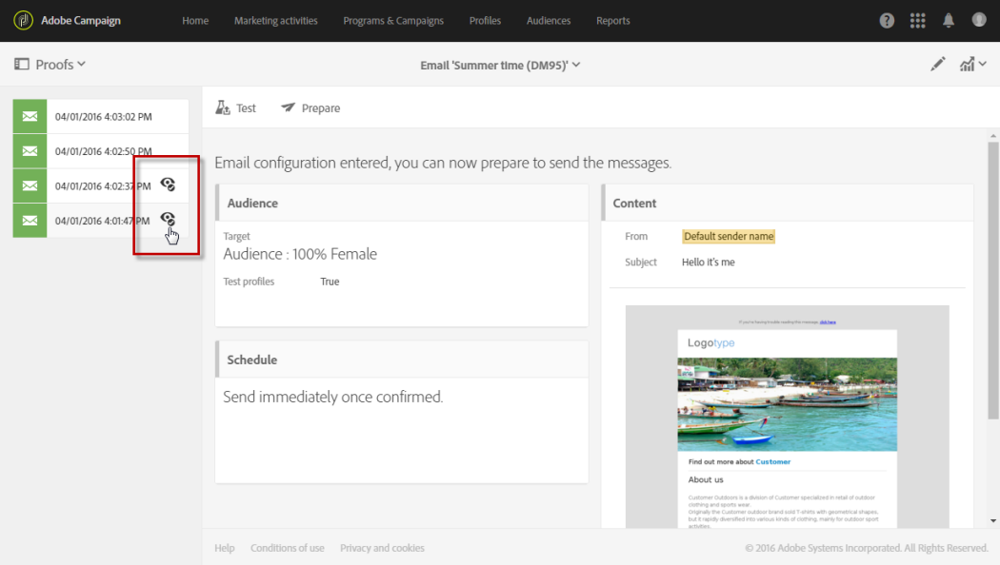

# Procesamiento de correo electrónico{#email-rendering}

Antes de pulsar el botón **[!UICONTROL Send]**, asegúrese de que su mensaje se mostrará de una forma óptima en una gran variedad de clientes, correos y dispositivos web.

Para permitirlo, Adobe Campaign captura el procesamiento y lo pone a disposición en un informe dedicado. Esto le permite previsualizar el mensaje enviado en los diferentes contextos en los que se puede recibir.

Los clientes móviles, de mensajería y de correo web disponibles para **Procesamiento de correo electrónico** en Adobe Campaign se enumeran en el [sitio web](https://litmus.com/email-testing) de Litmus (haga clic en **Ver todos los clientes de correo electrónico**).

## Generando procesamiento de correo electrónico {#checking-the-email-rendering-report}

Una vez que haya creado su envío de correo electrónico y definido su contenido, así como la población de destino, siga los pasos a continuación.

1. Haga clic en **Audiencia** para acceder a la pestaña **[!UICONTROL Test profiles]**.

   

1. Utilice el editor de consultas para definir los perfiles de prueba que desea utilizar, incluidos los perfiles de prueba que se utilizan para el **procesamiento de correo electrónico**. Consulte [Acerca de los perfiles de prueba](../../audiences/using/managing-test-profiles.md).

   

1. Compruebe y confirme la consulta y, a continuación, guarde los cambios.
1. Haga clic en el botón **[!UICONTROL Test]** de la barra de acciones.

   

1. Seleccione la opción **[!UICONTROL Email rendering]** y haga clic en **[!UICONTROL OK]**.

   

   >[!NOTE]
   >
   >La opción **[!UICONTROL Proof + Email rendering]** le permite enviar una prueba y utilizar simultáneamente la función de procesamiento de correo electrónico. Puede solicitar la aprobación del mensaje por parte de los destinatarios de prueba y, al mismo tiempo, puede probar la forma en que se recibirá el mensaje en función de las bandejas de entrada de destino. En este caso, también debe seleccionar Prueba de perfiles de prueba. Consulte [Acerca de los perfiles de prueba](../../audiences/using/managing-test-profiles.md).

   Se envía el envío de prueba.

1. Las miniaturas de procesamiento están disponibles unos minutos después de enviar los mensajes. Para acceder a ellos, seleccione **[!UICONTROL Proofs]** en la lista desplegable **[!UICONTROL Summary]**.

   

1. En la lista **[!UICONTROL Proofs]**, haga clic en el icono **[!UICONTROL Access email rendering]**.

   

Se muestra el informe de procesamiento de correo electrónico dedicado. Consulte [Descripción del informe de procesamiento de correo electrónico](#email-rendering-report-description).

**Temas relacionados**:

* [Creación de un correo electrónico](../../channels/using/creating-an-email.md)
* [Envío de pruebas](../../sending/using/sending-proofs.md)
* [Editor de consultas](../../automating/using/editing-queries.md#about-query-editor)

## Informe de procesamiento de correo electrónico {#email-rendering-report-description}

Este informe presenta los procesamientos de correo electrónico tal y como aparecen al destinatario. Los procesamientos de correo electrónico pueden variar en función del modo en que el destinatario abra la entrega de correo electrónico: en un explorador, en un dispositivo móvil o a través de una aplicación de correo electrónico.

### Tokens de procesamiento de correo electrónico

El número de procesamientos disponibles aparece en el contrato de licencia. Cada entrega con **Procesamiento de correo electrónico** habilitado reduce en uno los procesamientos disponibles (conocidos como tokens).

Los tokens corresponden a cada renderización individual y no al informe completo de renderización de correo electrónico, lo que significa que:

* **Cada vez** que se genera el informe de procesamiento de correo electrónico, se resta un token por cada cliente de mensajería: uno para el procesamiento de Outlook 2000, uno para el procesamiento de Outlook, uno para el procesamiento de Apple Mail, etc.

* **Para el mismo envío**, si genera de nuevo el procesamiento de correo electrónico, el número de tokens disponibles se reduce de nuevo según el número de procesamientos generados.

### Resumen del informe

El resumen del informe muestra el número de mensajes recibidos, no deseados (spam), no recibidos o pendientes de recepción.

El informe se divide en tres partes: **[!UICONTROL Mobile]**, **[!UICONTROL Messaging clients]**, y **[!UICONTROL Webmails]**. Desplácese hacia abajo por el informe para mostrar todas las representaciones agrupadas en estas tres categorías.

Para obtener los detalles de cada informe, haga clic en la tarjeta correspondiente. Se muestra la renderización del método de recepción seleccionado.

La pestaña **[!UICONTROL Technical data]** le permite obtener más información, como las fechas de recepción y captura, y los encabezados completos de los correos electrónicos.
