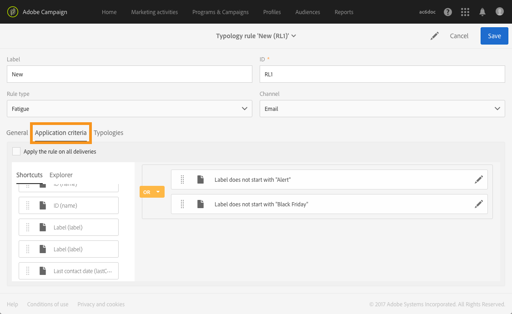

# Reglas de fatiga{#fatigue-rules}

## Acerca de las reglas de fatiga {#about-fatigue-rules}

Las reglas de fatiga permiten a los especialistas en mercadotecnia establecer reglas comerciales globales de canal cruzado que excluyen automáticamente los perfiles sobre los que se solicitan campañas.

Para implementar reglas de fatiga, debe definir un número máximo de mensajes por perfil y seleccionar un período en el que se aplicará la regla. Durante la preparación del envío, los perfiles se excluyen del envío, si procede, en función del número de mensajes que ya se les hayan enviado.

>[!NOTE]
>
>Para aplicar las reglas de fatiga, debe definir una fecha de contacto para el envío. Si decide enviar mensajes inmediatamente, no se aplicará la regla de fatiga.

Temas relacionados:

* [Preparación](../../administration/using/configuring-email-channel.md#preparation)
* [Administración de tipologías](../../sending/using/managing-typologies.md)
* [Reglas de tipología](../../sending/using/managing-typology-rules.md)
* [Optimización de la frecuencia de comunicación para prevenir la fatiga de contacto](https://helpx.adobe.com/campaign/kb/simplify-campaign-management.html#Engageyourcustomersateverystep)

## Creating a fatigue rule {#creating-a-fatigue-rule}

Para crear y configurar una regla de tipología de **[!UICONTROL Fatigue]**, siga los siguientes pasos:

1. Haga clic en el logotipo de Adobe Campaign, en la esquina superior izquierda de la interfaz, y luego seleccione **[!UICONTROL Administration]** > **[!UICONTROL Channels]** > **[!UICONTROL Typologies]** > **[!UICONTROL Typology rules]**.

   

1. En la lista de reglas de tipología, haga clic en **[!UICONTROL Create]**.

   

1. In the **[!UICONTROL Rule type]** field, select **[!UICONTROL Fatigue]**.

   

1. En el **[!UICONTROL Channel]** campo, seleccione a qué canal se aplicará la regla. Puede seleccionar un solo canal (correo electrónico, SMS, correo directo, aplicación móvil) o seleccionar **[!UICONTROL All channels]**. Consulte [Selección del canal](#choosing-the-channel).

   

1. En la **[!UICONTROL General]** ficha, defina el método para calcular el número máximo de mensajes por perfil. Puede elegir un umbral constante o una variable. También puede reducir el umbral en perfiles y envíos. For more on this, refer to [Defining the threshold](#defining-the-threshold).

   

1. Elija una **[!UICONTROL Sliding period]** opción en la que se aplicará la reglas de tipología. For more on this, refer to [Setting the sliding period](#setting-the-sliding-period).

   

   En este ejemplo (consulte capturas de pantalla anteriores), elegimos enviar un número máximo de 4 mensajes durante un período deslizante de 15 días.

1. En la **[!UICONTROL Application criteria]** ficha, puede elegir aplicar esta regla a todos los envíos o restringir la aplicabilidad de la regla según el mensaje que se va a enviar. La regla solo se ejecutará si se cumple la condición de la aplicación. Por ejemplo, puede aplicar la regla solo en mensajes con una etiqueta que comience por una palabra determinada o con un ID que contenga determinadas letras. Consulte [Restricción de la aplicabilidad de una regla](../../sending/using/filtering-rules.md#restricting-the-applicability-of-a-filtering-rule)de filtrado.

   

1. Seleccione la **[!UICONTROL Typologies]** ficha y vincule la reglas de tipología a la tipología utilizada para los envíos. Consulte [Administración de tipologías](../../sending/using/managing-typologies.md) y [Reglas de tipología](../../sending/using/managing-typology-rules.md).

   

   >[!NOTE]
   >
   >La tipología se puede definir en la plantilla de envíos para que se aplique automáticamente a todas las entregas creadas con esta plantilla.

Durante la preparación del envío, los perfiles se excluyen del envío, si procede, en función del número de envíos que ya se les hayan enviado. Puede vista los resultados de la ejecución de reglas de fatiga en los registros de envío. Consulte [Visualización de los resultados](#viewing-the-fatigue-results)de fatiga.

>[!IMPORTANT]
>
>Para que funcionen las reglas de fatiga, debe definir una fecha de contacto para el envío. Si decide enviar mensajes inmediatamente, no se aplicará la regla de fatiga.

## Elección del canal {#choosing-the-channel}

Las reglas de fatiga están disponibles para varios canales. El canal se define en el **[!UICONTROL Channel]** campo de la configuración de reglas de tipología. Puede seleccionar un solo canal o **[!UICONTROL All channels]**.

**canales disponibles**

Están disponibles los siguientes canales:

* Correo electrónico
* Móvil (SMS)
* Correo postal
* Aplicación móvil: este canal le permite enviar notificaciones push a perfiles o a suscriptores de la aplicación. Si decide enviar notificaciones a perfiles, serán compatibles con las reglas de fatiga de varios canales.

   >[!IMPORTANT]
   >
   >Las reglas de fatiga no son compatibles con las notificaciones push enviadas a los suscriptores de la aplicación. Si va a enviar mensajes a los suscriptores de la aplicación, no se aplicarán las reglas de fatiga.

* Todos los canales: esta opción le permite aplicar la regla a todos los canales. Por ejemplo, puede decidir enviar un máximo de 3 mensajes al mes en cualquier canal. Si la semana pasada enviaste dos correos electrónicos a un perfil e intentas enviar una notificación push hoy, se excluirá el mismo perfil.

**Tipos de Envío**

Las reglas de fatiga son compatibles con todos los tipos de envío: envíos únicos, envíos recurrentes, envíos y mensajes transaccionales de flujo de trabajo.

**Los mensajes** transaccionales se pueden utilizar para enviar mensajes de servicio dirigidos a un evento (rtEvent), así como mensajes de marketing (perfiles de objetivo), por ejemplo un mensaje de remarketing. Las reglas de fatiga solo son compatibles con los mensajes de marketing (perfiles de objetivo). Los mensajes transaccionales de Evento no contienen información sobre perfiles, por lo que no son compatibles con las normas de fatiga (incluso en el caso de un enriquecimiento con perfiles). Con la compatibilidad de los mensajes de marketing en los mensajes transaccionales, puede **aplicar una regla de fatiga a todos los canales, incluidos los mensajes transaccionales** de marketing.

## Definición del umbral {#defining-the-threshold}

Cada regla de fatiga define un umbral, es decir, el número máximo de mensajes que se pueden enviar a un perfil durante un período determinado. Una vez alcanzado este umbral, no se pueden realizar más entregas hasta el final del periodo. Este proceso le permite excluir automáticamente un perfil de un envío si un mensaje supera el umbral establecido, evitando así una solicitud excesiva.

Los valores de umbral pueden ser constantes o variables. Esto significa que para un período determinado, los umbrales pueden variar de un perfil a otro, o incluso para el mismo perfil.

**Uso de un umbral de corrección**

El umbral representa el mayor número de mensajes que se pueden enviar a un perfil durante el período de que se trate.

De forma predeterminada, el umbral es constante y es necesario indicar un número máximo de mensajes autorizados por la regla.

**Uso de un umbral de variable**

Para definir un umbral de variable, seleccione el **[!UICONTROL Depends on the recipient]** valor en el **[!UICONTROL Threshold type]** campo.

A continuación, tiene dos opciones:

* seleccione un campo de perfil: el umbral variará para cada perfil según el campo seleccionado. Por ejemplo, si ha ampliado el recurso de perfiles con un campo &#39;Frecuencia de comunicación&#39;, haga clic en el botón de la derecha del **[!UICONTROL Threshold computation formula]** campo y seleccione el campo. Para cada perfil, el umbral tomará el valor del campo &#39;Frecuencia de comunicación&#39;.

   

* definir una fórmula: haga clic en el segundo botón de la derecha del **[!UICONTROL Threshold computation formula]** campo para definir una fórmula de cálculo de umbral avanzada. Por ejemplo, puede indexar el número de mensajes autorizados según el segmento al que pertenece el perfil. Esto significa que un perfil que pertenece al segmento &#39;Web&#39; puede recibir más mensajes que otros perfiles. Una fórmula de **[!UICONTROL Iif (@origin='Web', 5, 3)]** tipo autoriza el envío de 5 mensajes a perfiles del segmento Web y 3 para otros segmentos.

   

**Mejora del umbral de perfiles y envíos**

De forma predeterminada, todos los mensajes tienen en cuenta el cálculo de umbral. Marque la **[!UICONTROL Refine Threshold on profiles and deliveries]** casilla para filtrar los perfiles y envíos que se van a contar al preparar el envío.

En el siguiente ejemplo, solo se cuentan los perfiles masculinos y solo se cuentan los envíos con una etiqueta que comience con **Newsletters** .

Refinar el umbral en envíos es diferente a restringir la aplicabilidad de toda la regla ( **[!UICONTROL Application criteria]** ficha):

* **[!UICONTROL Application criteria]**:: se decide ejecutar la regla o no según criterios específicos. Por ejemplo, si la condición de la aplicación es &#39;Etiquetar inicios con newsletter&#39;, la regla solo se aplicará a los envíos que respeten esta condición. Si la etiqueta del envío inicio con &#39;Promoción&#39;, la regla no se ejecutará en absoluto.
* **[!UICONTROL Refine threshold on profiles and deliveries > Deliveries to count]**:: todos los envíos que utilicen esta reglas de tipología ejecutarán la regla, pero usted decide, entre los envíos anteriores y programados, cuáles desea contar. Por ejemplo, si la restricción es &#39;Etiquetar inicios con newsletter&#39;, la regla se ejecutará incluso si la etiqueta de envío inicio con &#39;Promo&#39;. Durante el período deslizante seleccionado, contará el número de envíos cuya etiqueta inicio con &#39;Newsletter&#39;.

## Setting the sliding period {#setting-the-sliding-period}

Las reglas de fatiga se definen en los períodos móviles n días. El período se configura en la **[!UICONTROL Sliding period]** sección, por ejemplo 2 semanas, 7 días o 5 horas.

Cuando se ejecuta la regla, se tienen en cuenta tanto los envíos pasados como los envíos programados. Esto garantiza que, en un período deslizante determinado, el umbral nunca se supere.

Por ejemplo, si define un período de 48 horas, el sistema buscará 48 horas **antes de la fecha** de contacto y 48 horas **después de la fecha** de contacto. Por lo tanto, el período seleccionado se duplica para permitir la integración de envíos futuros y anteriores.

Para restringir los envíos tomados en cuenta a un período de 2 semanas, introduzca **Día** y **7** o 1 semana en la sección Período **** deslizante. Los Envíos enviados hasta 7 días antes de la fecha de envío y programados hasta 7 días después de la fecha de envío en la que se aplica la regla se tendrán en cuenta en el cálculo.

## Ver los resultados de fatiga {#viewing-the-fatigue-results}

Durante la preparación del envío, los perfiles se excluyen del envío, si procede, en función del número de envíos que ya se les hayan enviado. Para vista los resultados de ejecución de regla de fatiga, haga clic en el botón en la esquina inferior derecha del **[!UICONTROL Deployment]** bloque.

Hay tres fichas disponibles que muestran los detalles de los resultados de la ejecución de fatiga, incluido el nombre de la regla que se aplicó:

* Registros de envío:

   

* Registros de exclusión:

   

* Causas de exclusión:

   

## Visualización del informe de resumen de regla de fatiga {#viewing-the-fatigue-rule-summary-report}

Adobe Campaign incluye un informe dedicado sobre las reglas de fatiga para ayudarle a comprender cómo se aplican a sus campañas. Esto le permite conocer el impacto de sus campañas entre sí y realizar los ajustes adecuados.

Se puede acceder al **[!UICONTROL Fatigue rules summary]** informe desde el **[!UICONTROL Reports]** botón, en la esquina superior derecha de cada programa, campaña y mensaje.

En la parte izquierda de la pantalla, puede filtrar los datos del informe en la fecha de contacto del envío. De forma predeterminada, el período seleccionado inicio 15 días antes de la fecha actual y finaliza 15 días después. También puede filtrar por una regla de fatiga específica.

El gráfico circular muestra la siguiente información sobre el período seleccionado:

* **[!UICONTROL Total targeted]**:: el destinatario total antes de la preparación del mensaje
* **[!UICONTROL Excluded]**:: el número total de exclusiones debidas a la aplicación de reglas de fatiga
* **[!UICONTROL Other exclusions]**:: el número total de exclusiones debidas a otras reglas de tipología
* **[!UICONTROL To deliver]**:: el número total de mensajes que se enviarán tras la preparación del mensaje ( **[!UICONTROL To deliver]** = **[!UICONTROL Total targeted]** - **[!UICONTROL Excluded]** - **[!UICONTROL Other exclusions]** )

A la derecha del gráfico, encontrará el número de exclusiones, desglosado por regla de fatiga.

La tabla inferior muestra todos los envíos dentro del período seleccionado. Para cada envío, puede ver las reglas de fatiga aplicadas y las exclusiones correspondientes. En la tabla también se muestran los Envíos que no tienen fecha de contacto.

* **[!UICONTROL 0]** significa que la regla de fatiga se aplicó pero no hubo exclusión.
* **[!UICONTROL -N]** significa que no se produjeron exclusiones.
* un campo vacío significa que no se aplicó la regla de fatiga.

>[!NOTE]
>
>Los datos mostrados no son contextuales para el programa, el mensaje o la campaña desde la que se accede al informe. Este informe muestra todas las reglas y envíos de fatiga de todas las unidades organizativas. Esto le permite obtener una vista global de todos los envíos para comprender cómo las campañas se ven influidas por otros.

## Ejemplos {#examples}

Existen muchas posibilidades en cuanto a la implementación de la gestión de fatiga. Estos son algunos ejemplos de lo que puede hacer:

* Cree una regla de fatiga usando un umbral **** constante que se aplique a **todos los canales**:

   Supongamos que crea una regla de varios canales, con un umbral constante de 3 durante un período deslizante de 7 días.

   La semana pasada, sus perfiles Premium recibieron un correo electrónico de promoción y un correo electrónico de remercadotecnia transaccional. También programaste un SMS que se enviará la semana que viene. Hoy, usted decide enviar una notificación push dirigida a todos sus perfiles. Los perfiles Premium se excluirán de la inserción de hoy porque ya se ha alcanzado el número máximo de mensajes durante un período de 2 semanas.

   

* Cree una regla de fatiga usando un umbral **de** variable basado en un campo **de** perfil:

   Ha ampliado el recurso perfiles con un campo &#39;Límite de comunicación&#39; para definir un umbral diferente para cada perfil. En la regla de fatiga, defina un umbral de variable basado en este campo y seleccione un período deslizante de 2 días. Veamos dos ejemplos de perfiles: John tiene un límite de comunicación de 1 y David tiene un umbral de 2. Ambos ya recibieron un correo electrónico con newsletter ayer. Usted decide enviarles otro correo electrónico hoy. Sólo David lo recibirá, porque John ha sido excluido del destinatario.

   

* Cree una regla de fatiga usando una fórmula **de cálculo de** umbral:

   Desea cambiar el umbral según la edad de sus perfiles. Si un perfil es menor de 40, desea definir un límite de 4 y, para perfiles más antiguos, un límite de 2. En lugar de definir este umbral para cada perfil con un campo extendido, puede crear una fórmula directamente en la regla de fatiga para calcular el umbral según la edad de los perfiles. En nuestro ejemplo, la fórmula sería **[!UICONTROL Iif (@age<40, 4, 2)]**.

   

   >[!NOTE]
   >
   >Esta sección también incluye un ejemplo paso a paso de una regla de fatiga que utiliza una fórmula de cálculo de umbral.

* Cree una regla de fatiga que **ajuste el umbral** en perfiles y envíos:

   Ha ampliado el recurso de perfiles con un campo &#39;Puntuación&#39; y también ha ampliado el recurso de envíos con un campo &#39;Tipo&#39;. Desea definir un umbral constante de 3 pero desea excluir del recuento todos los envíos del tipo &#39;Alerta&#39; o &#39;Viernes negro&#39; y todos los perfiles con una puntuación buena de 10. Cuando la regla se ejecute, contará, entre los envíos anteriores y programados, todos los envíos que no sean del tipo &#39;Alerta&#39; o &#39;Viernes Negro&#39; enviados a perfiles cuya puntuación sea menor que 10.

   

Este es un ejemplo paso a paso de una regla de fatiga que utiliza una fórmula de cálculo de umbral.

En este caso de uso, queremos crear una reglas de tipología para evitar el envío de más de 2 mensajes por semana a perfiles Premium y 2 mensajes por semana a perfiles estándar.

Para identificar clientes y clientes potenciales, hemos ampliado el recurso de perfiles con el **[!UICONTROL Status]** campo, que contiene 0 para perfiles Premium y 1 para perfiles estándar.

Para crear la regla, siga los siguientes pasos:

1. Create a new **Fatigue** type typology rule.
1. En la **[!UICONTROL Threshold]** sección, queremos crear una fórmula para calcular el umbral en función de cada perfil. Seleccione el **[!UICONTROL Depends on the recipient]** valor en el **[!UICONTROL Threshold type]** campo y, a continuación, haga clic en el icono del segundo botón situado a la derecha del **[!UICONTROL Threshold computation formula]** campo.

   

1. En la **[!UICONTROL List of functions]** sección, haga clic con el doble en la función **Iif** del **[!UICONTROL Others]** nodo.

   

1. Then select the profile&#39;s **Status** in the **[!UICONTROL Available fields]** section.

   

1. Introduzca los valores deseados para crear la fórmula siguiente: **Iif(@status=0,2,4)**

   

   Esta fórmula permite asignar el valor 2 si el estado es igual a 0 y el valor 4 para todos los demás estados.

1. Haga clic en **[!UICONTROL Confirm]** para aprobar la fórmula.
1. Indique la **[!UICONTROL Sliding period]** forma en que se aplicará la regla: 7 días en este caso, para limitar los envíos tomados en cuenta a un período de 2 semanas.

   

1. Ahora vincule la regla que acaba de crear a una tipología para aplicarla a sus envíos. Para ello, seleccione la **[!UICONTROL Typologies]** ficha, haga clic en **[!UICONTROL Create element]** y seleccione la tipología utilizada para los envíos.

   

1. Guarde la regla para aprobar la creación.

La regla se aplicará a todos los envíos según la tipología.
