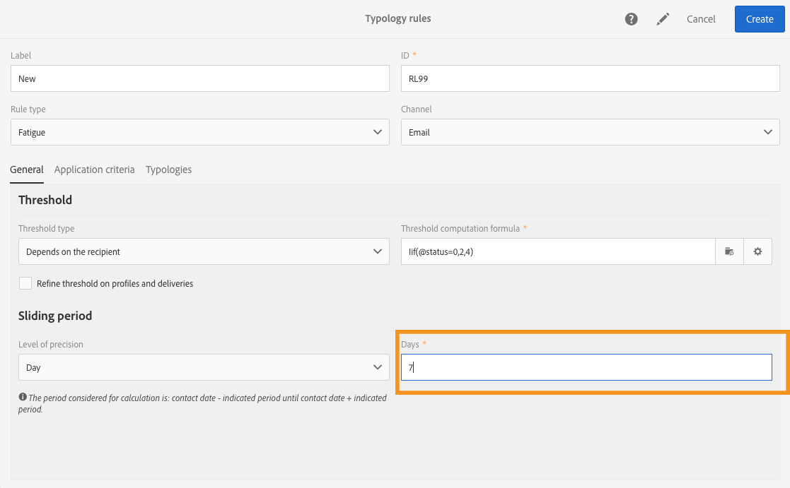

# Reglas de fatiga{#fatigue-rules}

## Acerca de las reglas de fatiga {#about-fatigue-rules}

Las reglas de fatiga permiten a los expertos en marketing establecer reglas empresariales globales de canal cruzado que excluyen automáticamente los perfiles saturados de las campañas.

Para implementar reglas de fatiga, debe definir un número máximo de mensajes por perfil y seleccionar un periodo en el que se aplicará la regla. Durante la preparación, los perfiles se excluyen del mismo, si corresponde, en función de la cantidad de mensajes que ya hayan recibido.

>[!NOTE]
>
>Para aplicar las reglas de fatiga, debe definir una fecha de contacto para la entrega. Si decide enviar mensajes inmediatamente, no se aplicará la regla de fatiga.

Temas relacionados:

* [Preparación](../../administration/using/configuring-email-channel.md#preparation)
* [Administración de tipologías](../../sending/using/managing-typologies.md)
* [Reglas de tipología](../../sending/using/managing-typology-rules.md)
* [Optimización de la frecuencia de comunicación para prevenir la fatiga de contacto](https://helpx.adobe.com/es/campaign/kb/simplify-campaign-management.html#Engageyourcustomersateverystep)

## Creación de una regla de fatiga {#creating-a-fatigue-rule}

Para crear y configurar una regla de tipología de **[!UICONTROL Fatigue]**, siga los siguientes pasos:

1. Haga clic en el logotipo de Adobe Campaign, en la esquina superior izquierda de la interfaz, y luego seleccione **[!UICONTROL Administration]** > **[!UICONTROL Channels]** > **[!UICONTROL Typologies]** > **[!UICONTROL Typology rules]**.

   

1. En la lista de reglas de tipología, haga clic en **[!UICONTROL Create]**.

   

1. En el campo **[!UICONTROL Rule type]**, seleccione **[!UICONTROL Fatigue]**.

   

1. En el campo **[!UICONTROL Channel]**, seleccione a qué canal se aplicará la regla. Puede seleccionar un solo canal (correo electrónico, SMS, correo postal, aplicación móvil) o seleccionar **[!UICONTROL All channels]**. Consulte [Selección del canal](#choosing-the-channel).

   

1. En la pestaña **[!UICONTROL General]**, defina el método para calcular el número máximo de mensajes por perfil. Puede elegir un umbral constante o una variable. También puede restringir el umbral en perfiles y entregas. Para más información, consulte [Definición del umbral](#defining-the-threshold).

   

1. Elija un **[!UICONTROL Sliding period]** en la que se aplicará la regla de tipología. Para obtener más información, consulte [Configuración del periodo deslizante](#setting-the-sliding-period).

   

   En este ejemplo (consulte las capturas de pantalla anteriores), elegimos enviar un número máximo de 4 mensajes durante un periodo deslizante de 15 días.

1. En la pestaña **[!UICONTROL Application criteria]**, puede elegir aplicar esta regla a todas las entregas o restringir la aplicabilidad de la regla según el mensaje que se va a enviar. La regla solo se ejecutará si se cumple la condición de la aplicación. Por ejemplo, puede aplicar la regla solo en mensajes con una etiqueta que comience por una palabra determinada o con un ID que contenga determinadas letras. Consulte [Restricción de la aplicabilidad de una regla de filtrado](../../sending/using/filtering-rules.md#restricting-the-applicability-of-a-filtering-rule).

   

1. Seleccione la pestaña **[!UICONTROL Typologies]** y vincule la regla de tipología a la tipología utilizada para las entregas. Consulte [Administración de tipologías](../../sending/using/managing-typologies.md) y [Reglas de tipología](../../sending/using/managing-typology-rules.md).

   

   >[!NOTE]
   >
   >La tipología se puede definir en la plantilla de envíos para que se aplique automáticamente a todas las entregas creadas con esta plantilla.

Durante la preparación, los perfiles se excluyen del mismo, si corresponde, en función de la cantidad de entregas que ya hayan recibido. Puede ver los resultados de la ejecución de reglas de fatiga en los registros de entregas. Consulte [Visualización de los resultados de fatiga](#viewing-the-fatigue-results).

>[!IMPORTANT]
>
>Para que funcionen las reglas de fatiga, debe definir una fecha de contacto para la entrega. Si decide enviar mensajes inmediatamente, no se aplicará la regla de fatiga.

## Elección del canal {#choosing-the-channel}

Las reglas de fatiga están disponibles para varios canales. El canal se define en el campo **[!UICONTROL Channel]** de la configuración de regla de tipología. Puede seleccionar un solo canal o **[!UICONTROL All channels]**.

**Canales disponibles**

Los siguientes canales están disponibles:

* Correo electrónico
* Móvil (SMS)
* Correo postal
* Aplicación móvil: este canal le permite enviar notificaciones push a perfiles o a suscriptores de la aplicación. Si decide enviar notificaciones a perfiles, serán compatibles con las reglas de fatiga de varios canales.

   >[!IMPORTANT]
   >
   >Las reglas de fatiga no son compatibles con las notificaciones push enviadas a los suscriptores de la aplicación. Si va a enviar mensajes a los suscriptores de la aplicación, no se aplicarán las reglas de fatiga.

* Todos los canales: esta opción le permite aplicar la regla a todos los canales. Por ejemplo, puede decidir enviar un máximo de 3 mensajes al mes en cualquier canal. Si la semana pasada envió dos correos electrónicos a un perfil e intenta enviar una notificación push hoy, se excluirá el mismo perfil.

**Tipos de entregas**

Las reglas de fatiga son compatibles con todos los tipos de entrega: entregas únicas, entregas recurrentes, entregas de flujo de trabajo y mensajes transaccionales.

La **mensajería transaccional** se pueden utilizar para enviar mensajes de servicio dirigidos a un evento (rtEvent), así como mensajes de marketing (perfiles de objetivo), por ejemplo un mensaje de remarketing. Las reglas de fatiga solo son compatibles con los mensajes de marketing (perfiles de objetivo). Los mensajes transaccionales de evento no contienen información sobre perfiles, por lo que no son compatibles con las normas de fatiga (incluso en el caso de un enriquecimiento con perfiles). Con el soporte de los mensajes de marketing en la mensajería transaccional, puede **aplicar una regla de fatiga a todos los canales, incluidos los mensajes transaccionales de marketing**.

## Definición del umbral {#defining-the-threshold}

Cada regla de fatiga define un umbral, es decir, el número máximo de mensajes que se pueden enviar a un perfil durante un periodo determinado. Una vez alcanzado este umbral, no se pueden realizar más entregas hasta el final del periodo. Este proceso permite excluir automáticamente un perfil de una entrega si un mensaje supera el umbral establecido, evitando así saturar al destinatario.

Los valores de umbral pueden ser constantes o variables. Esto significa que, para un periodo determinado, los umbrales pueden variar de un perfil a otro o incluso en un mismo perfil.

**Uso de un umbral fijo**

El umbral representa el número máximo de mensajes que se pueden enviar a un perfil durante el periodo en cuestión.

De forma predeterminada, el umbral es constante y es necesario indicar un número máximo de mensajes autorizados por la regla.

**Uso de un umbral variable**

Para definir un umbral variable, seleccione el valor **[!UICONTROL Depends on the recipient]** en el campo **[!UICONTROL Threshold type]**.

A continuación, tiene dos opciones:

* Seleccione un campo de perfil: el umbral variará para cada perfil según el campo seleccionado. Por ejemplo, si ha ampliado el recurso de perfiles con un campo “Frecuencia de comunicación”, haga clic en el botón de la derecha del campo **[!UICONTROL Threshold computation formula]** y seleccione el campo. Para cada perfil, el umbral tomará el valor del campo “Frecuencia de comunicación”.

   

* Definir una fórmula: haga clic en el segundo botón de la derecha del campo **[!UICONTROL Threshold computation formula]** para definir una fórmula de cálculo de umbral avanzada. Por ejemplo, puede indexar el número de mensajes autorizados según el segmento al que pertenezca el perfil. Esto significa que un perfil que pertenece al segmento “Web” puede recibir más mensajes que otros perfiles. Una fórmula de tipo **[!UICONTROL Iif (@origin='Web', 5, 3)]** autoriza el envío de 5 mensajes a perfiles del segmento web y 3 para otros segmentos.

   

**Restricción del umbral de perfiles y entregas**

De forma predeterminada, todos los mensajes tienen en cuenta el cálculo de umbral. Marque la casilla **[!UICONTROL Refine Threshold on profiles and deliveries]** para filtrar los perfiles y entregas que se van a contar al preparar la entrega.

En el siguiente ejemplo, solo se cuentan los perfiles masculinos y las entregas con una etiqueta que comience con **Newsletters**.

Restringir el umbral en entregas es diferente a restringir la aplicabilidad de toda la regla (pestaña **[!UICONTROL Application criteria]**):

* **[!UICONTROL Application criteria]**: usted decide ejecutar la regla o no según criterios específicos. Por ejemplo, si la condición de la aplicación es “Etiqueta empieza con Newsletter”, la regla solo se aplicará a las entregas que respeten esta condición. Si la etiqueta de la entrega empieza con “Promoción”, la regla no se ejecutará.
* **[!UICONTROL Refine threshold on profiles and deliveries > Deliveries to count]**: todas las entregas que utilicen esta regla de tipología ejecutarán la regla, pero usted decide, entre las entregas anteriores y programadas, cuáles desea contar. Por ejemplo, si la restricción es “Etiqueta empieza con Newsletter”, la regla se ejecutará incluso si la etiqueta de entrega empieza con “Promoción”. Durante el periodo deslizante seleccionado, contará el número de entregas cuya etiqueta empiece con “Newsletter”.

## Configuración del periodo deslizante {#setting-the-sliding-period}

Las reglas de fatiga se definen en periodos sucesivos en días N. El periodo se configura en la sección **[!UICONTROL Sliding period]**, por ejemplo 2 semanas, 7 días o 5 horas.

Cuando se ejecuta la regla, se tienen en cuenta tanto las entregas pasadas como las entregas programadas. Esto garantiza que, en un periodo deslizante determinado, el umbral nunca se supere.

Por ejemplo, si define un periodo de 48 horas, el sistema buscará 48 horas **antes de la fecha de contacto** y 48 horas **después de la fecha de contacto**. Así pues, el periodo seleccionado se duplica para permitir la integración de entregas futuras y pasadas.

Para restringir las entregas tomadas en cuenta a un periodo de 2 semanas, introduzca **Día** y **7** o 1 semana en la sección **Periodo deslizante**. En el cálculo se tienen en cuenta las entregas realizadas hasta 7 días antes de la fecha de entrega y programadas hasta 7 días después de la fecha de entrega en la que se aplica la regla.

## Visualización de los resultados de fatiga {#viewing-the-fatigue-results}

Durante la preparación, los perfiles se excluyen del mismo, si corresponde, en función de la cantidad de entregas que ya hayan recibido. Para ver los resultados de ejecución de la regla de fatiga, haga clic en el botón en la esquina inferior derecha del bloque **[!UICONTROL Deployment]**.

Hay tres pestañas disponibles que muestran los detalles de los resultados de la ejecución de fatiga, incluido el nombre de la regla que se aplicó:

* Registros de entregas:

   

* Registros de exclusión:

   

* Causas de exclusión:

   

## Visualización del informe de resumen de la regla de fatiga {#viewing-the-fatigue-rule-summary-report}

Adobe Campaign incluye un informe dedicado sobre las reglas de fatiga para ayudarle a comprender cómo se aplican a sus campañas. Esto le permite conocer el impacto de sus campañas entre sí y realizar los ajustes adecuados.

Se puede acceder al informe **[!UICONTROL Fatigue rules summary]** desde el botón **[!UICONTROL Reports]** en la esquina superior derecha de cada programa, campaña y mensaje.

En la parte izquierda de la pantalla, puede filtrar los datos del informe en la fecha de contacto de la entrega. De forma predeterminada, el periodo seleccionado se inicia 15 días antes de la fecha actual y finaliza 15 días después. También puede filtrar por una regla de fatiga específica.

El gráfico circular muestra la siguiente información sobre el periodo seleccionado:

* **[!UICONTROL Total targeted]**: el destinatario total antes de la preparación del mensaje
* **[!UICONTROL Excluded]**: el número total de exclusiones debido a la aplicación de la regla de fatiga
* **[!UICONTROL Other exclusions]**: el número total de exclusiones debido a otras reglas de tipología
* **[!UICONTROL To deliver]**: el número total de mensajes que se entregarán tras la preparación del mensaje (**[!UICONTROL To deliver]** = **[!UICONTROL Total targeted]** - **[!UICONTROL Excluded]** - **[!UICONTROL Other exclusions]**)

A la derecha del gráfico, encontrará el número de exclusiones, desglosado por regla de fatiga.

La tabla inferior muestra todas las entregas dentro del periodo seleccionado. Para cada entrega, puede ver las reglas de fatiga aplicadas y las exclusiones correspondientes. En la tabla también se muestran las entregas que no tienen fecha de contacto.

* **[!UICONTROL 0]** significa que la regla de fatiga se aplicó pero no hubo exclusión.
* **[!UICONTROL -N]** significa que se produjeron exclusiones N.
* un campo vacío significa que no se aplicó la regla de fatiga.

>[!NOTE]
>
>Los datos mostrados no son contextuales para el programa, el mensaje o la campaña desde la que se accede al informe. Este informe muestra todas las reglas y entregas de fatiga de todas las unidades organizativas. Esto le permite obtener una vista global de todas las entregas para comprender cómo las campañas se ven influidas por otras.

## Ejemplos {#examples}

Existen muchas posibilidades en cuanto a la implementación de la gestión de fatiga. Estos son algunos ejemplos de lo que puede hacer:

* Creación de una regla de fatiga usando un **umbral constante** que se aplique a **todos los canales**:

   Supongamos que crea una regla de varios canales con un umbral constante de 3 durante un periodo deslizante de 7 días.

   La semana pasada, sus perfiles Premium recibieron un correo electrónico de promoción y un correo electrónico de remarketing transaccional. También programó un SMS que se enviará la semana que viene. Hoy, usted decide enviar una notificación push dirigida a todos sus perfiles. Los perfiles Premium se excluirán de la notificación push de hoy porque ya se ha alcanzado el número máximo de mensajes durante un periodo de 2 semanas.

   

* Creación de una regla de fatiga usando un **umbral variable** basado en un **campo de perfil**:

   Ha ampliado el recurso de perfiles con un campo “Límite de comunicación” para definir un umbral diferente para cada perfil. En la regla de fatiga, defina un umbral variable basado en este campo y seleccione un periodo deslizante de 2 días. Veamos dos ejemplos de perfiles: John tiene un límite de comunicación de 1 y David tiene un umbral de 2. Ambos ya recibieron un correo electrónico de la newsletter ayer. Hoy decide enviarles otro correo electrónico. Solo David lo recibirá, porque John ha sido excluido de los destinatarios.

   

* Creación de una regla de fatiga usando una **fórmula de cálculo de umbral**:

   Desea cambiar el umbral según la edad de sus perfiles. Si un perfil es menor de 40, desea definir un límite de 4 y, para perfiles más antiguos, un límite de 2. En lugar de definir este umbral para cada perfil con un campo ampliado, puede crear una fórmula directamente en la regla de fatiga para calcular el umbral según la edad de los perfiles. En nuestro ejemplo, la fórmula sería **[!UICONTROL Iif (@age<40, 4, 2)]**.

   

   >[!NOTE]
   >
   >Esta sección también incluye un ejemplo paso a paso de una regla de fatiga que utiliza una fórmula de cálculo de umbral.

* Cree una regla de fatiga que **restrinja el umbral** en perfiles y entregas:

   Ha ampliado el recurso de perfiles con un campo “Puntuación” y también ha ampliado el recurso de entregas con un campo “Tipo”. Desea definir un umbral constante de 3, pero quiere excluir del recuento todas las entregas del tipo “Alerta” o “Black Friday” y todos los perfiles con una puntuación mayor que 10. Cuando la regla se ejecute, contará, entre las entregas anteriores y programadas, todas las entregas que no sean del tipo “Alerta” o “Black Friday” enviadas a perfiles cuya puntuación sea menor que 10.

   

Este es un ejemplo paso a paso de una regla de fatiga que utiliza una fórmula de cálculo de umbral.

En este caso de uso, queremos crear una regla de tipología para evitar la entrega de más de 2 mensajes por semana a perfiles Premium y 2 mensajes por semana a perfiles estándar.

Para identificar clientes y clientes potenciales, hemos ampliado el recurso de perfiles con el campo **[!UICONTROL Status]**, que contiene 0 para perfiles Premium y 1 para perfiles estándar.

Para crear la regla, siga los siguientes pasos:

1. Creación de una nueva regla de tipología de tipo **fatiga**.
1. En la sección **[!UICONTROL Threshold]**, queremos crear una fórmula para calcular el umbral en función de cada perfil. Seleccione el valor **[!UICONTROL Depends on the recipient]** en el campo **[!UICONTROL Threshold type]** y, a continuación, haga clic en el icono del segundo botón situado a la derecha del campo **[!UICONTROL Threshold computation formula]**.

   

1. En la sección **[!UICONTROL List of functions]**, haga doble clic en la función **Iif** del nodo **[!UICONTROL Others]**.

   

1. A continuación, en la sección **, seleccione** Estado **[!UICONTROL Available fields]** de los perfiles.

   

1. Introduzca los valores deseados para crear la fórmula siguiente: **Iif(@status=0,2,4)**

   

   Esta fórmula permite asignar el valor 2 si el estado es igual a 0 y el valor 4 para todos los demás estados.

1. Haga clic en **[!UICONTROL Confirm]** para aprobar la fórmula.
1. Indique el **[!UICONTROL Sliding period]** en que se aplicará la regla: 7 días en este caso, para restringir las entregas tomadas en cuenta a un periodo de 2 semanas.

   

1. Ahora, vincule la regla que acaba de crear a una tipología para aplicarla a sus entregas. Para ello, seleccione la pestaña **[!UICONTROL Typologies]**, haga clic en **[!UICONTROL Create element]** y seleccione la tipología utilizada para sus entregas.

   

1. Guarde la regla para aprobar la creación.

La regla se aplicará a todas las entregas según la tipología.
