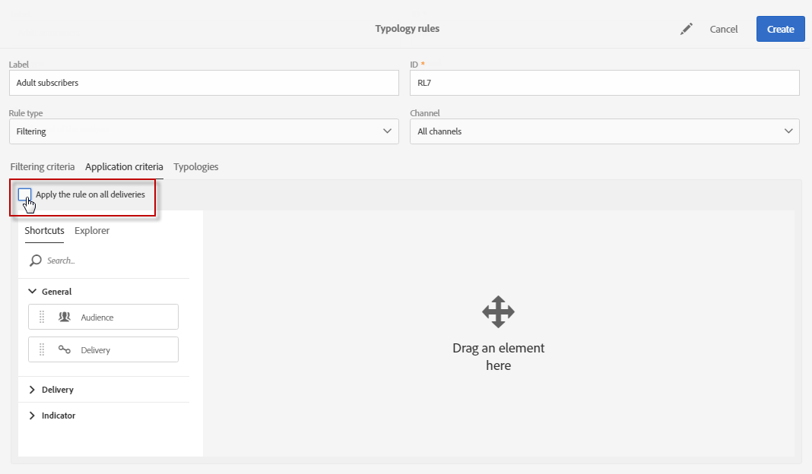

# Reglas de filtrado {#filtering-rules}

Las reglas de filtrado permiten excluir una parte del destinatario de mensajes según los criterios definidos en una consulta, como perfiles en cuarentena o perfiles que ya se han enviado un determinado número de correos electrónicos.

## Reglas de tipología de filtrado predeterminadas {#default-filtering-typology-rules}

La siguiente tabla proporciona información sobre las reglas de filtrado integradas, así como sus canales relacionados.

| Etiqueta | Canal | Descripción |
| ---------|----------|---------|
| **[!UICONTROL Address not specified]** | Todo | Excluye la población objetivo sin ninguna dirección especificada (correo electrónico, dirección postal, etc.) según el canal seleccionado). |
| **[!UICONTROL Address on denylist]** | Todo | Excluye las direcciones que están en la  de lista de bloqueados. |
| **[!UICONTROL Duplicate]** | Todo | Excluye los duplicados según la población objetivo **[!UICONTROL Address]** campo . |
| **[!UICONTROL Exclude mobile applications]** | Aplicación móvil | Excluye las suscripciones a la aplicación que no coinciden con la aplicación móvil definida en el mensaje. |
| **[!UICONTROL Exclude mobile applications for In-App]** | En la aplicación | Excluye las suscripciones a la aplicación que no coinciden con la aplicación móvil definida en el mensaje (plantilla In-App). |
| **[!UICONTROL Exclude mobile applications for In-App broadcast]** | En la aplicación | Excluye las suscripciones de la aplicación que no coinciden con la aplicación móvil definida en el mensaje (plantilla de difusión en la aplicación) |
| **[!UICONTROL Exclude mobile applications for Push]** | Aplicación móvil | Excluye las suscripciones de la aplicación que no coinciden con la aplicación móvil definida en el mensaje (para push) |
| **[!UICONTROL Quarantined address]** | Todo | Excluye direcciones en cuarentena. |
| **[!UICONTROL Target limited in size]** | Todo | Comprueba si se ha alcanzado el tamaño máximo de entrega para el objetivo. Se aplica a los envíos de correo postal con la opción &quot;límite de envío&quot; activada. |

Además de estas reglas de filtrado predeterminadas, hay dos reglas de exclusión disponibles:

* **[!UICONTROL Exclusion of addresses]** ( **[!UICONTROL addressExclusions]** )
* **[!UICONTROL Exclusion of domains]** ( **[!UICONTROL domainExclusions]** ).

Durante el análisis del correo electrónico, estas reglas comparan las direcciones de correo de los destinatarios con las direcciones o nombres de dominio prohibidos incluidos en una lista de supresión global encriptada que se administra en la instancia de envío. Si se encuentra una coincidencia, el mensaje no se envía a ese destinatario.

El objetivo de esto es evitar que se incluya el servicio en una lista de bloqueados de actividad maliciosa, especialmente a través de Spamtrap. Por ejemplo, si se utiliza un Spamtrap para suscribirse a través de uno de sus formularios web, se envía un mensaje de correo electrónico de confirmación automáticamente a ese Spamtrap y esto hace que incluya su dirección lista de bloqueados automáticamente.

>[!NOTE]
>
>Las direcciones y los nombres de dominio contenidos en la lista de supresión global están ocultos. En los registros de análisis de envío solo se indica el número de destinatarios excluidos.

## Creación de una regla de filtrado {#creating-a-filtering-rule}

Puede crear sus propias reglas de filtrado según sus necesidades. Por ejemplo, puede filtrar la población de destinatarios de los boletines informativos para que los suscriptores menores de 18 años nunca reciban comunicaciones.

Para crear una regla de tipología de filtrado, siga estos pasos:

1. Cree una nueva regla de tipología. Los pasos principales para crear reglas de tipología se detallan en [esta sección](../../sending/using/managing-typology-rules.md).

1. Seleccione el **[!UICONTROL Filtering]** tipo de regla y, a continuación, especifique el canal deseado.

1. En el **[!UICONTROL Filtering criteria]** , seleccione las suscripciones en la pestaña **[!UICONTROL Subscription]** categoría.

   

1. En el **[!UICONTROL Explorer]** del editor de consultas, arrastre y suelte la pestaña **[!UICONTROL Subscriber]** en la parte principal de la pantalla.

   

1. Seleccione el **[!UICONTROL Age]** y defina las condiciones de filtrado para que la edad de los suscriptores sea inferior a 18.

   

1. En el **[!UICONTROL Typologies]** , vincule esta regla a una tipología.

   

1. Asegúrese de que la tipología esté seleccionada en la plantilla de envío o de envío que desee utilizar. Para obtener más información, consulte [esta sección](../../sending/using/managing-typologies.md#applying-typologies-to-messages).

   

Siempre que se utilice esta regla en un mensaje, se excluirán automáticamente los suscriptores que se consideren menores de edad.

## Configuración del contexto de segmentación de las reglas de filtrado {#configuring-filtering-rules-targeting-context}

El Campaign Standard le permite configurar la variable  **Segmentación** y **Filtrado** dimensiones que se deben usar en función de los datos que desee segmentar.

Para ello, abra las propiedades de la regla de tipología y acceda a la **[!UICONTROL Advanced information]** para obtener más información.

De forma predeterminada, el filtrado se realiza en la variable **[!UICONTROL Profiles]**. Por ejemplo, si la regla está dirigida a una aplicación móvil, la variable **[!UICONTROL Filtering dimension]** se puede cambiar a **[!UICONTROL Subscriptions to an application]**.

## Restricción de la aplicabilidad de una regla de filtrado {#restricting-the-applicability-of-a-filtering-rule}

Puede restringir la aplicabilidad de una regla de filtrado según el mensaje que se va a enviar.

1. En la regla de tipología de **[!UICONTROL Application criteria]** , desmarque **[!UICONTROL Apply the rule on all deliveries]** , que está activada de forma predeterminada.

   

1. Utilice el editor de consultas para definir un filtro. Por ejemplo, puede aplicar la regla solo en mensajes cuya etiqueta comience por una palabra determinada o cuyo ID contenga determinadas letras.

   

En este caso, la regla solo se aplica a los mensajes que correspondan a los criterios definidos.
