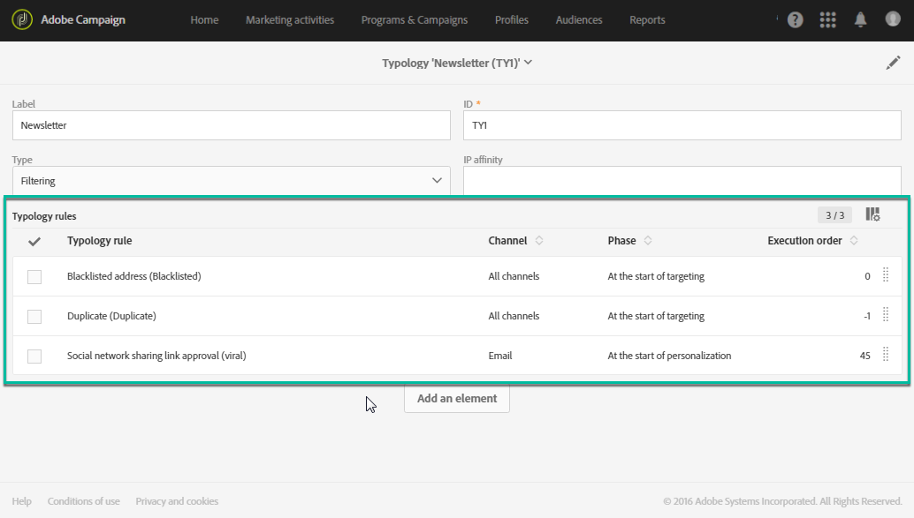
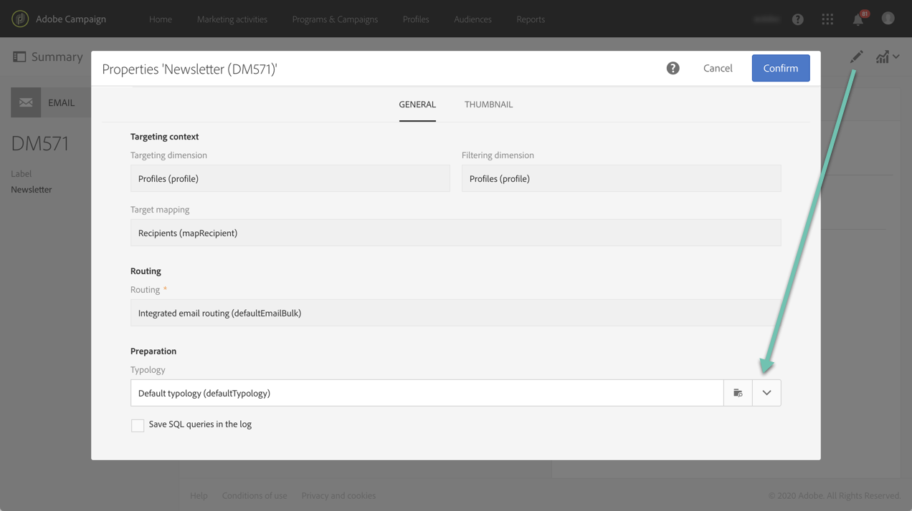

# Administración de tipologías {#managing-typologies}

## Acerca de las tipologías {#about-typologies}

Las tipologías son conjuntos de reglas que permiten comprobar la validez de un mensaje antes de enviarlo. Por ejemplo, podrá ver si el contenido del mensaje no está vacío, si hay un baja, si hay exclusión de duplicados, etc.

Se puede acceder a las tipologías a través del menú **[!UICONTROL Administration]** > **[!UICONTROL Channels]** > **[!UICONTROL Typologies]**. De forma predeterminada, hay una tipología predeterminada disponible en la aplicación. En función de sus necesidades, puede crear sus propias tipologías o modificar las existentes.

Para cada tipología, la sección **[!UICONTROL Typology rules]** lista el conjunto de reglas que se ejecutan al usar la tipología con un mensaje.

>[!NOTE]
>
>Para obtener más detalles sobre una de las reglas de tipología, haga doble clic en ella. La regla se mostrará en modo de solo lectura.

## Creación de una tipología {#creating-a-typology}

Para crear una nueva tipología, siga estos pasos:

1. Acceda al menú **[!UICONTROL Administration]** > **[!UICONTROL Channels]** > **[!UICONTROL Typologies]**.

1. Se muestra la lista de tipologías. Haga clic en el botón **[!UICONTROL Create]**.

   

1. Defina la tipología **[!UICONTROL Label]** y, luego, haga clic en el botón **[!UICONTROL Add an element]** para seleccionar las reglas de tipología que desee incluir en ella. Para obtener más información sobre las reglas de tipología, consulte [esta sección](../../sending/using/managing-typology-rules.md).

   

   >[!NOTE]
   >
   >El campo **[!UICONTROL IP affinity]** permite administrar las afinidades según la configuración. Se definen en el archivo de configuración de la instancia. Si desea utilizar las afinidades, póngase en contacto con el administrador.

1. Haga clic en **[!UICONTROL Create]** para confirmar la selección. Su tipología ya estará lista para utilizarse en los mensajes.

## Aplicación de tipologías a mensajes {#applying-typologies-to-messages}

Al asociar una tipología con una plantilla de mensaje o un mensaje, las reglas de tipología incluidas en ella se ejecutarán para comprobar la validez del mensaje.

>[!NOTE]
>
>A cada mensaje o plantilla de mensaje solo se le puede asignar una única tipología.

Para vincular una tipología a un mensaje, siga estos pasos:

1. Acceda a las propiedades del mensaje. Tenga en cuenta que se puede acceder a las plantillas de mensaje desde el menú de navegación **[!UICONTROL Resources]** > **[!UICONTROL Templates]**.

1. En la sección **[!UICONTROL Advanced parameters]** > **[!UICONTROL Preparation]**, seleccione la tipología para vincular al mensaje.

   

1. Haga clic en **[!UICONTROL Confirm]**.

   La tipología seleccionada está ahora vinculada al mensaje. Todas sus reglas de tipología asociadas se ejecutarán para comprobar la validez del mensaje.
