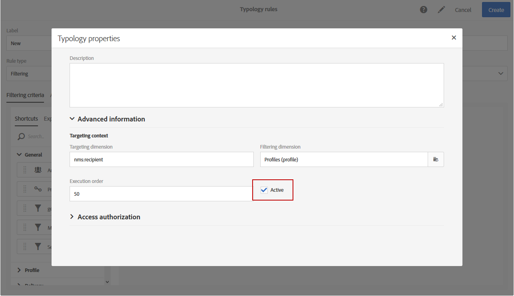

# Administración de reglas de tipología {#managing-typology-rules}

## Acerca de las reglas de tipología {#about-typology-rules}

Las reglas de tipología son reglas empresariales que permiten realizar comprobaciones y filtrados en el mensaje antes de enviarlo. Los tipos de reglas de tipología disponibles son:

* Reglas de **filtrado**: este tipo de regla le permite excluir una parte del destinatario de mensajes según los criterios definidos en una consulta, como perfiles en cuarentena o perfiles que ya se han enviado un determinado número de correos electrónicos. Para obtener más información, consulte [esta sección](../../sending/using/filtering-rules.md).

* Reglas de **fatiga**: este tipo de reglas le permite definir un número máximo de mensajes por perfil para evitar saturar demasiado. Para obtener más información, consulte [esta sección](../../sending/using/fatigue-rules.md).

* Reglas de **control**: este tipo de reglas permite al usuario comprobar la validez y la calidad de los mensajes antes de enviarlos, como la visualización de caracteres, el tamaño del mensaje SMS, el formato de la dirección, etc. Para obtener más información, consulte [esta sección](../../sending/using/control-rules.md).

Las reglas de tipología están disponibles en el menú **[!UICONTROL Administration]** > **[!UICONTROL Channels]** > **[!UICONTROL Typologies]** > **[!UICONTROL Typology rules]**.

De forma predeterminada, hay disponibles varias reglas de tipología de **filtrado** y **control** listas para usar. Se detallan en las secciones [Reglas de filtrado](../../sending/using/fatigue-rules.md) y [Reglas de control](../../sending/using/control-rules.md).

Según sus necesidades, puede modificar las reglas de tipología existentes o crear otras nuevas, excepto las reglas **[!UICONTROL Control]**, que son de solo lectura y no se pueden modificar.

## Crear una regla de tipología {#creating-a-typology-rule}

Los pasos principales para crear una regla de tipología son los siguientes:

1. Acceda al menú **[!UICONTROL Administration]** / **[!UICONTROL Channels]** / **[!UICONTROL Typologies]** / **[!UICONTROL Typology rules]** y haga clic en **[!UICONTROL Create]**.

   

1. Introduzca la tipología **[!UICONTROL Label]** y, a continuación, especifique el **[!UICONTROL Channel]** al cual debe aplicarse la regla.

   

1. Especifique la regla de tipología **[!UICONTROL Type]**, luego configúrela según sus necesidades. Tenga en cuenta que la configuración de reglas de tipología varía según el tipo. Para obtener más información, consulte las secciones **[Reglas de filtrado](../../sending/using/filtering-rules.md)** y **[Reglas de fatiga](../../sending/using/fatigue-rules.md)**.

1. Seleccione las tipologías en las que desea incluir la nueva regla. Para ello, seleccione la pestaña **[!UICONTROL Typologies]** y, a continuación, haga clic en el botón **[!UICONTROL Create element]**.

   

1. Seleccione la tipología que desee y haga clic en **[!UICONTROL Confirm]**.

   

1. Una vez seleccionadas todas las tipologías, haga clic en **[!UICONTROL Create]** para confirmar la creación de la regla de tipología.

## Orden de ejecución de las reglas de tipología {#typology-rules-execution-order}

Las reglas de tipología se ejecutan en un orden especificado durante las fases de direccionamiento, análisis y personalización de mensajes.

En el modo de operación estándar, las reglas se aplican en la siguiente secuencia:

1. Reglas de control, si se aplican al principio del objetivo.
1. Reglas de filtrado:

   * Reglas de aplicación nativas para la clasificación de direcciones: dirección definida/dirección no verificada/dirección en lista de bloqueados/dirección en cuarentena/calidad de la dirección.
   * Reglas de filtrado definidas por el usuario.

1. Reglas de control, si se aplican al final del objetivo.
1. Reglas de control, si se aplican al inicio de la personalización.
1. Reglas de control, si se aplican al final de la personalización.

Sin embargo, puede adaptar el orden de ejecución del mismo tipo de reglas en cada tipología. De hecho, cuando se ejecutan varias reglas durante la misma fase de procesamiento de mensajes, puede elegir el orden en que se aplican.

Por ejemplo, una regla de filtrado cuya orden de ejecución se posicione en el número 20 se ejecutará antes que una regla de filtrado cuya orden de ejecución se posicione en el número 30.

En **[!UICONTROL Properties]** de una regla de tipología, puede establecer su orden de ejecución. Cuando se deben aplicar varias reglas, el orden de ejecución de cada regla determina las que se deben procesar primero. Para obtener más información, consulte la sección [Orden de ejecución de las reglas de tipología](#typology-rules-execution-order).

Se puede desactivar una regla de tipología a través de **[!UICONTROL Properties]** si no desea que la regla se aplique en el momento en que se analizan los mensajes relacionados con la regla.

