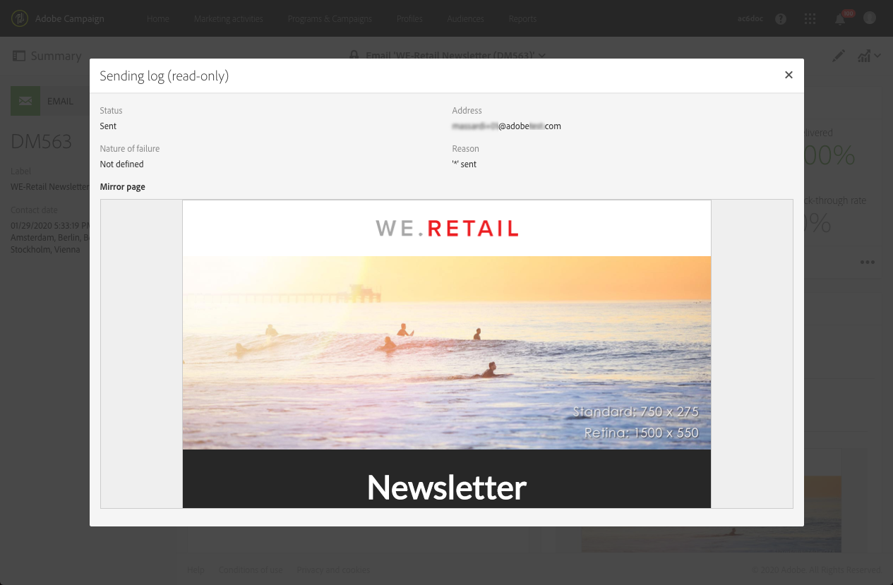

# Seguimiento de un envío{#monitoring-a-delivery}

Existen varias formas de supervisar un envío y medir su impacto. Como administrador funcional, puede acceder a los registros de mensajes y de envíos.

>[!IMPORTANT]
>
>Solo funcional [administradores](../../administration/using/users-management.md#functional-administrators), con **[!UICONTROL Administration]** función y acceso a **Todo** las unidades pueden acceder a los registros de envío, los registros de mensajes, los registros de seguimiento y los registros de exclusión o suscripción. Un usuario no administrador puede dirigirse a estos registros empezando por una tabla vinculada (perfiles, envío).

* **Registros de mensajes**: se puede acceder a estos registros directamente desde el panel de mensajes. Muestran los detalles del envío, qué destinatario se ha excluido y por qué, así como la información de seguimiento como aperturas y clics.

  Para ver los registros de mensajes, haga clic en el icono situado en la parte inferior derecha del bloque **[!UICONTROL Deployment]**.

  Varias pestañas contienen información (si existe) acerca de **[!UICONTROL Sending logs]**, **[!UICONTROL Exclusion logs]**, **[!UICONTROL Exclusion causes]**, **[!UICONTROL Tracking logs]** y **[!UICONTROL Tracked URLs]**. Consulte [Registros de envío](#delivery-logs).

  

  El registro contiene todos los mensajes relacionados con el envío y las pruebas. Los iconos específicos le permiten identificar errores o advertencias. Para obtener más información, consulte [Aprobación de mensajes](../../sending/using/previewing-messages.md).

  Para exportar el registro, haga clic en el botón **[!UICONTROL Export list]**.

  

* **Registros de trabajo**: Se puede acceder a una lista de los trabajos por lotes activados por la entrega desde el panel de mensajes seleccionando **[!UICONTROL Job history]** desde el **[!UICONTROL Summary]** lista desplegable.

  Seleccione cualquier trabajo de la lista para ver los detalles de los seleccionados **[!UICONTROL Batch job]**.

  

* **Alertas de envío**: para realizar un seguimiento de los envíos erróneos o correctos, Adobe Campaign proporciona un sistema de alertas por correo electrónico que envía notificaciones para informar a los usuarios de las actividades importantes del sistema.
* **Informes**: en el panel de mensajes, puede acceder a varios informes para este mensaje específico. También tiene el menú **[!UICONTROL Reports]**, que le permite acceder a una lista completa de informes integrados o personalizados que puede utilizar para crear métricas específicas relacionadas con su mensaje o campaña.
* Un administrador también puede exportar registros a un archivo independiente que se puede procesar en sus propias herramientas de creación de informes o de inteligencia de negocios. Para obtener más información, consulte [Exportación de registros](../../automating/using/exporting-logs.md).

**Temas relacionados:**

* [Recepción de alertas cuando se produzcan errores](../../sending/using/receiving-alerts-when-failures-happen.md)
* [Informes](../../reporting/using/about-dynamic-reports.md)

## Registros de envío {#delivery-logs}

### Registros de envío {#sending-logs}

La pestaña **[!UICONTROL Sending logs]** muestra el historial de cada ocurrencia de este envío. La lista de los mensajes enviados y sus estados se almacena aquí. Permite ver el estado de envío de cada destinatario.

Para cada perfil cuyo estado sea **[!UICONTROL Sent]**, la columna **[!UICONTROL Date]** muestra cuándo se envió el mensaje.

Para acceder a los detalles de un registro de envío específico, haga clic en el icono de lápiz a la derecha de la fila correspondiente.

Todos los detalles del registro de envío son de solo lectura. También puede ver una previsualización de la página espejo.

>[!NOTE]
>
>Para mostrar el procesamiento de páginas espejo en la interfaz de usuario de Campaign, la URL del servidor de páginas espejo debe ser segura. En ese caso, utilice https:// en lugar de http:// para configurar esta URL al [configurar su marca](../../administration/using/branding.md#configuring-and-using-brands).

### Registros de exclusión {#exclusion-logs}

La pestaña **[!UICONTROL Exclusion logs]** lista todos los mensajes que se han excluido del destinatario al que se han enviado y especifica el motivo del error de envío.

### Causas de exclusión {#exclusion-causes}

La pestaña **[!UICONTROL Exclusion causes]** muestra el volumen (en número de mensajes) de mensajes que se excluyeron del envío de destinatario.

