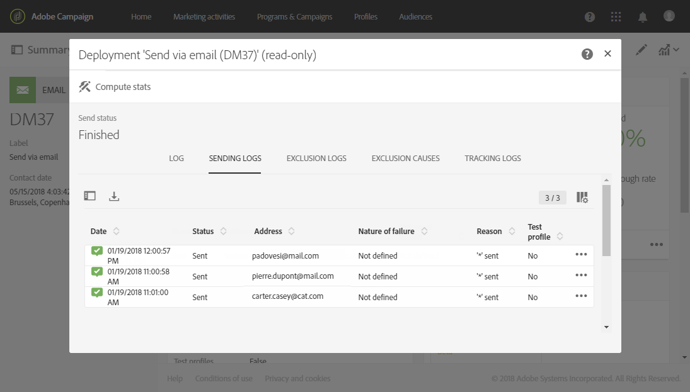

# Seguimiento de un envío{#monitoring-a-delivery}

Existen varias formas de supervisar una entrega y medir su impacto:

* **Registros** de mensajes: Se puede acceder a estos registros directamente desde el tablero de mensajes. Muestran los detalles del envío, qué destino se ha excluido y por qué, así como la información de seguimiento como aperturas y clics.

   Para ver los registros de mensajes, haga clic en el icono en la parte inferior derecha del **[!UICONTROL Deployment]** bloque.

   Varias fichas contienen información (si existe) acerca de **[!UICONTROL Sending logs]**, **[!UICONTROL Exclusion logs]**, **[!UICONTROL Exclusion causes]**, **[!UICONTROL Tracking logs]** y **[!UICONTROL Tracked URLs]**. Consulte Registros [de envío](#delivery-logs).

   

   El registro contiene todos los mensajes relacionados con la entrega y las pruebas. Los iconos específicos le permiten identificar errores o advertencias. Para obtener más información sobre esto, consulte [Aprobación de mensajes](../../sending/using/previewing-messages.md).

   Puede exportar el registro haciendo clic en el **[!UICONTROL Export list]** botón .

   

* **Alertas** de envío: Para realizar un seguimiento de los éxitos o errores de entrega, Adobe Campaign ofrece un sistema de alertas por correo electrónico que envía notificaciones para informar a los usuarios de las actividades importantes del sistema.
* **Informes**: Desde el tablero de mensajes, puede acceder a varios informes para este mensaje específico. También tiene un **[!UICONTROL Reports]** menú que le permite acceder a una lista completa de informes integrados o personalizados que puede utilizar para delinear métricas específicas relacionadas con su mensaje o campaña.
* Un administrador también puede exportar registros en un archivo independiente que se puede procesar en sus propias herramientas de informes o de BI. Para obtener más información sobre esto, consulte [Exportación de registros](../../automating/using/exporting-logs.md).

**Temas relacionados:**

* [Recibir alertas cuando se produzcan errores](../../sending/using/receiving-alerts-when-failures-happen.md)
* [Informes](../../reporting/using/about-dynamic-reports.md)

## Registros de envío {#delivery-logs}

### Envío de registros {#sending-logs}

La **[!UICONTROL Sending logs]** ficha ofrece un historial de cada incidencia de este envío. La lista de mensajes enviados y sus estados se almacena aquí. Permite ver el estado de entrega de cada destinatario.

Para cada perfil con un **[!UICONTROL Sent]** estado, la **[!UICONTROL Date]** columna muestra cuándo se envió el mensaje.

### Registros de exclusión {#exclusion-logs}

La **[!UICONTROL Exclusion logs]** ficha enumera todos los mensajes que se han excluido del destino enviado y especifica el motivo del error de envío.

### Causas de exclusión {#exclusion-causes}

La **[!UICONTROL Exclusion causes]** ficha muestra el volumen (en número de mensajes) de mensajes que se excluyeron del envío de destino.

