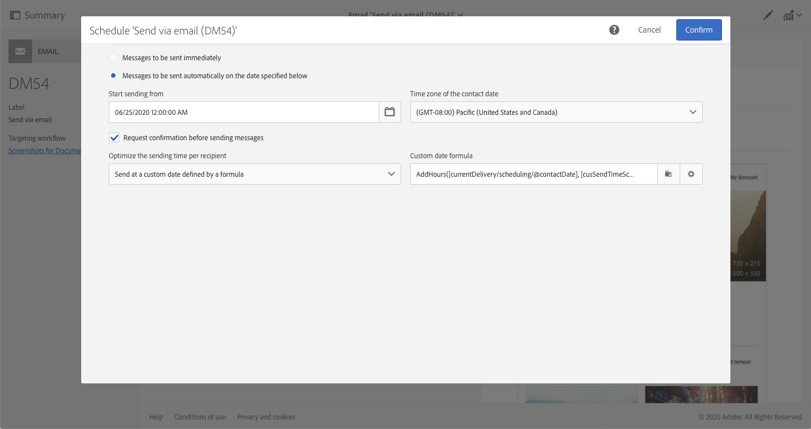
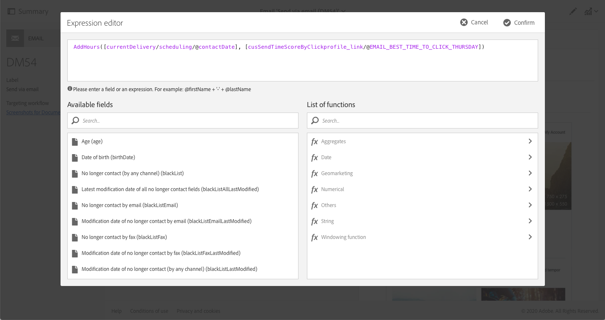
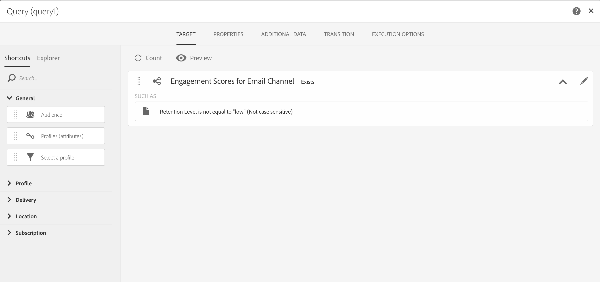

# Funciones de participación predictiva del usuario {#journey-ai}

Con Campaign, puede optimizar el diseño y el envío de los recorridos de los clientes para predecir las preferencias de participación de cada individuo. Con la tecnología de IA y aprendizaje automático, la optimización del tiempo de envío y la puntuación de participación predictiva de Adobe Campaign pueden analizar y predecir las tasas abiertas, los tiempos de envío óptimos y la probable reproducción basada en las métricas de participación históricas.

>[!IMPORTANT]
>
>Esta capacidad no está disponible de forma predeterminada como parte del producto. La implementación requiere la participación de Adobe Consulting. Póngase en contacto con el representante de su Adobe para obtener más información.

Adobe Campaign ofrece dos nuevos modelos de aprendizaje automático: **Optimización del tiempo de envío predictivo** y **Puntuación de participación predictiva**. Estos dos modelos son modelos de aprendizaje automático específicos para diseñar y ofrecer mejores recorridos de cliente.

* **Optimización del tiempo de envío predictivo** predice cuál es la mejor hora de envío para cada perfil de destinatario para aperturas de correos electrónicos o clics, y para aperturas de mensajes push. Para cada perfil de destinatario, las puntuaciones indican la mejor hora de envío para cada día de la semana y qué día es mejor para enviar y obtener los mejores resultados.

* **Puntuación de participación predictiva**: predice la probabilidad de que un destinatario se involucre con un mensaje, así como la probabilidad de exclusión (cancelar la suscripción) en los próximos 7 días después del siguiente envío de correo electrónico. Las probabilidades se dividen además en bloques según el nivel de participación previsto con el contenido: alto, medio o bajo. Estos modelos también proporcionan la clasificación del percentil de riesgo de cancelación de suscripción para que los clientes entiendan dónde está la clasificación de un determinado cliente en relación con otros.

## Optimización del tiempo de envío predictivo{#predictive-send-time}

La optimización del tiempo de envío predictivo predice cuál es la mejor hora de envío para cada perfil de destinatario para las aperturas de correos electrónicos o clics, y para las aperturas de mensajes push. Para cada perfil de destinatario, las puntuaciones indican la mejor hora de envío para cada día de la semana y qué día es mejor para enviar y obtener los mejores resultados.

Dentro del modelo de optimización del tiempo de envío predictivo, hay dos submodelos:

* **El tiempo de envío predictivo de la apertura** es el mejor momento para enviar una comunicación al cliente para maximizar las aperturas.

* **El tiempo de envío predictivo de los clics** es el mejor momento para enviar una comunicación al cliente para maximizar los clics

**Entrada de modelo**: registros de envío, registros de seguimiento y atributos de perfil (no PII).

**Salida de modelo**: el mejor momento para enviar un mensaje (para aperturas y clics).

Detalles de la salida

* Calcula la mejor hora del día para enviar un correo electrónico durante los 7 días de la semana con intervalos de 1 hora (por ejemplo: 9:00 a. m., 10:00 a. m., 11:00 a. m.)
* El modelo indicará el mejor día de la semana y la mejor hora de ese día.
* Cada horario óptimo se calcula dos veces: una vez para maximizar la tasa de apertura y otra para maximizar la tasa de clics.
* Se dan 16 campos (14 para los días de la semana y 2 para toda la semana):

* El mejor momento para enviar un correo electrónico para optimizar los clics los lunes: valores entre 0 y 23.

* El mejor momento para enviar un correo electrónico para optimizar las aperturas los lunes: valores entre 0 y 23.
* ...
* El mejor momento para enviar un correo electrónico para optimizar los clics los domingo: valores entre 0 y 23.
* El mejor momento para enviar un correo electrónico para optimizar las aperturas los domingos: valores entre 0 y 23.
* ...
* El mejor día para enviar un correo electrónico para optimizar las aperturas para toda la semana: de lunes a domingo.
* El mejor momento para enviar un correo electrónico para optimizar las aperturas para toda la semana: valores entre 0 y 23.

>[!NOTE]
>
>El modelo necesita al menos un mes de datos para producir resultados significativos.
>
>Estas funciones predictivas solo se aplican a los canales de correo electrónico y push.

Una vez implementadas en Campaign, las funciones de aprendizaje automático enriquecen los datos de perfiles con las pestañas nuevas con las mejores puntuaciones de aperturas y clics. Las métricas se calculan y se llevan a Campaign mediante flujos de trabajo técnicos.

Para acceder a estas métricas, debe hacer lo siguiente:

1. Abrir un perfil y hacer clic en el botón Editar.

1. Hacer clic en la pestaña **Puntuación de tiempo de envío por clic** o **Puntuación de tiempo de envío por apertura**.

De forma predeterminada, las puntuaciones de perfil proporcionarán la mejor hora del día para cada día de la semana y la mejor hora general de la semana.


### Enviar mensajes en el mejor momento{#use-predictive-send-time}

Para que los mensajes de correo electrónico se publiquen a una hora óptima para el perfil, el envío debe programarse con la opción **[!UICONTROL Send at a custom date defined by a formula]**.

Obtenga información sobre cómo calcular la fecha de envío [en esta sección](../../sending/using/computing-the-sending-date.md).

La fórmula debe rellenarse con la mejor hora específica del día en que se va a realizar el envío.



Ejemplo de la fórmula:

```
AddHours([currentDelivery/scheduling/@contactDate],
[cusSendTimeScoreByClickprofile_link/@EMAIL_BEST_TIME_TO_CLICK_WEDNESDAY])
```



>[!NOTE]
>
>El modelo de datos puede variar según la implementación.

## Puntuación de participación predictiva {#predictive-scoring}

La puntuación de participación predictiva predice la probabilidad de que un destinatario se involucre con un mensaje, así como la probabilidad de exclusión (cancelar la suscripción) en los próximos 7 días después del siguiente envío de correo electrónico.

Las probabilidades se dividen además en bloques según el nivel de participación previsto con el contenido: alto, medio o bajo. Estos modelos también proporcionan la clasificación del percentil de riesgo de cancelación de suscripción para que los clientes entiendan dónde está la clasificación de un determinado cliente en relación con otros.

La puntuación de participación predictiva le permite:

* **Seleccionar una audiencia**: mediante la actividad de consulta, puede seleccionar la audiencia para interactuar con un mensaje específico
* **Excluir una audiencia**: mediante la actividad de consulta, puede quitar la audiencia que tiene más probabilidades de cancelar la suscripción
* **Personalizar**: personalice los mensajes según el nivel de participación (los usuarios con un alto nivel de participación recibirán un mensaje diferente al que reciben los que no participan).

Este modelo utiliza varias puntuaciones para indicar:

* **Puntuación de participación de aperturas/Puntuación de participación de clics**: este valor coincide con la probabilidad de que un suscriptor interactúe con un mensaje específico (lo abra o haga clic). Los valores van del 0,0 al 1,0.
* **Probabilidad de baja**: este valor coincide con la probabilidad de que el destinatario cancele la suscripción del canal de correo electrónico a partir de un correo electrónico abierto. Los valores van del 0,0 al 1,0.
* **Nivel de retención**: este valor clasifica a los usuarios en tres niveles: baja, media y alta. Es muy probable que el nivel alto permanezca con la marca y que el bajo probablemente cancele la suscripción.
* **Clasificación del percentil de retención**: clasificación de perfiles en términos de las probabilidades de baja. Los valores van del 0,0 al 1,0. Por ejemplo, si la clasificación del porcentaje de retención es de 0,953, es más probable que este destinatario permanezca con la marca y tenga menos probabilidades de cancelar la suscripción que el 95,3 % de todos los destinatarios.

>[!NOTE]
>
>Estas funciones predictivas solo se aplican a los envíos de correo electrónico.
>
>El modelo necesita al menos un mes de datos para producir resultados significativos.

**Entrada de modelo**: registros de envío, registros de seguimiento y atributos de perfil específicos.

**Salida de modelo**: un atributo del perfil que describe su puntuación y categoría.

Para acceder a estas métricas, debe hacer lo siguiente:

1. Abrir un perfil y hacer clic en el botón Editar.

1. Haga clic en la pestaña **Puntuaciones de participación para el canal de correo electrónico**.

Mediante una actividad de consulta en un flujo de trabajo, puede utilizar la puntuación para optimizar la audiencia. Por ejemplo, con los criterios de **nivel de retención:**

