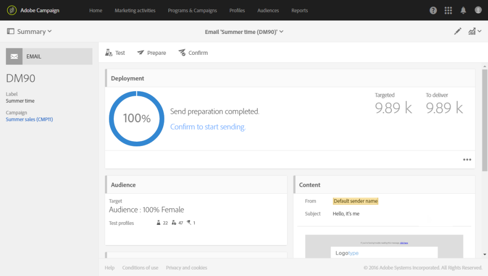

# Preparación del envío{#preparing-the-send}

La preparación corresponde al paso de calcular la población objetivo y generar el contenido del mensaje para cada perfil incluido en el objetivo. Una vez finalizada la preparación, los mensajes están listos para enviarse, ya sea inmediatamente o en [la fecha y la hora programadas](../../sending/using/about-scheduling-messages.md).

1. Para empezar a preparar el envío, haga clic en **Preparar** situado en la barra de acciones.

   

1. El **[!UICONTROL Deployment]** El bloque muestra el progreso de preparación y, a continuación, las estadísticas de preparación: número de mensajes dirigidos, número de mensajes que enviar, etc.

   En función del tamaño de la población de destinatarios, esta operación puede tardar algún tiempo.

   

1. Interrumpa la preparación en cualquier momento utilizando **Detener** , situado en la barra de acciones.

   Durante la fase de preparación, no se envían mensajes. Por lo tanto, puede iniciarla o detenerla sin riesgo alguno.

   

1. El mensaje se guarda automáticamente durante la fase de preparación para la entrega. Si necesita realizar cambios en la programación del mensaje después del paso de preparación, debe asegurarse de hacer clic en **[!UICONTROL Prepare]** botón de nuevo para que se tengan en cuenta esos cambios. Para obtener más información sobre cómo programar un mensaje, consulte [página](../../sending/using/about-scheduling-messages.md).

   

1. Para ver los registros de preparación, haga clic en el botón situado en la parte inferior derecha del bloque.

   

1. El **[!UICONTROL Deployment]** se abre la ventana, corrija los errores y reinicie la preparación.

   El último mensaje de registro muestra los mensajes de error y los errores. Un icono específico muestra el tipo de error encontrado: el icono amarillo indica un error de procesamiento no crítico, el icono rojo indica un error crítico que impide que se inicie la entrega.

   

1. Compruebe las estadísticas de preparación antes de confirmar el envío de los mensajes. Si el número de mensajes que se van a enviar no se corresponde con la configuración, edite la población de destino (consulte [Selección de una audiencia en un mensaje](../../audiences/using/selecting-an-audience-in-a-message.md)) y reinicie la preparación.

Una vez completada la preparación, el mensaje está listo para enviarse. Para obtener más información, consulte [Confirmación del envío](../../sending/using/confirming-the-send.md).

**Reglas de tipología**

Adobe Campaign incluye un conjunto de reglas de tipología integradas que se aplican durante la preparación del mensaje. Se utilizan para comprobar si un mensaje es válido y cumple con los criterios de calidad. Consulte [Tipologías](../../sending/using/about-typology-rules.md). Puede definir sus propias reglas de tipología, por ejemplo, y puede establecer reglas globales de fatiga entre canales que excluyan automáticamente los perfiles superpuestos de las campañas. Consulte [Reglas de fatiga](../../sending/using/fatigue-rules.md).

**Comprobación de mensaje SMS**

Si ha insertado campos de personalización o texto condicional en el contenido del mensaje SMS, estos factores pueden introducir caracteres que no se tienen en cuenta con la codificación GSM. Cuando se ejecuta la preparación, se supervisa la longitud del mensaje y se muestra un mensaje de advertencia si sobrepasa el límite.

Para obtener más información, consulte [Codificación, longitud y transliteración de SMS](../../administration/using/configuring-sms-channel.md#sms-encoding--length-and-transliteration) y [Personalización de mensajes SMS](../../channels/using/personalizing-sms-messages.md) secciones.
