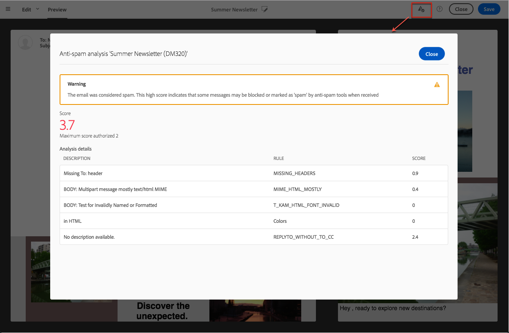

# Vista previa de entregas {#previewing-messages}

## Vista previa de correos electrónicos {#previewing-emails}

Campaign Standard le permite obtener una vista previa de los mensajes antes de enviarlos para comprobar su personalización y cómo los destinatarios los verán.

La vista previa de mensajes se realiza utilizando **Test profiles** que se añade al destino del mensaje.

Para los mensajes **email**, el Campaign Standard permite previsualizar los mensajes con perfiles de destino en lugar de perfiles de prueba. Esto le permite obtener una representación exacta del mensaje que recibirá un perfil específico. Para obtener más información, consulte [Prueba de mensajes de correo electrónico con perfiles de destino](../../sending/using/testing-messages-using-target.md).

Para obtener una vista previa de un mensaje con perfiles de prueba, siga estos pasos:

1. En [Email Designer](../../designing/using/designing-content-in-adobe-campaign.md), haga clic en el botón **[!UICONTROL Preview]**.

   

   Una vista de escritorio y una vista móvil interactiva del correo electrónico se muestran en paralelo.

1. Durante cada previsualización se realiza una comprobación automática del contenido no deseado. Haga clic en el botón **[!UICONTROL Anti-spam analysis]** para obtener más información sobre la advertencia.

   

1. Seleccione el botón **[!UICONTROL Change profile]** para elegir el perfil de prueba en el que desea probar los elementos de personalización.

   

1. Para salir del modo **[!UICONTROL Preview]** , haga clic en el botón **[!UICONTROL Edit]** en la parte superior izquierda de la pantalla.

   

**Temas relacionados**

* [Administración de perfiles de prueba](../../audiences/using/managing-test-profiles.md)
* [Prueba de mensajes de correo electrónico con perfiles de destino](../../sending/using/testing-messages-using-target.md)
* [Envío de pruebas](../../sending/using/sending-proofs.md)

## Vista previa de mensajes SMS {#previewing-sms}

Para los mensajes **SMS**, el Campaign Standard le permite previsualizar los mensajes mediante perfiles de prueba. Esto le permite obtener una representación exacta del mensaje que recibirá un perfil específico. Para obtener más información, consulte [Administración de perfiles de prueba](../../audiences/using/managing-test-profiles.md).

Para obtener una vista previa de un mensaje SMS con perfiles de prueba, siga estos pasos:

1. Una vez que haya rellenado el **[!UICONTROL Properties]** del mensaje SMS y seleccionado las audiencias, puede personalizar el envío. Para obtener más información, consulte [sección](../../channels/using/personalizing-sms-messages.md).

   

1. Después de personalizar el contenido, haga clic en **[!UICONTROL Create]** para acceder a la ventana **[!UICONTROL Summary]**.

1. En la ventana **[!UICONTROL Summary]** , haga clic en **[!UICONTROL Content]** para obtener una vista previa del envío.

   

1. Haga clic **[!UICONTROL Preview]** en la barra de herramientas.

   

1. Haga clic en **[!UICONTROL Change profile]** para seleccionar el perfil de prueba y luego en **[!UICONTROL Confirm]**.

   

Ahora puede ver la representación exacta del mensaje en función de los perfiles de prueba seleccionados.

**Temas relacionados**

* [Acerca de los mensajes SMS](../../channels/using/about-sms-messages.md)
* [Creación de un mensaje SMS](../../channels/using/creating-an-sms-message.md)
* [Personalización de mensajes SMS](../../channels/using/personalizing-sms-messages.md)

## Vista previa de notificaciones push {#previewing-push}

Para **Push notification**, el Campaign Standard permite previsualizar los mensajes mediante perfiles de prueba. Esto le permite obtener una representación exacta del mensaje que recibirá un perfil específico. Para obtener más información, consulte [Administración de perfiles de prueba](../../audiences/using/managing-test-profiles.md).

Para obtener una vista previa de una notificación push con perfiles de prueba, siga estos pasos:

1. Una vez que haya rellenado el **[!UICONTROL Properties]** de la notificación push y haya seleccionado las audiencias, puede personalizar el envío. Para obtener más información, consulte [Personalización de una notificación push](../../channels/using/customizing-a-push-notification.md).

1. Después de personalizar el contenido, puede comprobar directamente la renderización de las notificaciones push según los dispositivos y el sistema operativo en la ventana de vista previa.

   

1. Para previsualizar la notificación push con perfiles de prueba, haga clic en **[!UICONTROL Preview with test profile]**.

   

1. Seleccione el perfil de prueba y, a continuación, **[!UICONTROL Confirm]**.

Ahora puede ver la representación exacta del mensaje en función de los perfiles de prueba seleccionados.

**Temas relacionados**

* [Acerca de las notificaciones push](../../channels/using/about-push-notifications.md)
* [Preparación y envío de una notificación push](../../channels/using/preparing-and-sending-a-push-notification.md)
* [Personalización de una notificación push](../../channels/using/customizing-a-push-notification.md)

## Vista previa de mensajes en la aplicación {#previewing-in-app}

Para **In-App**, el Campaign Standard le permite previsualizar los mensajes mediante perfiles de prueba. Esto le permite obtener una representación exacta del mensaje que recibirá un perfil específico. Para obtener más información, consulte [Administración de perfiles de prueba](../../audiences/using/managing-test-profiles.md).

Para obtener una vista previa de un mensaje en la aplicación mediante perfiles de prueba, siga estos pasos:

1. Una vez que haya rellenado el **[!UICONTROL Properties]** del mensaje en la aplicación, haya seleccionado las audiencias y haya configurado el **[!UICONTROL Triggers]**, puede personalizar el envío. Para obtener más información, consulte [Personalización de un mensaje en la aplicación](../../channels/using/customizing-an-in-app-message.md).

1. Después de personalizar el contenido, puede comprobar directamente la renderización del mensaje en la aplicación según los dispositivos y el sistema operativo en la ventana de vista previa.

   

1. Para obtener una vista previa del mensaje en la aplicación con perfiles de prueba, haga clic en **[!UICONTROL Preview]**.

   

1. Seleccione el perfil de prueba y, a continuación, **[!UICONTROL Confirm]**.

Ahora puede ver la representación exacta del mensaje en función de los perfiles de prueba seleccionados.

**Temas relacionados**

* [Acerca de la mensajería en la aplicación](../../channels/using/about-in-app-messaging.md)
* [Preparación y envío de un mensaje en la aplicación](../../channels/using/preparing-and-sending-an-in-app-message.md)
* [Personalización de un mensaje en la aplicación](../../channels/using/customizing-an-in-app-message.md)
