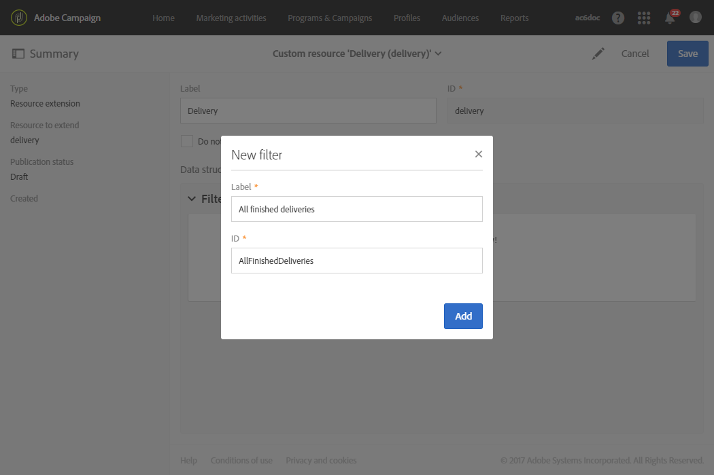

# Recepción de alertas cuando se produzcan errores{#receiving-alerts-when-failures-happen}

## Acerca de las alertas de entrega {#about-delivery-alerting}

La variable **Alertas de envío** es un sistema de gestión de alertas que permite a un grupo de usuarios recibir automáticamente notificaciones que contengan información sobre la ejecución de sus entregas.

Las notificaciones enviadas contienen un informe basado de forma predeterminada en los siguientes criterios:

* Entregas fallidas
* Entregas con una preparación fallida
* Entregas con una relación de error de rechazo suave incorrecta
* Entregas con una mala proporción de errores de devolución
* Entregas con un estado pendiente mayor que el habitual
* Entregas con un bajo rendimiento
* Entregas en curso

Los destinatarios de las alertas pueden monitorizar los envíos que está procesando Adobe Campaign y realizar las acciones adecuadas cuando hay problemas en su ejecución.

Estas notificaciones de alerta se pueden personalizar en función de criterios de alerta específicos definidos a través de un panel en la interfaz de Adobe Campaign.

>[!NOTE]
>
>Las notificaciones de alertas se envían únicamente por correo electrónico.

Las notificaciones enviadas contienen:

* A **[!UICONTROL Summary]** mostrar el número de envíos que cumplen los criterios definidos y la etiqueta/color elegido para cada criterio.
* A **[!UICONTROL Details]** lista de todos los criterios de entrega definidos para el panel correspondiente y todos los envíos para cada criterio.

## Tableros de alertas de entrega {#delivery-alerting-dashboards}

### Acerca de los paneles de alertas de entrega {#about-delivery-alerting-dashboards}

Para administrar los destinatarios de las notificaciones, definir los criterios de alerta y acceder al historial de las alertas, debe utilizar los paneles.

>[!NOTE]
>
>Para acceder y configurar los paneles y los criterios de alerta, debe tener derechos de administración o aparecer en la variable **Supervisores de envío** grupo de seguridad. Los usuarios de Standard no pueden acceder a los paneles de la interfaz de Adobe Campaign. Solo pueden recibir las notificaciones de alerta. Para obtener más información sobre usuarios y seguridad en Adobe Campaign, consulte [Tipos de usuarios](../../administration/using/users-management.md) y [Acerca de los grupos de seguridad](../../administration/using/managing-groups-and-users.md#about-security-groups).

Desde la interfaz de Adobe Campaign, puede:

* Cree y administre tableros de alertas de entrega. Consulte [Creación de un panel de alertas de entrega](#creating-a-delivery-alerting-dashboard).
* Defina y administre los criterios de alerta de envío para cada tablero. Por ejemplo, puede generar alertas basadas en envíos con errores de preparación o envíos con un rendimiento bajo solamente. Consulte [Acerca de los criterios de alerta](#about-alerting-criteria).
* Modifique los parámetros de criterios para cada tablero. Consulte [Parámetros de criterios](#criteria-parameters).
* Defina un grupo de destinatarios para cada tablero.

   Por ejemplo, desea informar a los usuarios solo con derechos de administración de los envíos fallidos. Sin embargo, desea que los usuarios de marketing reciban información sobre los envíos con una tasa de error de rechazo suave. Por lo tanto, debe crear dos tableros diferentes y definir los criterios que desee para cada grupo de destinatarios.

* Acceda al historial de todas las alertas enviadas para cada panel.

   Al seleccionar un tablero, la última alerta enviada para este tablero se muestra de forma predeterminada. Todas las alertas enviadas se muestran a la izquierda de la pantalla. Haga clic en un elemento de la **[!UICONTROL History]** para acceder a las alertas correspondientes.

### Creación de un panel de alertas de entrega {#creating-a-delivery-alerting-dashboard}

Si desea enviar notificaciones basadas en criterios específicos a distintos grupos de usuarios, debe utilizar varios paneles. Para crear un tablero nuevo:

1. Vaya a **[!UICONTROL Administration]** > **[!UICONTROL Channels]** > **[!UICONTROL Delivery alerting]**.
1. Seleccione **[!UICONTROL Delivery alerting dashboards]** y haga clic en **[!UICONTROL Create]**.
1. Marque la **[!UICONTROL Enabled]** para activar el tablero actual.

   Si esta opción está desactivada, ya no se envían las notificaciones vinculadas a este panel. Esta opción está desactivada de forma predeterminada.

   

1. Seleccione el grupo de destinatarios al que desea enviar una notificación desde la **[!UICONTROL Alert group]** lista desplegable. Para modificar o crear un grupo, consulte [Creación de un grupo de seguridad y asignación de usuarios](../../administration/using/managing-groups-and-users.md#creating-a-security-group-and-assigning-users).
1. En el **[!UICONTROL Delivery alerting criteria]** , haga clic en **[!UICONTROL Create element]** para agregar criterios. Consulte [Acerca de los criterios de alerta](#about-alerting-criteria).
1. Seleccione el botón **[!UICONTROL Edit properties]**. En el **[!UICONTROL Criteria parameters]** , defina cómo se aplicarán los criterios. Consulte [Parámetros de criterios](#criteria-parameters).
1. Haga clic en **[!UICONTROL Create]** para guardar el tablero.

Ahora, cada vez que una entrega cumple los criterios definidos en este panel, se envía una notificación de alerta al grupo de usuarios especificado.

## Criterios de alerta de entrega {#delivery-alerting-criteria}

### Acerca de los criterios de alerta {#about-alerting-criteria}

Para acceder a los criterios de alerta de entrega, vaya a **[!UICONTROL Administration]** > **[!UICONTROL Channels]** > **[!UICONTROL Delivery alerting]** y seleccione **[!UICONTROL Delivery alerting criteria]**.

En los paneles de alerta de envío se pueden usar los criterios siguientes:

* **[!UICONTROL Deliveries failed]**: Cualquier entrega programada dentro de un intervalo definido, con un estado incorrecto.
* **[!UICONTROL Deliveries with preparation failed]**: Cualquier entrega modificado dentro de un intervalo definido y para el que se ha producido un error en el paso de preparación (cálculo del objetivo y generación de contenido). Para obtener más información, consulte [Preparación del envío](../../sending/using/preparing-the-send.md).
* **[!UICONTROL Delivery with bad error ratio for soft bounces]**: Cualquier envío programado dentro de un intervalo definido, con un estado mínimo **[!UICONTROL In progress]**, con una proporción de error de rechazo suave buena que un porcentaje definido.
* **[!UICONTROL Delivery with bad error ratio for hard bounces]**: Cualquier envío programado dentro de un intervalo definido, con un estado mínimo **[!UICONTROL In progress]**, con una proporción de error de rechazo grave buena que un porcentaje definido.
* **[!UICONTROL Deliveries with long start pending]**: Cualquier envío programado dentro de un intervalo definido, con un **[!UICONTROL Start pending]** estado durante más de una duración definida, **[!UICONTROL Start pending]** lo que significa que el sistema aún no ha tenido en cuenta los mensajes.
* **[!UICONTROL Deliveries with low throughput]**: Cualquier envío iniciado durante más de una duración definida, con menos de un porcentaje definido de mensajes procesados, con un rendimiento inferior al valor definido.
* **[!UICONTROL Deliveries in progress]**: Cualquier envío programado dentro de un intervalo definido, con la variable **[!UICONTROL In progress]** estado.

>[!NOTE]
>
>Todos los parámetros que se aplican a los criterios anteriores tienen valores predeterminados. Estos valores se pueden cambiar en la variable **[!UICONTROL Criteria parameters]** de los paneles de alerta de envío. Consulte [Parámetros de criterios](#criteria-parameters).

Puede seleccionar cualquier elemento del **[!UICONTROL Delivery alerting criteria]** para acceder a sus detalles.

Para cada criterio, puede definir la siguiente configuración:

* **[!UICONTROL Indicators to add in alerts]**, es decir, las columnas que aparecerán en el informe **[!UICONTROL Details]** para las entregas correspondientes al criterio seleccionado.

   

* **[!UICONTROL Alert type]**, es decir, la etiqueta y el color que aparecen junto al criterio de entrega en el resumen de la notificación.

   

* **[!UICONTROL Criteria frequency]**: Si se cumple un criterio para una entrega, se repite en cada notificación enviada dentro del periodo de monitorización. De lo contrario, solo se enviará una alerta por día (en la primera incidencia) según el criterio de alerta para una entrega.

   De forma predeterminada, esta opción se establece en una vez al día para todos los criterios.

**Temas relacionados:**

* [Registros de envío](../../sending/using/monitoring-a-delivery.md#sending-logs)
* [Frecuencia de alertas](#alerting-frequency)
* [Iconos y estados de la actividad de marketing](../../start/using/marketing-activities.md#marketing-activity-icons-and-statuses)

### Creación de un criterio de alerta de entrega {#creating-a-delivery-alerting-criterion}

Puede crear nuevos criterios de alerta de envío para adaptarlos mejor a sus necesidades.

Por ejemplo, puede crear un nuevo criterio que permita enviar una notificación que incluya todas las entregas con una **[!UICONTROL Finished]** estado.

Para ello, primero debe ampliar la variable **Entrega** y añada un nuevo filtro que le permita seleccionar solo las entregas con un **[!UICONTROL Finished]** estado.

1. Vaya a **Adobe Campaign** > **Administración** > **Desarrollo** > **Recursos personalizados** y haga clic en **[!UICONTROL Create]**.
1. Select **[!UICONTROL Extend an existing resource]**, seleccione **[!UICONTROL Delivery]** recurso de la lista desplegable y haga clic en **[!UICONTROL Create]** para editarlo.

   

   Para obtener más información sobre la ampliación de un recurso existente, consulte [Definición del recurso](../../developing/using/creating-or-extending-the-resource.md).

1. En el **[!UICONTROL Delivery]** , vaya a la **[!UICONTROL Filter definition]** y haga clic en **[!UICONTROL Add an element]** para crear un filtro.

   

1. Edite la nueva definición del filtro: en el **[!UICONTROL Filter definition]** , arrastre y suelte la **[!UICONTROL Status]** en el espacio de trabajo y seleccione **[!UICONTROL Finished]** como condición de filtro.

   

   Para obtener más información sobre la creación y edición de filtros personalizados, consulte [Definir filtros](../../developing/using/configuring-filter-definition.md).

1. Guarde los cambios y publique los recursos. Para obtener más información, consulte [Publicación de un recurso personalizado](../../developing/using/updating-the-database-structure.md#publishing-a-custom-resource).

   El filtro se crea y ahora se puede seleccionar en un nuevo criterio de alerta de envío.

1. Vaya a **[!UICONTROL Administration]** > **[!UICONTROL Channels]** > **[!UICONTROL Delivery alerting]**, seleccione **[!UICONTROL Delivery alerting criteria]** y haga clic en **[!UICONTROL Create]**.
1. En el **[!UICONTROL Delivery filter applied by this criterion]** lista desplegable, seleccione el filtro que acaba de crear.

   

   Puede definir la configuración del criterio del mismo modo que para los criterios predeterminados. Consulte [Acerca de los criterios de alerta](#about-alerting-criteria).

Una vez creados, estos criterios se pueden añadir a un panel de alertas de envío, así como a otros criterios. Consulte [Acerca de los paneles de alertas de entrega](#about-delivery-alerting-dashboards).

**Temas relacionados:**

[Adición o ampliación de un recurso](../../developing/using/key-steps-to-add-a-resource.md)

## Parámetros de alerta de entrega {#delivery-alerting-parameters}

### Parámetros de criterios {#criteria-parameters}

En el **[!UICONTROL Criteria parameters]** pestaña de [panel de alertas de entrega](#creating-a-delivery-alerting-dashboard), puede definir la configuración que se aplica a los criterios seleccionados en este tablero.

* **[!UICONTROL Delivery target minimum size]**: Por ejemplo, si introduce 100 en este campo, se envía una notificación solo para las entregas con un objetivo igual o bueno a 100 destinatarios. Este parámetro se aplica a todos los criterios.
* **[!UICONTROL Monitoring period before and after the contact date (in hours)]**: Número de horas antes y después de la hora actual. Solo se tienen en cuenta las entregas con una fecha de contacto en este intervalo de tiempo. Este parámetro se aplica a todos los criterios. De forma predeterminada, el valor de este campo se establece en 24 horas.

   Para obtener más información sobre la fecha de contacto, consulte [Acerca de la programación](../../sending/using/about-scheduling-messages.md).

* **[!UICONTROL Maximum ratio of soft bounce errors]**: Se envía una notificación para todas las entregas con una proporción de error de rechazo leve buena que el valor especificado. De forma predeterminada, el valor de este campo se establece en 0,05 (5%).

   Para obtener más información sobre los errores de devolución, consulte [Clasificación del correo rechazado](../../sending/using/understanding-delivery-failures.md#bounce-mail-qualification) y [Lista de tipos de errores de entrega](../../sending/using/understanding-delivery-failures.md#delivery-failure-types-and-reasons).

* **[!UICONTROL Maximum ratio of hard bounce errors]**: Se envía una notificación para todas las entregas con una proporción de error de rechazo grave buena que el valor especificado. De forma predeterminada, el valor de este campo se establece en 0,05 (5%).

   Para obtener más información sobre los errores de rechazo grave, consulte [Clasificación del correo rechazado](../../sending/using/understanding-delivery-failures.md#bounce-mail-qualification) y [Lista de tipos de errores de entrega](../../sending/using/understanding-delivery-failures.md#delivery-failure-types-and-reasons).

* **[!UICONTROL Minimum time threshold for delivery in 'Start pending' status (in minutes)]**: Se envía una notificación para todas las entregas con un **[!UICONTROL Start pending]** estado durante más tiempo que la duración especificada en este campo, **[!UICONTROL Start pending]** lo que significa que el sistema aún no ha tenido en cuenta los mensajes.
* **[!UICONTROL Minimum time required for the computation of the throughput (in minutes)]**: Solo las entregas iniciadas (con **[!UICONTROL In progress]** ) para más de la duración especificada se tienen en cuenta para la variable **[!UICONTROL Deliveries with low throughput]** criterio.
* **[!UICONTROL Maximum percentage of processed messages for the computation of the throughput]**: Solo se tienen en cuenta las entregas con un porcentaje de mensajes procesados inferior al porcentaje especificado para la variable **[!UICONTROL Deliveries with low throughput]** criterio.
* **[!UICONTROL Minimum expected throughput (in sent messages per hour)]**: Solo se tienen en cuenta las entregas con un rendimiento inferior al valor especificado para la variable **[!UICONTROL Deliveries with low throughput]** criterio.
* **[!UICONTROL Minimum processed ratio required for 'Deliveries in progress' criterion]**: Solo se tienen en cuenta las entregas con un porcentaje de mensajes procesados superior al porcentaje especificado.

### Frecuencia de alertas {#alerting-frequency}

La variable **[!UICONTROL Frequency of delivery alerting]** permite definir el retardo entre dos envíos de alerta. De forma predeterminada, se establece en 10 minutos.

Puede cambiar esta configuración a través del **[!UICONTROL Administration]** > **[!UICONTROL Application settings]** > **[!UICONTROL Options]** para abrir el Navegador.

>[!NOTE]
>
>Esta opción se aplica a todos los tableros definidos en Adobe Campaign. No puede establecer una frecuencia específica para cada tablero.

## Motivos de las alertas de entrega {#delivery-alerting-reasons}

La variable **Alertas de envío** mantiene informados automáticamente a todos los usuarios de Adobe Campaign implicados sobre el estado de ejecución de la entrega, a través del correo electrónico y el panel.

Ahora, cuando reciba una notificación de alerta de envío, aquí tiene algunas sugerencias sobre lo que puede hacer.

En primer lugar, compruebe el **Registro** para ver toda la información relacionada con la entrega y las pruebas. Los iconos rojo y amarillo le permiten identificar errores o advertencias. El icono rojo indica un error crítico que impide que se inicie el envío.

Para ver el historial de cada ocurrencia de un envío, seleccione la opción **[!UICONTROL Sending logs]** pestaña . Contiene la lista de mensajes enviados y sus estados. Puede comprobar el estado de entrega de cada destinatario ( **[!UICONTROL Sent]**, **[!UICONTROL Pending]**, **[!UICONTROL Failed]**, etc.). Para obtener más información, consulte [Registros de envío](../../sending/using/monitoring-a-delivery.md#sending-logs).

A continuación, se indican algunos motivos posibles para recibir notificaciones de alerta según los criterios que se cumplan para una entrega.

* **[!UICONTROL Deliveries failed]**: Este criterio le informa de todas las entregas con un estado incorrecto. Puede deberse a:

   * Un problema con el servidor de entrega (MTA, Agente de transferencia de mensajes)
   * Tiempo de espera de conexión entre el servidor de entrega de Adobe Campaign y el servidor receptor
   * Un problema de envío
   * Un flujo de trabajo incorrecto

   Si la entrega se activa con un flujo de trabajo, compruebe si dicho flujo de trabajo se inició correctamente. Para obtener más información, consulte [Ejecución de un flujo de trabajo](../../automating/using/about-workflow-execution.md). De lo contrario, póngase en contacto con el administrador de Adobe Campaign para resolver el problema.

* **[!UICONTROL Deliveries with preparation failed]**: Se puede producir un error durante la preparación del envío en los siguientes casos:

   * A la entrega le falta un asunto.
   * Hay una sintaxis incorrecta en los campos de personalización.
   * Falta el objetivo.
   * La entrega supera el límite de tamaño.

   Para obtener más información, consulte [Preparación del envío](../../sending/using/preparing-the-send.md). Sin embargo, estos errores generalmente se detectan durante el análisis del mensaje. Consulte [Reglas de control](../../sending/using/control-rules.md).

* Las posibles causas de un **[!UICONTROL Delivery with bad error ratio for soft bounces]** la alerta puede ser:

   * El servidor del destinatario está inactivo.
   * El buzón del destinatario está lleno.

   Para obtener más información, consulte la **[!UICONTROL Exclusion logs]** y **[!UICONTROL Exclusion causes]** de los registros de envío. Consulte [Registros de exclusión](../../sending/using/monitoring-a-delivery.md#exclusion-logs).

   Las posibles causas de un **[!UICONTROL Delivery with bad error ratio for hard bounces]** la alerta puede ser:

   * El destinatario se añade a la  de lista de bloqueados, lo que significa que ya no desea que se le siga contactando.
   * La dirección de correo electrónico del destinatario no existe.
   * El dominio del destinatario no existe.
   * El servidor del destinatario está bloqueando la entrega.

   Para evitar errores de rechazos leves y graves, siga las prácticas recomendadas a continuación:

   * Genere reglas de tipología de filtrado para excluir una parte del destinatario de mensajes durante el análisis de envío, como los destinatarios en cuarentena. Consulte [Creación de una regla de filtrado](../../sending/using/filtering-rules.md).
   * Actualice con regularidad la base de datos de clientes para mantener buenos procesos de administración de cuarentena. Consulte [Acerca de las cuarentenas](../../sending/using/understanding-quarantine-management.md#about-quarantines).
   * En términos generales, mejore la capacidad de envío lo mejor que pueda. Consulte Adobe Campaign [Capacidad de entrega](../../sending/using/about-deliverability.md) documentación detallada y póngase en contacto con el administrador de Adobe Campaign para obtener ayuda.

* **[!UICONTROL Deliveries with long start pending]**: Normalmente esto significa que hay un problema en el nivel de MTA (Agente de transferencia de mensajes). El proceso de ejecución está esperando a que estén disponibles algunos recursos. Es posible que el MTA no se haya iniciado.

   **[!UICONTROL Deliveries with low throughput]**: De nuevo, se trata de un problema de entrega que significa que el MTA es demasiado lento.

   Para obtener más información sobre estos problemas, póngase en contacto con su administrador de Adobe Campaign.

**Temas relacionados:**

* [Comprensión de los errores de entrega](../../sending/using/understanding-delivery-failures.md)
* [Comprensión de la gestión de la cuarentena](../../sending/using/understanding-quarantine-management.md)
* [Acerca de la inclusión y la exclusión en Campaign](../../audiences/using/about-opt-in-and-opt-out-in-campaign.md)
