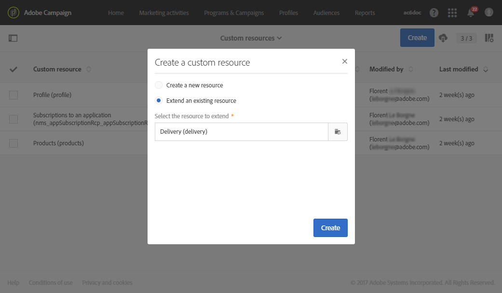

# Recibir alertas cuando se produzcan errores{#receiving-alerts-when-failures-happen}

## Acerca de las alertas de envío {#about-delivery-alerting}

The **Delivery alerting** feature is an alert management system that enables a group of users to automatically receive notifications containing information on the execution of their deliveries.

Las notificaciones enviadas contienen un informe basado de forma predeterminada en los siguientes criterios:

* Envíos fallidos
* Envíos con error de preparación
* Envíos con una relación de error de devolución en blanco incorrecta
* Envíos con una tasa de error de devolución de disco duro incorrecta
* Envíos con un estado pendiente mayor de lo habitual
* Envíos con bajo rendimiento
* Envíos en curso

Los destinatarios de las alertas pueden supervisar los envíos que está procesando Adobe Campaign y realizar las acciones oportunas cuando hay problemas en su ejecución.

Estas notificaciones de alerta se pueden personalizar en función de criterios de alerta específicos definidos mediante un panel en la interfaz de Adobe Campaign.

>[!NOTE]
>
>Las notificaciones de alertas se envían únicamente por correo electrónico.

Las notificaciones enviadas contienen:

* Un **[!UICONTROL Summary]** cuadro que muestra el número de envíos que cumplen los criterios definidos y la etiqueta o el color que se seleccionan para cada criterio.
* Una **[!UICONTROL Details]** sección que enumera todos los criterios de envío definidos para el panel correspondiente y todos los envíos para cada criterio.

## Paneles de alerta de envío {#delivery-alerting-dashboards}

### Acerca de los paneles de alertas de envío {#about-delivery-alerting-dashboards}

Para administrar los destinatarios de las notificaciones, definir los criterios de alerta y acceder al historial de las alertas, debe utilizar paneles.

>[!NOTE]
>
>Para acceder y configurar los paneles y los criterios de alerta, debe tener derechos de administración o aparecer en el grupo de seguridad de supervisores **de** Envío. Los usuarios estándar no pueden acceder a los paneles en la interfaz de Adobe Campaign. Solo pueden recibir las notificaciones de alerta. Para obtener más información sobre usuarios y seguridad en Adobe Campaign, consulte [Tipos de usuarios](../../administration/using/users-management.md) y [Acerca de los grupos](../../administration/using/managing-groups-and-users.md#about-security-groups)de seguridad.

Desde la interfaz de Adobe Campaign, puede:

* Cree y gestione paneles de alertas de envío. Consulte [Creación de un panel](#creating-a-delivery-alerting-dashboard)de alertas de envío.
* Defina y gestione los criterios de alerta de envío para cada panel. Por ejemplo, puede generar alertas basadas en envíos con una preparación fallida o envíos con un rendimiento bajo solamente. Consulte [Acerca de los criterios](#about-alerting-criteria)de alerta.
* Modifique los parámetros de criterios para cada panel. Consulte Parámetros [de criterios](#criteria-parameters).
* Defina un grupo de destinatarios para cada panel.

   Por ejemplo, desea informar a los usuarios con derechos de administración únicamente de los envíos con errores. Sin embargo, desea que los usuarios de mercadotecnia reciban información sobre los envíos con una tasa de error negativa de devolución suave. Por lo tanto, debe crear dos paneles diferentes y definir los criterios que desee para cada grupo de destinatarios.

* Acceda al historial de todas las alertas enviadas para cada panel.

   Al seleccionar un panel, la última alerta enviada para este panel se muestra de forma predeterminada. Todas las alertas enviadas se muestran a la izquierda de la pantalla. Haga clic en un elemento de la **[!UICONTROL History]** lista para acceder a las alertas correspondientes.

### Creación de un panel de alertas de envío {#creating-a-delivery-alerting-dashboard}

Si desea enviar notificaciones basadas en criterios específicos a distintos grupos de usuarios, debe utilizar varios paneles. Para crear un nuevo panel:

1. Vaya a **[!UICONTROL Administration]** > **[!UICONTROL Channels]** > **[!UICONTROL Delivery alerting]**.
1. Seleccione **[!UICONTROL Delivery alerting dashboards]** y haga clic en **[!UICONTROL Create]**.
1. Marque la **[!UICONTROL Enabled]** casilla para activar el panel actual.

   Si esta opción está desactivada, ya no se envían las notificaciones vinculadas a este panel. Esta opción está desactivada de forma predeterminada.

   

1. Seleccione el grupo de destinatarios que desea notificar desde la lista **[!UICONTROL Alert group]** desplegable. Para modificar o crear un grupo, consulte [Creación de un grupo de seguridad y asignación de usuarios](../../administration/using/managing-groups-and-users.md#creating-a-security-group-and-assigning-users).
1. En la **[!UICONTROL Delivery alerting criteria]** sección, haga clic en **[!UICONTROL Create element]** para agregar criterios. Consulte [Acerca de los criterios](#about-alerting-criteria)de alerta.
1. Seleccione el botón **[!UICONTROL Edit properties]**. En la **[!UICONTROL Criteria parameters]** ficha, defina cómo se aplicarán los criterios. Consulte Parámetros [de criterios](#criteria-parameters).
1. Click **[!UICONTROL Create]** to save the dashboard.

Ahora, cada vez que un envío cumpla los criterios definidos en este panel, se enviará una notificación de alerta al grupo de usuarios especificado.

## Criterios de alerta de envío {#delivery-alerting-criteria}

### Acerca de los criterios de alerta {#about-alerting-criteria}

Para acceder a los criterios de alerta de envío, vaya a **[!UICONTROL Administration]** > **[!UICONTROL Channels]** > **[!UICONTROL Delivery alerting]** y seleccione **[!UICONTROL Delivery alerting criteria]**.

Los siguientes criterios se pueden usar en los paneles de alerta de envío:

* **[!UICONTROL Deliveries failed]**:: Cualquier envío programado dentro de un rango definido, con un estado erróneo.
* **[!UICONTROL Deliveries with preparation failed]**:: Cualquier envío modificado dentro de un rango definido, para el cual ha fallado el paso de preparación (cálculo de destinatarios y generación de contenido). Para obtener más información sobre esto, consulte [Preparación del envío](../../sending/using/preparing-the-send.md).
* **[!UICONTROL Delivery with bad error ratio for soft bounces]**:: Cualquier envío programado dentro de un rango definido, con un estado al menos **[!UICONTROL In progress]**, con una proporción de error de devolución suave buena que un porcentaje definido.
* **[!UICONTROL Delivery with bad error ratio for hard bounces]**:: Cualquier envío programado dentro de un rango definido, con un estado al menos **[!UICONTROL In progress]**, con una proporción de error de devolución buena que un porcentaje definido.
* **[!UICONTROL Deliveries with long start pending]**:: Cualquier envío programado dentro de un rango definido, con un estado **[!UICONTROL Start pending]** mayor que el definido, **[!UICONTROL Start pending]** lo que significa que el sistema aún no ha tenido en cuenta los mensajes.
* **[!UICONTROL Deliveries with low throughput]**:: Cualquier envío iniciado durante más tiempo del definido, con menos de un porcentaje definido de mensajes procesados, con un rendimiento inferior al valor definido.
* **[!UICONTROL Deliveries in progress]**:: Cualquier envío programado dentro de un rango definido, con el **[!UICONTROL In progress]** estado.

>[!NOTE]
>
>Todos los parámetros que se aplican a los criterios anteriores tienen valores predeterminados. Estos valores se pueden cambiar en la **[!UICONTROL Criteria parameters]** ficha de los paneles de alerta de envío. Consulte Parámetros [de criterios](#criteria-parameters).

Puede seleccionar cualquier elemento de la **[!UICONTROL Delivery alerting criteria]** lista para acceder a sus detalles.

Para cada criterio, puede definir la siguiente configuración:

* **[!UICONTROL Indicators to add in alerts]**, es decir, las columnas que aparecerán en la sección **[!UICONTROL Details]** de la notificación para los envíos correspondientes al criterio seleccionado.

   

* **[!UICONTROL Alert type]**, es decir, la etiqueta y el color que aparecerán junto al criterio de envío en el resumen de la notificación.

   

* **[!UICONTROL Criteria frequency]**:: Si se cumple un criterio para un envío, se repite en cada notificación enviada dentro del período de seguimiento. De lo contrario, solo se enviará una alerta por día (en la primera incidencia) según el criterio de alerta de un envío.

   De forma predeterminada, esta opción se establece en una vez al día para todos los criterios.

**Temas relacionados:**

* [Registros de envío](../../sending/using/monitoring-a-delivery.md#sending-logs)
* [Frecuencia de alerta](#alerting-frequency)
* [Iconos y estados de la actividad de marketing](../../start/using/marketing-activities.md#marketing-activity-icons-and-statuses)

### Creación de un criterio de alerta de envío {#creating-a-delivery-alerting-criterion}

Puede crear nuevos criterios de alerta de envío para adaptarlos mejor a sus necesidades.

Por ejemplo, puede crear un nuevo criterio que permita enviar una notificación con todos los envíos con un **[!UICONTROL Finished]** estado.

Para ello, primero debe ampliar el recurso de **Envío** y agregar un nuevo filtro que le permita seleccionar solo los envíos con un **[!UICONTROL Finished]** estado.

1. Vaya a **Adobe Campaign** > **Administración** > **Desarrollo** > Recursos **** personalizados y haga clic en **[!UICONTROL Create]**.
1. Seleccione **[!UICONTROL Extend an existing resource]**, seleccione el **[!UICONTROL Delivery]** recurso en la lista desplegable y haga clic en **[!UICONTROL Create]** para editarlo.

   

   Para obtener más información sobre cómo ampliar un recurso existente, consulte [Definir el recurso](../../developing/using/creating-or-extending-the-resource.md).

1. En el **[!UICONTROL Delivery]** recurso, vaya a la **[!UICONTROL Filter definition]** ficha y haga clic en **[!UICONTROL Add an element]** para crear un filtro.

   

1. Edite la nueva definición del filtro: en la **[!UICONTROL Filter definition]** ventana, arrastre y suelte el **[!UICONTROL Status]** elemento en el espacio de trabajo y selecciónelo **[!UICONTROL Finished]** como condición del filtro.

   

   Para obtener más información sobre la creación y edición de filtros personalizados, consulte [Definición de filtros](../../developing/using/configuring-filter-definition.md).

1. Guarde los cambios y publique los recursos. For more on this, see [Publishing a custom resource](../../developing/using/updating-the-database-structure.md#publishing-a-custom-resource).

   El filtro se crea y ahora se puede seleccionar en un nuevo criterio de alerta de envío.

1. Vaya a **[!UICONTROL Administration]** > **[!UICONTROL Channels]** > **[!UICONTROL Delivery alerting]**, seleccione **[!UICONTROL Delivery alerting criteria]** y haga clic en **[!UICONTROL Create]**.
1. En la lista **[!UICONTROL Delivery filter applied by this criterion]** desplegable, seleccione el filtro que acaba de crear.

   

   Puede definir la configuración del criterio del mismo modo que para los criterios predeterminados. Consulte [Acerca de los criterios](#about-alerting-criteria)de alerta.

Una vez creados, estos criterios se pueden agregar a un panel de alertas de envío, así como a otros criterios. Consulte [Acerca de los paneles](#about-delivery-alerting-dashboards)de alertas de envío.

**Temas relacionados:**

[Adición o ampliación de un recurso](../../developing/using/key-steps-to-add-a-resource.md)

## Parámetros de alerta de envío {#delivery-alerting-parameters}

### Parámetros de criterios {#criteria-parameters}

En la **[!UICONTROL Criteria parameters]** ficha de un panel [de alertas de](#creating-a-delivery-alerting-dashboard)envío, puede definir la configuración que se aplica a los criterios seleccionados en este panel.

* **[!UICONTROL Delivery target minimum size]**:: Por ejemplo, si introduce 100 en este campo, se enviará una notificación solo para envíos con un destinatario igual o bueno a 100 destinatarios. Este parámetro se aplica a todos los criterios.
* **[!UICONTROL Monitoring period before and after the contact date (in hours)]**:: Número de horas antes y después de la hora actual. Sólo se tienen en cuenta los envíos que tengan una fecha de contacto en este intervalo de tiempo. Este parámetro se aplica a todos los criterios. De forma predeterminada, el valor de este campo se establece en 24 horas.

   Para obtener más información sobre la fecha de contacto, consulte [Acerca de la programación](../../sending/using/about-scheduling-messages.md).

* **[!UICONTROL Maximum ratio of soft bounce errors]**:: Se envía una notificación para todos los envíos con una proporción de error de devolución suave buena que el valor especificado. De forma predeterminada, el valor de este campo está establecido en 0,05 (5%).

   Para obtener más información acerca de los errores de devolución suave, consulte [Rebotar cualificación](../../sending/using/understanding-delivery-failures.md#bounce-mail-qualification) de correo y [Lista de tipos](../../sending/using/understanding-delivery-failures.md#delivery-failure-types-and-reasons)de error de envío.

* **[!UICONTROL Maximum ratio of hard bounce errors]**:: Se envía una notificación para todos los envíos con una proporción de error de devolución forzada buena que no sea el valor especificado. De forma predeterminada, el valor de este campo está establecido en 0,05 (5%).

   Para obtener más información acerca de los errores de devolución, consulte [Rebotar cualificación](../../sending/using/understanding-delivery-failures.md#bounce-mail-qualification) de correo y [Lista de tipos](../../sending/using/understanding-delivery-failures.md#delivery-failure-types-and-reasons)de error de envío.

* **[!UICONTROL Minimum time threshold for delivery in 'Start pending' status (in minutes)]**:: Se envía una notificación para todos los envíos con un estado **[!UICONTROL Start pending]** mayor que el especificado en este campo, lo que significa que el sistema no ha tenido en cuenta los mensajes aún **[!UICONTROL Start pending]** .
* **[!UICONTROL Minimum time required for the computation of the throughput (in minutes)]**:: Solo se tienen en cuenta para el criterio los envíos iniciados (con **[!UICONTROL In progress]** estado) durante más tiempo del especificado **[!UICONTROL Deliveries with low throughput]** .
* **[!UICONTROL Maximum percentage of processed messages for the computation of the throughput]**:: Para el **[!UICONTROL Deliveries with low throughput]** criterio solo se tienen en cuenta los envíos con un porcentaje de mensajes procesados inferior al porcentaje especificado.
* **[!UICONTROL Minimum expected throughput (in sent messages per hour)]**:: Solo se tienen en cuenta para el **[!UICONTROL Deliveries with low throughput]** criterio los envíos con un rendimiento inferior al valor especificado.
* **[!UICONTROL Minimum processed ratio required for 'Deliveries in progress' criterion]**:: Solo se tienen en cuenta los envíos con un porcentaje de mensajes procesados superior al porcentaje especificado.

### Frecuencia de alerta {#alerting-frequency}

La **[!UICONTROL Frequency of delivery alerting]** opción permite definir el retraso entre dos envíos de alertas. De forma predeterminada, se establece en 10 minutos.

Puede cambiar esta configuración a través del menú **[!UICONTROL Administration]** > **[!UICONTROL Application settings]** > **[!UICONTROL Options]** .

>[!NOTE]
>
>Esta opción se aplica a todos los paneles definidos en Adobe Campaign. No se puede establecer una frecuencia específica para cada panel.

## Motivos de alerta de envío {#delivery-alerting-reasons}

La función de alerta **de** Envío mantiene informados automáticamente a todos los usuarios de Adobe Campaign implicados sobre el estado de ejecución de envío, por correo electrónico y panel.

Ahora, cuando recibe una notificación de alerta de envío, aquí tiene algunos consejos sobre lo que puede hacer.

En primer lugar, marque la ficha **Registro** del envío para vista de toda la información relacionada con el envío y las pruebas. Los iconos rojo y amarillo le permiten identificar errores o advertencias. El icono rojo indica un error crítico que impide que se inicie el envío.

Para vista del historial de cada incidencia de un envío, seleccione la **[!UICONTROL Sending logs]** ficha. Contiene la lista de los mensajes enviados y sus estados. Allí puede comprobar el estado del envío de cada destinatario ( **[!UICONTROL Sent]**, **[!UICONTROL Pending]**, **[!UICONTROL Failed]**, etc.). For more on this, see [Sending logs](../../sending/using/monitoring-a-delivery.md#sending-logs).

A continuación se indican algunos motivos posibles para recibir las notificaciones de alerta según los criterios que se cumplen en un envío.

* **[!UICONTROL Deliveries failed]**:: Este criterio le informa de todos los envíos con un estado erróneo. Puede deberse a:

   * Un problema con el servidor de envío (MTA, Agente de transferencia de mensajes)
   * Tiempo de espera de conexión entre el servidor de Adobe Campaign envío y el servidor receptor
   * Un problema de entrega
   * Un flujo de trabajo erróneo

   Si el envío se activa con un flujo de trabajo, compruebe si el flujo de trabajo se inició correctamente. Para obtener más información sobre esto, consulte [Ejecución de un flujo de trabajo](../../automating/using/about-workflow-execution.md). De lo contrario, póngase en contacto con el administrador de Adobe Campaign para resolver el problema.

* **[!UICONTROL Deliveries with preparation failed]**:: Puede producirse un error durante la preparación del envío en los siguientes casos:

   * Al envío le falta un asunto.
   * Hay una sintaxis incorrecta en los campos de personalización.
   * Falta el destinatario.
   * El envío supera el límite de tamaño.

   Para obtener más información sobre esto, consulte [Preparación del envío](../../sending/using/preparing-the-send.md). Sin embargo, estos errores generalmente se detectan durante la análisis del mensaje. Consulte Reglas [de control](../../sending/using/control-rules.md).

* Las posibles causas de una **[!UICONTROL Delivery with bad error ratio for soft bounces]** alerta pueden ser:

   * El servidor del destinatario no funciona.
   * El buzón del destinatario está lleno.

   Para obtener más información, consulte las fichas **[!UICONTROL Exclusion logs]** y **[!UICONTROL Exclusion causes]** los registros de envío. Consulte Registros [de](../../sending/using/monitoring-a-delivery.md#exclusion-logs)exclusión.

   Las posibles causas de una **[!UICONTROL Delivery with bad error ratio for hard bounces]** alerta pueden ser:

   * El destinatario se agrega a la  de lista de bloqueados, lo que significa que ya no desea que se contacte con ellos.
   * La dirección de correo electrónico del destinatario no existe.
   * El dominio del destinatario no existe.
   * El servidor del destinatario está bloqueando el envío.

   Para evitar errores de devolución en blanco y en bruto, siga las optimizaciones a continuación:

   * Cree reglas de tipología de filtrado para excluir una parte del destinatario de mensajes durante la análisis de envío, como destinatarios en cuarentena. See [Creating a filtering rule](../../sending/using/filtering-rules.md).
   * Actualice regularmente la base de datos de clientes para mantener los procesos de gestión de cuarentenas correctos. Consulte [Acerca de las cuarentenas](../../sending/using/understanding-quarantine-management.md#about-quarantines).
   * En términos generales, mejore la capacidad de entrega lo mejor posible. Consulte la documentación detallada de Adobe Campaign [Delivery](../../sending/using/about-deliverability.md) y póngase en contacto con el administrador de Adobe Campaign para obtener ayuda.

* **[!UICONTROL Deliveries with long start pending]**:: Generalmente esto significa que hay un problema en el nivel de MTA (Agente de transferencia de mensajes). El proceso de ejecución está esperando a que estén disponibles algunos recursos. Es posible que el MTA no se haya iniciado.

   **[!UICONTROL Deliveries with low throughput]**:: Nuevamente, este es un problema de entrega, lo que significa que el MTA es demasiado lento.

   Para obtener más información sobre estos problemas, póngase en contacto con el administrador de Adobe Campaign.

**Temas relacionados:**

* [Comprensión de los errores de entrega](../../sending/using/understanding-delivery-failures.md)
* [Comprensión de la gestión de la cuarentena](../../sending/using/understanding-quarantine-management.md)
* [Acerca de la inclusión y la exclusión en Campaign](../../audiences/using/about-opt-in-and-opt-out-in-campaign.md)

