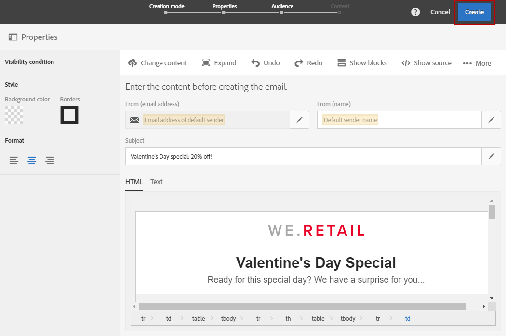

# Envío de mensajes en el huso horario del destinatario{#sending-messages-at-the-recipient-s-time-zone}

Al administrar una campaña en la que la fecha y la hora son importantes, puede programar una entrega que tenga en cuenta la hora local de cada destinatario: recibirán notificaciones push, por correo electrónico o SMS en el momento que usted programe, en su propio huso horario.

>[!NOTE]
>
>Para utilizar esta funcionalidad, asegúrese de que todos los perfiles a los que se dirige su entrega tengan un huso horario especificado en la sección **[!UICONTROL Address]** de sus propiedades. Para obtener más información sobre el acceso a las propiedades del perfil, consulte esta [sección](../../audiences/using/editing-profiles.md).

Para enviar una entrega en el huso horario del destinatario, también puede utilizar la actividad **[!UICONTROL Scheduler]** en un flujo de trabajo. Para obtener más información, consulte [esta página](../../automating/using/scheduler.md).

En el siguiente ejemplo, queremos enviar un código promocional que solo sea válido en San Valentín a todos los clientes en todo el mundo. Para disponer de tiempo suficiente para utilizarlo durante el día, todos los clientes deben recibir su mensaje el 14 de febrero a las 8:00 a. m., según sus husos horarios.

1. En la pestaña **[!UICONTROL Marketing activities]**, inicie la creación de su envío, en nuestro caso un correo electrónico. Para obtener más información sobre la creación de envíos, consulte esta [sección](../../channels/using/creating-an-email.md).
1. Después de diseñar el correo electrónico de San Valentín, haga clic en **[!UICONTROL Create]** para acceder al panel de control de entregas. Para obtener más información sobre el diseño de correo electrónico, consulte esta [página](../../designing/using/personalization.md#example-email-personalization).

   

1. En el panel de control de entregas, seleccione el bloque **[!UICONTROL Schedule]**.

   

1. Seleccione la opción **[!UICONTROL Messages to be sent automatically on the date]** especificada a continuación. Luego, en el campo **[!UICONTROL Start sending from]**, establezca la fecha de contacto, en nuestro caso el 14 de febrero a las 8:00 a. m. para que cada destinatario lo reciba en el día de San Valentín.

   

1. En el campo **[!UICONTROL Time zone of the contact date]**, seleccione el huso horario en el que debe enviarse el envío de forma predeterminada.

   Si el **[!UICONTROL Time zone]** de un perfil se queda como **[!UICONTROL Default]**, los destinatarios recibirán el envío según el huso horario elegido aquí.

1. En el menú desplegable **[!UICONTROL Optimize the sending time per recipient]**, elija **[!UICONTROL Send at the recipient's time zone]**. Esto permite a los destinatarios recibir el correo electrónico del día de San Valentín el 14 de febrero, dependiendo de su huso horario.

   

1. Después de confirmar la programación de su envío, haga clic en el botón **[!UICONTROL Prepare]** y luego **[!UICONTROL Confirm]** su envío.

   Asegúrese de confirmar el envío con al menos 24 horas de anticipación. De lo contrario, según su ubicación, algunos destinatarios podrían recibir la entrega antes del evento del día de San Valentín.

   

No importa dónde se encuentren, todos los destinatarios recibirán el mensaje el 14 de febrero a las 8:00 a. m., hora local.
