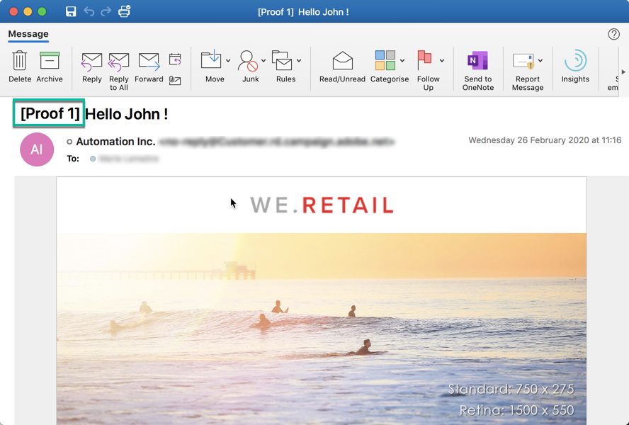

# Envío de pruebas {#sending-proofs}

## Acerca de las pruebas {#about-proofs}

Una prueba es un mensaje específico que le permite probar un mensaje antes de enviarlo al destino principal. Los destinatarios de la prueba se encargan de aprobar el mensaje (su contenido y forma).

Existen dos tipos de destinatarios de prueba:

* **Los perfiles** de prueba le permiten dirigirse a destinatarios adicionales que no coincidan con los criterios de objetivo definidos.

   Se pueden agregar a la audiencia de un mensaje para detectar cualquier uso fraudulento de la base de datos de destinatarios o para asegurarse de que los correos electrónicos llegan a las bandejas de entrada. Para obtener más información sobre esto, consulte [Administración de perfiles](../../audiences/using/managing-test-profiles.md)de prueba.

   >[!NOTE]
   >
   >Para enviar una prueba, los perfiles de prueba deben incluirse en la audiencia del mensaje.

* **Los perfiles** de sustitución le permiten colocarse en la posición de uno de los perfiles objetivo y obtener una representación exacta del mensaje que recibirá el perfil. Para obtener más información sobre esto, consulte [Prueba de mensajes de correo electrónico con perfiles](../../sending/using/testing-messages-using-target.md)de objetivo.

   >[!NOTE]
   >
   >Esta función solo está disponible para el canal de correo electrónico.

## Envío de una prueba {#sending-a-proof}

Para enviar pruebas, siga estos pasos:

1. Asegúrese de que los destinatarios de las pruebas estén configurados:
   * **Los perfiles** de prueba deben incluirse en la audiencia del mensaje.
   * **Los perfiles** de sustitución deben agregarse una vez que la preparación del mensaje se haya realizado correctamente (consulte [esta sección](../../sending/using/testing-messages-using-target.md)).

1. Haga clic en el botón **[!UICONTROL Send a test]**.

   

1. Seleccione el tipo de prueba que desee utilizar:

   * **[!UICONTROL Email rendering]**:: seleccione esta opción para probar la forma en que se recibe el mensaje según las bandejas de entrada objetivo. Para obtener más información, consulte Representación [por](../../sending/using/email-rendering.md)correo electrónico.
   * **[!UICONTROL Proof]**:: seleccione esta opción para probar el mensaje antes de enviarlo al destino principal. Los destinatarios de la prueba se encargan de aprobar la entrega comprobando tanto su contenido como su formato.
   * **[!UICONTROL Proof + Email rendering]**:: esta opción combina las dos opciones anteriores.
   

   >[!NOTE]
   >
   >El procesamiento por correo electrónico solo está disponible con perfiles de prueba. Si no se han agregado perfiles de prueba al mensaje, solo la **[!UICONTROL Proof]** opción estará disponible para selección.

1. Confirme su elección.

   Las pruebas se envían a los destinatarios configurados.

   

1. Puede ver las pruebas mediante la lista **[!UICONTROL Proofs]** desplegable.

   

1. Seleccione una prueba para acceder a su resumen. En un mensaje de correo electrónico, si ha seleccionado la opción Representación **por** correo electrónico como tipo de prueba, el **[!UICONTROL Access email rendering]** icono se muestra a la derecha de la etiqueta de prueba. Consulte Representación [por correo electrónico](../../sending/using/email-rendering.md).

   

Según los comentarios de las personas que reciban la prueba, se le puede solicitar que modifique el contenido de la entrega. Una vez realizadas las modificaciones, debe reiniciar la preparación del correo electrónico y volver a enviar una prueba. Se puede acceder a cada nueva prueba mediante el **[!UICONTROL Show proofs]** botón .

Debe enviar tantas pruebas como sea necesario hasta que haya finalizado el contenido de la entrega. Una vez finalizado, puede enviar el envío al objetivo principal y cerrar el ciclo de aprobación.

## Configuración de la línea de asunto de las pruebas {#configuring-proofs-subject-line}

Cuando se envía una prueba, su línea de asunto se configura de forma predeterminada con el prefijo **&quot;Prueba&quot;** , así como un contador que indica el número de la prueba.

Para cambiar la línea de asunto predeterminada y utilizarla, siga estos pasos:

1. En el tablero de mensajes, haga clic en el **[!UICONTROL Open properties]** botón .
1. En la **[!UICONTROL Advanced parameters]** sección, defina el prefijo que desee utilizar de forma predeterminada en la línea de asunto.

Para ocultar el número de la prueba en la línea de asunto, active la **[!UICONTROL Hide proof prefix counter]** opción.

>[!NOTE]
>
>Si desea ocultar el prefijo de prueba completo, deje el **[!UICONTROL Subject line prefix]** campo en blanco.

1. Haga clic **[!UICONTROL Confirm]**. La configuración se aplicará de forma predeterminada a todas las pruebas enviadas para el mensaje seleccionado.

**Tema relacionado:**

* [Envío de una prueba, preparación y envío de un vídeo por correo electrónico](https://docs.adobe.com/content/help/en/campaign-learn/campaign-standard-tutorials/getting-started/sending-test-preparing-sending-email.html)
* [Prueba de mensajes de correo electrónico con perfiles](../../sending/using/testing-messages-using-target.md)de objetivo.
* [Administración de perfiles](../../audiences/using/managing-test-profiles.md)de prueba.
* [Vista previa de mensajes](../../sending/using/previewing-messages.md)
* [Configuración de canales de correo electrónico](../../administration/using/configuring-email-channel.md)
