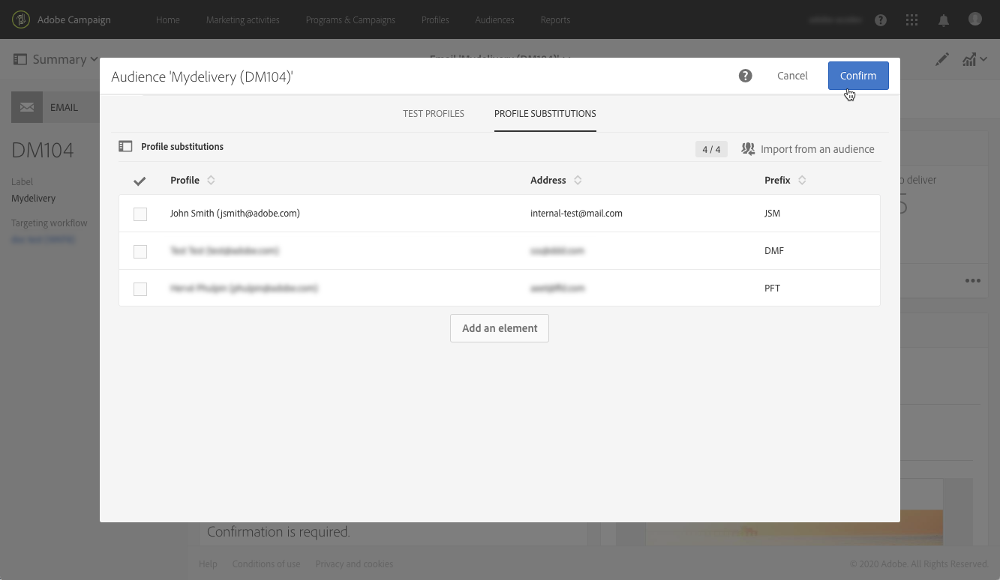
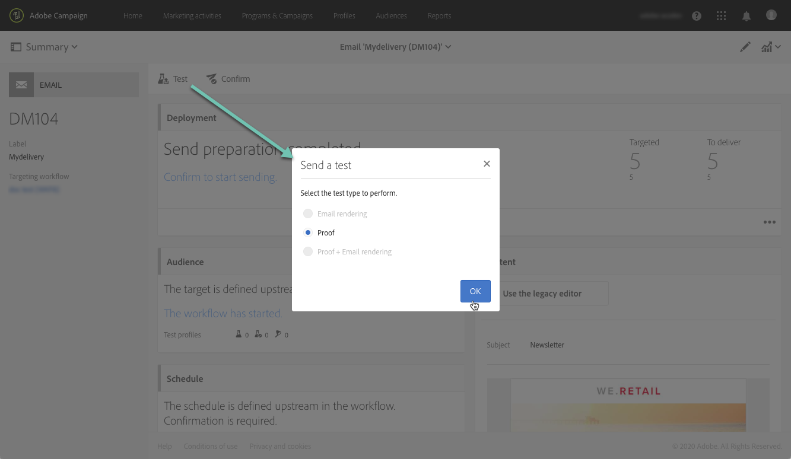
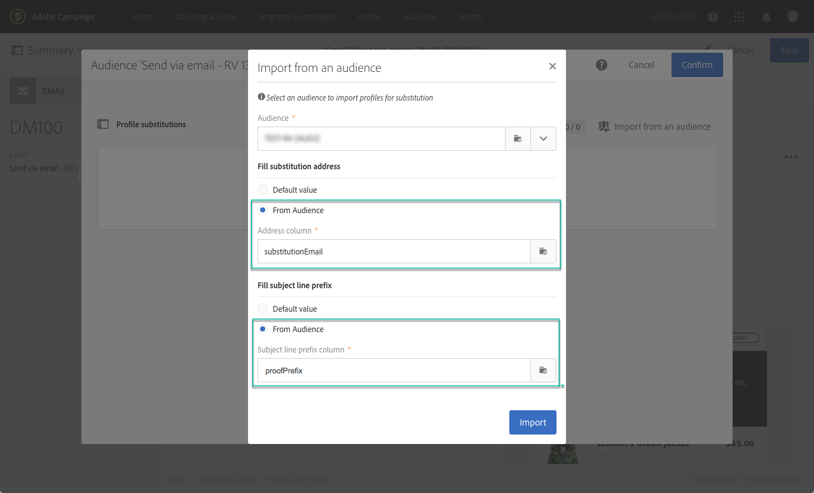
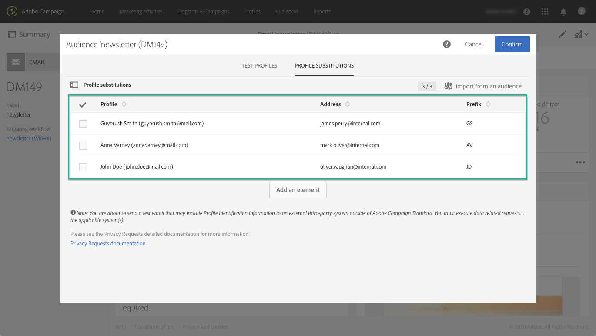
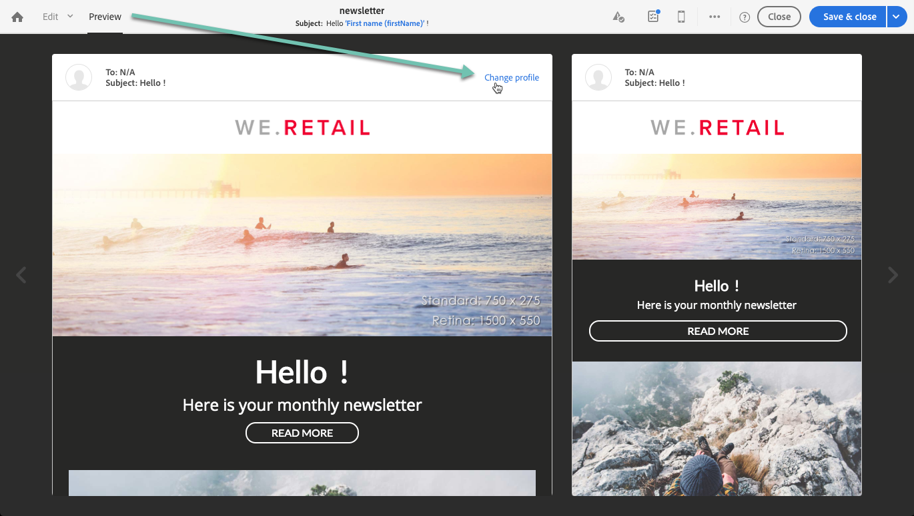

# Prueba de mensajes de correo electrónico con perfiles de destino {#testing-message-profiles}

## Información general {#overview}

Además de [perfiles de prueba](../../audiences/using/managing-test-profiles.md), puede probar un mensaje de correo electrónico colocándose en la posición de uno de los perfiles de destino. Esto le permite obtener una representación exacta del mensaje que recibirá el perfil (campos personalizados, información dinámica y personalizada, incluidos datos adicionales de flujos de trabajo...).

>[!NOTE]
>
> Esta función solo está disponible con mensajes de correo electrónico.

Los pasos principales son los siguientes:

1. Configure el mensaje y luego inicie la fase **Preparación**.
1. **Seleccione uno o varios** perfiles entre los perfiles a los que se dirige el mensaje.
1. Asocie con cada perfil una **dirección de sustitución** a la que se enviarán las pruebas.
1. (opcional) Para cada perfil, defina un **prefix** que se agregará a la línea de asunto de la prueba.
1. **** Vista previa en el Diseñador de correo electrónico del modo en que se mostrará el mensaje para los perfiles.
1. Envíe las pruebas.

>[!IMPORTANT]
>
>Esta función le permite enviar información personal de perfil a direcciones de correo electrónico externas. Tenga en cuenta que la ejecución de solicitudes de privacidad (RGPD y CCPA) en Campaign Standard NO ejecutará esa solicitud de manera externa.

 [Descubra esta función en vídeo](#video)

## Selección de perfiles y direcciones de sustitución {#selecting-profiles}

Para utilizar perfiles de destino en pruebas, primero debe seleccionarlos y luego definir las direcciones de sustitución que recibirán las pruebas. Para ello, puede [seleccionar perfiles específicos](#selecting-individual-profiles) entre los perfiles de destino o [importar perfiles de una audiencia existente](#importing-from-audience).

>[!NOTE]
>
>Puede seleccionar un máximo de 100 perfiles para realizar pruebas.

### Selección de perfiles individuales {#selecting-individual-profiles}

1. En el panel de mensajes, asegúrese de que la preparación del mensaje se haya realizado correctamente y, a continuación, haga clic en el bloque **[!UICONTROL Audience]** .

   

1. En la pestaña **[!UICONTROL Profile substitutions]** , haga clic en el botón **[!UICONTROL Create element]** para seleccionar los perfiles que desea utilizar para las pruebas.

   

1. Haga clic en el botón de selección de perfiles para mostrar la lista de perfiles a los que se dirige el mensaje.

   

1. Seleccione el perfil que desea utilizar para la prueba, luego introduzca en el campo **[!UICONTROL Address]** la dirección de sustitución deseada y haga clic en **[!UICONTROL Confirm]**. Todas las pruebas que segmenten el perfil se enviarán a esta dirección de correo electrónico, en lugar de a la definida en la base de datos para este perfil.

   Si desea añadir un prefijo específico a la línea de asunto de las pruebas, rellene el campo **[!UICONTROL Subject line prefix]** .

   >[!NOTE]
   >
   >El prefijo de línea de asunto puede contener hasta 500 caracteres.

   

   El prefijo se mostrará de la siguiente manera:

   

1. El perfil se añade a la lista, con su dirección de sustitución y prefijo asociados. Repita los pasos anteriores para todos los perfiles que desee utilizar para la prueba y, a continuación, haga clic en **[!UICONTROL Confirm]**.

   

   Si desea enviar una prueba a varias direcciones de sustitución para un mismo perfil, debe agregar este perfil tantas veces como sea necesario.

   En el ejemplo siguiente, la prueba basada en el perfil John Smith se envía a dos direcciones de sustitución diferentes:

   

1. Una vez definidos todos los perfiles y direcciones de sustitución, puede enviar una prueba para probar el mensaje. Para ello, haga clic en el botón **[!UICONTROL Test]** y seleccione el tipo de prueba que desea realizar.

   Tenga en cuenta que si no se ha agregado ningún perfil de prueba al destino del mensaje, las opciones **[!UICONTROL Email rendering]** y **[!UICONTROL Proof + Email rendering]** no están disponibles.  Para obtener más información sobre el envío de pruebas, consulte [esta sección](../../sending/using/sending-proofs.md).

   

>[!IMPORTANT]
>
>Si realiza algún cambio en el mensaje, asegúrese de volver a iniciar la preparación del mensaje. De lo contrario, los cambios no se reflejarán en la prueba.

### Importación de perfiles de una audiencia {#importing-from-audience}

Campaign Standard le permite importar una audiencia de perfiles que puede utilizar para realizar pruebas. Esto le permite, por ejemplo, enviar a una dirección de correo electrónico única un conjunto completo de mensajes dirigidos a perfiles diferentes.

Además, si la audiencia ya está configurada con las columnas de dirección y prefijo , puede importar esta información en la pestaña **[!UICONTROL Profile substitutions]** . En [esta sección](#use-case) se detalla un ejemplo de importación de audiencias con direcciones de sustitución.

>[!NOTE]
>
>Al importar una audiencia, solo se seleccionan y añaden a la pestaña **[!UICONTROL Profile substitutions]** los perfiles correspondientes al destinatario del mensaje.

Para importar perfiles que se van a usar para realizar pruebas desde una audiencia, siga estos pasos:

1. En el panel de mensajes, asegúrese de que la preparación del mensaje se haya realizado correctamente y, a continuación, haga clic en el bloque **[!UICONTROL Audience]** .

   

1. En la pestaña **[!UICONTROL Profile substitutions]**, haga clic en **[!UICONTROL Import from an audience]**.

   

1. Seleccione la audiencia que desea utilizar y, a continuación, introduzca la dirección de sustitución y el prefijo que se utilizará para las pruebas enviadas a la audiencia.

   >[!NOTE]
   >
   >El prefijo de línea de asunto puede contener hasta 500 caracteres.

   

   Si las direcciones de sustitución o los prefijos que se van a utilizar ya se han definido en la audiencia, seleccione la opción **[!UICONTROL From Audience]** y, a continuación, especifique la columna que se va a utilizar para recuperar esta información.

   

1. Haga clic en el botón **[!UICONTROL Import]**. Los perfiles de la audiencia correspondiente al destinatario del mensaje se añaden a la pestaña **[!UICONTROL Profile substitution]**, así como a las direcciones de sustitución y los prefijos asociados.

>[!NOTE]
>
>Si vuelve a importar la misma audiencia, con distintas direcciones de sustitución o prefijos, los perfiles se añaden a la lista además de los de la importación anterior.

## Vista previa del mensaje con perfiles de destino

>[!NOTE]
>
>La vista previa solo está disponible con el Diseñador de correo electrónico.

Para poder previsualizar los mensajes con perfiles de destino, asegúrese de haber añadido estos perfiles a la lista **[!UICONTROL Profile substitution]** (consulte [Definición de perfiles y direcciones de sustitución](#selecting-profiles)).

Si desea utilizar campos de personalización en el mensaje, deben agregarse **antes** de iniciar la preparación del mensaje. De lo contrario, no se tendrán en cuenta en la vista previa. Como resultado, asegúrese de volver a iniciar la preparación del mensaje si se realiza algún cambio en los campos de personalización.

Para obtener una vista previa de los mensajes mediante la sustitución de perfiles, siga estos pasos:

1. En el panel de mensajes, haga clic en la instantánea de contenido para abrir el mensaje en el Diseñador de correo electrónico.

   

1. Seleccione la pestaña **[!UICONTROL Preview]** y haga clic en **[!UICONTROL Change profile]**.

   

1. Haga clic en la pestaña **[!UICONTROL Profile Substitution]** para mostrar los perfiles de sustitución que se han agregado para la prueba.

   Seleccione los perfiles que desee utilizar para la vista previa y haga clic en **[!UICONTROL Select]**.

   

1. Se muestra una vista previa del mensaje. Utilice las flechas para desplazarse entre los perfiles seleccionados.

   

## Caso de uso {#use-case}

En este caso de uso, queremos enviar a un conjunto de perfiles específicos un boletín de correo electrónico personalizado. Antes de enviar la newsletter, queremos previsualizarla con algunos de los perfiles de destino y enviar pruebas a las direcciones de correo electrónico internas definidas en un archivo externo.

Los pasos principales para este caso de uso son los siguientes:

1. Cree la audiencia que desea usar para las pruebas.
1. Cree un flujo de trabajo para perfiles de destinatario y envíe la newsletter.
1. Configure las sustituciones de perfil del mensaje.
1. Previsualice el mensaje con perfiles de destino.
1. Envíe pruebas.

### Paso 1: Crear la audiencia que quiere usar para las pruebas

1. Prepare el archivo que desea importar para crear la audiencia. En nuestro caso, debe contener la dirección de sustitución que se utilizará para la prueba y un prefijo que se añadirá a la línea de asunto de la prueba.

   En este ejemplo, la dirección de correo electrónico &quot;oliver.vaughan@internal.com&quot; recibirá una prueba del mensaje dirigido al perfil con la dirección de correo electrónico &quot;john.doe@mail.com&quot;. El prefijo &quot;JD&quot; se agregará a la línea de asunto de la prueba.

   

1. Cree el flujo de trabajo para crear una audiencia a partir del archivo . Para ello, añada y configure las siguientes actividades:

   * **[!UICONTROL Load file]** actividad: Importa el archivo CSV (para obtener más información sobre esta actividad, consulte  [esta sección](../../automating/using/load-file.md)).
   * **[!UICONTROL Reconciliation]** actividad: Vincula la información del archivo a la información de la base de datos. En este ejemplo, utilice la dirección de correo electrónico del perfil como campo de reconciliación (para obtener más información sobre esta actividad, consulte [esta sección](../../automating/using/reconciliation.md)).
   * **[!UICONTROL Save audience]** actividad: Crea una audiencia basada en el archivo importado (para obtener más información sobre esta actividad, consulte  [esta sección](../../automating/using/save-audience.md)).

   

1. Ejecute el flujo de trabajo y, a continuación, vaya a la pestaña **[!UICONTROL Audiences]** para comprobar que la audiencia se ha creado con la información deseada.

   En este ejemplo, la audiencia está formada por tres perfiles. Cada uno de ellos está vinculado a una dirección de correo electrónico de sustitución que recibe la prueba, con un prefijo que se utiliza en la línea de asunto de la prueba.

   

### Paso 2: Creación de un flujo de trabajo para perfiles de destinatario y envío de la newsletter

1. Agregue actividades **[!UICONTROL Query]** y **[!UICONTROL Email delivery]** y, a continuación, configúrelas según sus necesidades (consulte las secciones [Query](../../automating/using/query.md) y [Email delivery](../../automating/using/email-delivery.md)).

   

1. Ejecute el flujo de trabajo y asegúrese de que la preparación del mensaje se haya realizado correctamente.

### Paso 3: Configure la pestaña Profile substitution del mensaje

1. Abra la actividad **[!UICONTROL Email delivery]**. En el panel del mensaje, haga clic en el bloque **[!UICONTROL Audience]** .

   

1. Seleccione la pestaña **[!UICONTROL Profile substitutions]** y haga clic en **[!UICONTROL Import from an audience]**.

   

1. En el campo **[!UICONTROL Audience]**, seleccione la audiencia creada a partir del archivo.

   

1. Defina la dirección de sustitución y el prefijo de línea de asunto que se utilizarán al enviar las pruebas.

   Para ello, seleccione la opción **[!UICONTROL From audience]** y luego seleccione la columna de la audiencia que contiene la información.

   

1. Haga clic en el botón **[!UICONTROL Import]**. Los perfiles de la audiencia se añaden a la lista, con sus direcciones de sustitución y prefijos de línea de asunto asociados.

   

   >[!NOTE]
   >
   >En nuestro caso, todos los perfiles de la audiencia se dirigen a la actividad **[!UICONTROL Query]**. Si uno de estos perfiles no formaba parte del destinatario de mensajes, no se agregaría a la lista.

### Paso 4: Vista previa del mensaje con perfiles de destino

1. En el panel de mensajes, haga clic en la instantánea de contenido para abrir el mensaje en el Diseñador de correo electrónico.

   

1. Seleccione la pestaña **[!UICONTROL Preview]** y haga clic en **[!UICONTROL Change profile]**.

   

1. Haga clic en la pestaña **[!UICONTROL Profile Substitution]** para mostrar los perfiles de sustitución que se han agregado anteriormente.

   Seleccione los perfiles que desee utilizar para la vista previa y haga clic en **[!UICONTROL Select]**.

   

1. Se muestra una vista previa del mensaje. Utilice las flechas para desplazarse entre los perfiles seleccionados.

   

### Paso 5: Envío de pruebas

1. En el panel del mensaje, haga clic en el botón **[!UICONTROL Test]** y confirme.

   

1. Las pruebas se envían según lo que se haya configurado en la pestaña **[!UICONTROL Profile substitutions]** .

   

## Tutorial en vídeo {#video}

Este vídeo muestra cómo probar los mensajes de correo electrónico mediante la sustitución de perfiles.

>[!VIDEO](https://video.tv.adobe.com/v/32368?quality=12)

Hay disponibles más vídeos prácticos del Campaign Standard [aquí](https://experienceleague.adobe.com/docs/campaign-standard-learn/tutorials/overview.html?lang=es).
