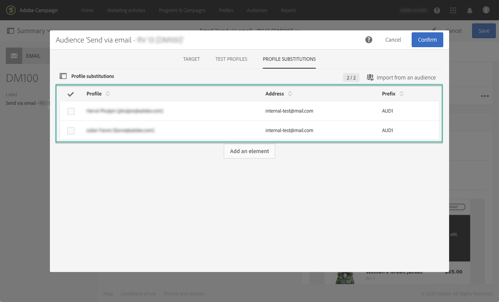

# Prueba de mensajes de correo electrónico con perfiles de objetivo {#testing-message-profiles}

## Información general {#overview}

Además de [probar perfiles](../../audiences/using/managing-test-profiles.md), puede probar un mensaje de correo electrónico colocándose en la posición de uno de los perfiles objetivo. Esto le permite obtener una representación exacta del mensaje que recibirá el perfil (campos personalizados, información dinámica y personalizada, incluidos datos adicionales de flujos de trabajo...).

>[!NOTE]
>
> Esta función solo está disponible con mensajes de correo electrónico.

Los pasos principales son los siguientes:

1. Configure el mensaje y luego inicie la fase de **preparación** .
1. **Seleccione uno o varios perfiles** entre los perfiles objetivo del mensaje.
1. Asocie con cada perfil una dirección **de** sustitución a la que se enviarán las pruebas.
1. (opcional) Para cada perfil, defina un **prefijo** para añadirlo a la línea de asunto de la prueba.
1. **Obtenga una vista previa** en el Diseñador de correo electrónico de cómo se mostrará el mensaje para los perfiles.
1. Envíe las pruebas.

Para obtener más información sobre el proceso global, consulte el vídeo del tutorial disponible [aquí](https://docs.adobe.com/content/help/en/campaign-standard-learn/tutorials/communication-channels/email/profile-substitution.html).

>[!IMPORTANT]
>
>Esta función le permite enviar información personal de perfil a direcciones de correo electrónico externas. Tenga en cuenta que la ejecución de solicitudes de privacidad (GDPR y CCPA) en Campaign Standard NO ejecutará esa solicitud externamente.

## Selección de perfiles y direcciones de sustitución {#selecting-profiles}

Para utilizar perfiles de objetivo para pruebas, primero debe seleccionarlos y luego definir las direcciones de sustitución que recibirán las pruebas. Para ello, puede [seleccionar perfiles](#selecting-individual-profiles) específicos entre los perfiles de destino o [importar perfiles de una audiencia](#importing-from-audience)existente.

>[!NOTE]
>
>Puede seleccionar un máximo de 100 perfiles para realizar pruebas.

### Selección de perfiles individuales {#selecting-individual-profiles}

1. En el tablero de mensajes, asegúrese de que la preparación del mensaje es correcta y, a continuación, haga clic en el **[!UICONTROL Audience]** bloque.

   

1. En la **[!UICONTROL Profile substitutions]** ficha, haga clic en el **[!UICONTROL Create element]** botón para seleccionar los perfiles que se utilizarán para la prueba.

   

1. Haga clic en el botón de selección de perfiles para mostrar la lista de perfiles dirigidos por el mensaje.

   

1. Seleccione el perfil que desee utilizar para la prueba, luego introduzca en el **[!UICONTROL Address]** campo la dirección de sustitución que desee y haga clic en **[!UICONTROL Confirm]**. Todas las pruebas dirigidas al perfil se enviarán a esta dirección de correo electrónico, en lugar de a la definida en la base de datos para este perfil.

   Si desea agregar un prefijo específico a la línea de asunto de las pruebas, rellene el **[!UICONTROL Subject line prefix]** campo.

   

   El prefijo se mostrará de la siguiente manera:

   

1. El perfil se agrega a la lista, con su dirección de sustitución y prefijo asociados. Repita los pasos anteriores para todos los perfiles que desee utilizar para la prueba y, a continuación, haga clic en **[!UICONTROL Confirm]**.

   

   Si desea enviar una prueba a varias direcciones de sustitución para un mismo perfil, debe agregar este perfil tantas veces como sea necesario.

   En el ejemplo siguiente, la prueba basada en el perfil de John Smith se enviará a dos direcciones de sustitución diferentes:

   

1. Una vez definidos todos los perfiles y las direcciones de sustitución, puede enviar una prueba para probar el mensaje. Para ello, haga clic en el **[!UICONTROL Test]** botón y, a continuación, seleccione el tipo de prueba que desea realizar.

   Tenga en cuenta que si no se ha agregado ningún perfil de prueba al destino del mensaje, las opciones **[!UICONTROL Email rendering]** y **[!UICONTROL Proof + Email rendering]** no estarán disponibles.  For more information on proofs sending, refer to [this section](../../sending/using/sending-proofs.md).

   

>[!IMPORTANT]
>
>Si realiza algún cambio en el mensaje, asegúrese de volver a iniciar la preparación del mensaje. De lo contrario, los cambios no se reflejarán en la prueba.

### Importación de perfiles de una audiencia {#importing-from-audience}

Campaign Standard le permite importar una audiencia de perfiles que puede utilizar para realizar pruebas. Esto le permite, por ejemplo, enviar a una dirección de correo electrónico única un conjunto completo de mensajes dirigidos a distintos perfiles.

Además, si la audiencia ya está configurada con las columnas de dirección y prefijo, podrá importar esta información en la **[!UICONTROL Profile substitutions]** ficha. En [esta sección](#use-case)se detalla un ejemplo de importación de audiencias con direcciones de sustitución.

>[!NOTE]
>
>Al importar una audiencia, solo se seleccionan y agregan a la **[!UICONTROL Profile substitutions]** ficha los perfiles correspondientes al destino del mensaje.

Para importar perfiles que se utilizarán para realizar pruebas desde una audiencia, siga estos pasos:

1. En el tablero de mensajes, asegúrese de que la preparación del mensaje se ha realizado correctamente y, a continuación, haga clic en el **[!UICONTROL Audience]** bloque.

   

1. En la **[!UICONTROL Profile substitutions]** ficha, haga clic en **[!UICONTROL Import from an audience]**.

   

1. Seleccione la audiencia que se va a usar y, a continuación, introduzca la dirección de sustitución y el prefijo que se va a utilizar para las pruebas enviadas a la audiencia.

   

   Si las direcciones de sustitución o los prefijos que se van a usar ya se han definido en la audiencia, seleccione la **[!UICONTROL From Audience]** opción y, a continuación, especifique la columna que se va a utilizar para recuperar esta información.

   

1. Haga clic en el botón **[!UICONTROL Import]**. Los perfiles de la audiencia correspondiente al destino del mensaje se agregan a la **[!UICONTROL Profile substitution]** ficha, así como los prefijos y direcciones de sustitución asociados.

>[!NOTE]
>
>Si vuelve a importar la misma audiencia, con distintas direcciones de sustitución y/o prefijos, los perfiles se agregarán a la lista además de los de la importación anterior.

    

## Vista previa del mensaje con perfiles de objetivo

>[!NOTE]
>
>La vista previa solo está disponible con el Diseñador de correo electrónico.

Para poder obtener una vista previa de los mensajes con perfiles de destino, asegúrese de haber agregado estos perfiles a la **[!UICONTROL Profile substitution]** lista (consulte [Definición de perfiles y direcciones](#selecting-profiles)de sustitución).

Si desea utilizar campos de personalización en el mensaje, estos deben agregarse **antes** de iniciar la preparación del mensaje. De lo contrario, no se tendrán en cuenta en la vista previa. Como resultado, asegúrese de iniciar de nuevo la preparación de mensajes si se realiza algún cambio en los campos de personalización.

Para obtener una vista previa de los mensajes mediante la sustitución de perfiles, siga estos pasos:

1. En el tablero de mensajes, haga clic en la instantánea de contenido para abrir el mensaje en el Diseñador de correo electrónico.

   

1. Seleccione la **[!UICONTROL Preview]** ficha y haga clic en **[!UICONTROL Change profile]**.

   

1. Haga clic en la ficha **[!UICONTROL Profile Substitution]** para mostrar los perfiles de sustitución que se han agregado para la prueba.

   Seleccione los perfiles que desee utilizar para la vista previa y haga clic en **[!UICONTROL Select]**.

   

1. Se muestra una vista previa del mensaje. Utilice las flechas para desplazarse entre los perfiles seleccionados.

   

## Ejemplo de uso {#use-case}

En este caso de uso, queremos enviar a un conjunto de perfiles específicos un boletín de correo electrónico personalizado. Antes de enviar la newsletter, queremos obtener una vista previa con algunos de los perfiles de destino y enviar pruebas a las direcciones de correo electrónico internas definidas en un archivo externo.

Los pasos principales para este caso de uso son los siguientes:

1. Cree la audiencia para utilizarla en las pruebas.
1. Cree un flujo de trabajo para segmentar perfiles y envíe la newsletter.
1. Configure las sustituciones de perfil del mensaje.
1. Obtenga una vista previa del mensaje con perfiles de destino.
1. Enviar pruebas.

### Paso 1: Crear una audiencia para usarla en las pruebas

1. Prepare el archivo que se va a importar para crear la audiencia. En nuestro caso, debe contener la dirección de sustitución que se utilizará para la prueba y un prefijo que se añadirá a la línea del asunto de la prueba.

   En este ejemplo, la dirección de correo electrónico &quot;oliver.vaughan@internal.com&quot; recibirá una prueba del mensaje dirigido al perfil con la dirección de correo electrónico &quot;john.doe@mail.com&quot;. El prefijo &quot;JD&quot; se agregará a la línea de asunto de la prueba.

   

1. Cree el flujo de trabajo para crear una audiencia a partir del archivo. Para ello, agregue y configure las actividades siguientes:

   * **[!UICONTROL Load file]** actividad: Importa el archivo CSV (para obtener más información sobre esta actividad, consulte [esta sección](../../automating/using/load-file.md)).
   * **[!UICONTROL Reconciliation]** actividad: Vincula información del archivo con información de la base de datos. En este ejemplo, utilizaremos la dirección de correo electrónico del perfil como campo de reconciliación (para obtener más información sobre esta actividad, consulte [esta sección](../../automating/using/reconciliation.md)).
   * **[!UICONTROL Save audience]** actividad: Crea una audiencia basada en el archivo importado (para obtener más información sobre esta actividad, consulte [esta sección](../../automating/using/save-audience.md)).
   

1. Ejecute el flujo de trabajo y, a continuación, vaya a la **[!UICONTROL Audiences]** ficha para comprobar que la audiencia se ha creado con la información deseada.

   En este ejemplo, la audiencia está formada por tres perfiles. Cada uno de ellos está vinculado a una dirección de correo electrónico de sustitución que recibirá la prueba, con un prefijo para utilizarlo en la línea de asunto de la prueba.

   

### Paso 2: Cree un flujo de trabajo para los perfiles objetivo y envíe la newsletter

1. Agregue **[!UICONTROL Query]** y **[!UICONTROL Email delivery]** actividades, luego configúrelas según sus necesidades (consulte las secciones de envío [de](../../automating/using/query.md) consultas y  correo electrónico).

   

1. Ejecute el flujo de trabajo y asegúrese de que la preparación del mensaje se realiza correctamente.

### Paso 3: Configurar la ficha de sustitución Perfil del mensaje

1. Open the **[!UICONTROL Email delivery]** activity. En el tablero de mensajes, haga clic en el **[!UICONTROL Audience]** bloque.

   

1. Seleccione la **[!UICONTROL Profile substitutions]** ficha y haga clic en **[!UICONTROL Import from an audience]**.

   

1. En el **[!UICONTROL Audience]** campo, seleccione la audiencia creada a partir del archivo.

   

1. Defina la dirección de sustitución y el prefijo de línea de asunto que se utilizarán al enviar las pruebas.

   Para ello, seleccione la **[!UICONTROL From audience]** opción y, a continuación, seleccione la columna de la audiencia que contiene la información.

   

1. Haga clic en el botón **[!UICONTROL Import]**. Los perfiles de la audiencia se agregan a la lista, con sus direcciones de sustitución asociadas y prefijos de línea de asunto.

   

   >[!NOTE]
   >
   >En nuestro caso, todos los perfiles de la audiencia se dirigen a la **[!UICONTROL Query]** actividad. Si uno de estos perfiles no formaba parte del destino del mensaje, no se agregaría a la lista.

### Paso 4: Vista previa del mensaje con perfiles de objetivo

1. En el tablero de mensajes, haga clic en la instantánea de contenido para abrir el mensaje en el Diseñador de correo electrónico.

   

1. Seleccione la **[!UICONTROL Preview]** ficha y haga clic en **[!UICONTROL Change profile]**.

   

1. Haga clic en la **[!UICONTROL Profile Substitution]** ficha para mostrar los perfiles de sustitución que se han agregado anteriormente.

   Seleccione los perfiles que desee utilizar para la vista previa y haga clic en **[!UICONTROL Select]**.

   

1. Se muestra una vista previa del mensaje. Utilice las flechas para desplazarse entre los perfiles seleccionados.

   

### Paso 5: Enviar pruebas

1. En el tablero de mensajes, haga clic en el **[!UICONTROL Test]** botón y confirme.

   

1. Las pruebas se envían según lo que se haya configurado en la **[!UICONTROL Profile substitutions]** ficha.

   
