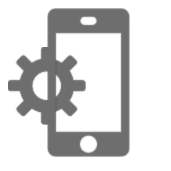

# Seguimiento de mensajes{#tracking-messages}

## Acerca del seguimiento {#about-tracking}

Gracias a sus funcionalidades de seguimiento, Adobe Campaign permite rastrear el comportamiento de los destinatarios de la entrega. Para ello, Adobe Campaign utiliza cookies de sesión y cookies permanentes.

Puede informar a los usuarios de que sus sitios están equipados con herramientas de seguimiento web a través de una solicitud de autorización (que llega a través de la página, por ejemplo) con una casilla de verificación para autorizar el uso de cookies o añadir un banner en la parte superior de la primera página en la que naveguen, etc. Las ventanas emergentes deben evitarse, ya que los exploradores suelen bloquearlas.

La información de seguimiento está disponible para cada contacto de la base de datos en **[!UICONTROL integrated customer profiles]**. Para obtener más información, consulte [esta sección](../../audiences/using/integrated-customer-profile.md).

Adobe Campaign utiliza dos tipos de cookies:

* Una cookie de sesión (nlid). Contiene el identificador del correo electrónico enviado al contacto (broadlogId) y el identificador de la plantilla de mensaje (deliveryId). Se añade cuando el contacto hace clic en una dirección URL incluida en un correo electrónico enviado por Adobe Campaign y le permite hacer un seguimiento de su comportamiento en la web. Esta cookie de sesión se borra automáticamente cuando se cierra el explorador. El contacto puede configurar el explorador para que rechace las cookies.
* Una cookie compartida entre soluciones de Adobe Experience Cloud. Esto le permite identificar a los usuarios que interactúan con las soluciones de Experience Cloud cuando visitan un sitio web. La descripción de esta cookie está disponible [aquí](https://experienceleague.adobe.com/docs/core-services/interface/ec-cookies/cookies-mc.html).

El seguimiento con Adobe Campaign Standard le permite acceder a las siguientes funcionalidades:

<table>
<tr>
    <td valign="top">
        
    </td>
    <td valign="top">
        
    </td>
    <td valign="top">
        
    </td>
        <td valign="top">
          
    </td>
    </td>
    <td valign="top">
          
</tr>
<tr>
<td>Seguimiento de correo electrónico</td>
<td>Seguimiento push</td>
<td>URL seguidas</td>
<td>Registros de seguimiento</td>
<td>Informe de seguimiento</td>
</tr>
</table>

## Registros de seguimiento {#tracking-logs}

La pestaña **[!UICONTROL Tracking logs]** enumera el historial de seguimiento de esta entrega. Esta pestaña muestra la información de seguimiento de los mensajes enviados, como todas las direcciones URL que Adobe Campaign ha rastreado. La información de seguimiento en esta pestaña se actualiza cada 10 minutos.

>[!NOTE]
>
>Si el seguimiento no está habilitado para una entrega, esta pestaña no se muestra. Los registros de seguimiento están disponibles para la variable **email** y **notificación push** solo canales.

En el ejemplo anterior, el destinatario:

* Se ha abierto el mensaje.
* Se hizo clic en el vínculo de la página espejo.
* Haga clic en el vínculo personalizado &quot;MÁS INFORMACIÓN&quot;.

En el **[!UICONTROL Type]** , los valores posibles son:

* **[!UICONTROL Email click]**: los destinatarios que hicieron clic en un vínculo personalizado.
* **[!UICONTROL Mirror page]**: el destinatario hizo clic en un vínculo a la página espejo.
* **[!UICONTROL Open]**: el destinatario abrió el correo electrónico.
* **[!UICONTROL Opt-out]**: el destinatario ha hecho clic en un vínculo de baja de suscripción.

>[!NOTE]
>
>Para la variable **notificación push** , solo se rastrearán los clics en notificaciones móviles. En ese caso, el valor será **[!UICONTROL Click on mobile notification]**.

Para obtener más información sobre cómo insertar vínculos de seguimiento, consulte [esta página](../../designing/using/links.md#inserting-a-link).

La variable **[!UICONTROL Tracking indicators]** contiene los indicadores clave para el seguimiento del comportamiento después de recibir los mensajes de correo electrónico. Para obtener más información, consulte esta [página](../../reporting/using/tracking-indicators.md).

## URL seguidas {#tracked-urls}

La variable **[!UICONTROL Tracked URLs]** reagrupa las direcciones URL incluidas en el mensaje enviado, incluido su tipo de dirección URL y su dirección URL de origen.

Para obtener más información sobre el seguimiento de vínculos, consulte [esta sección](../../designing/using/links.md#about-tracked-urls).
