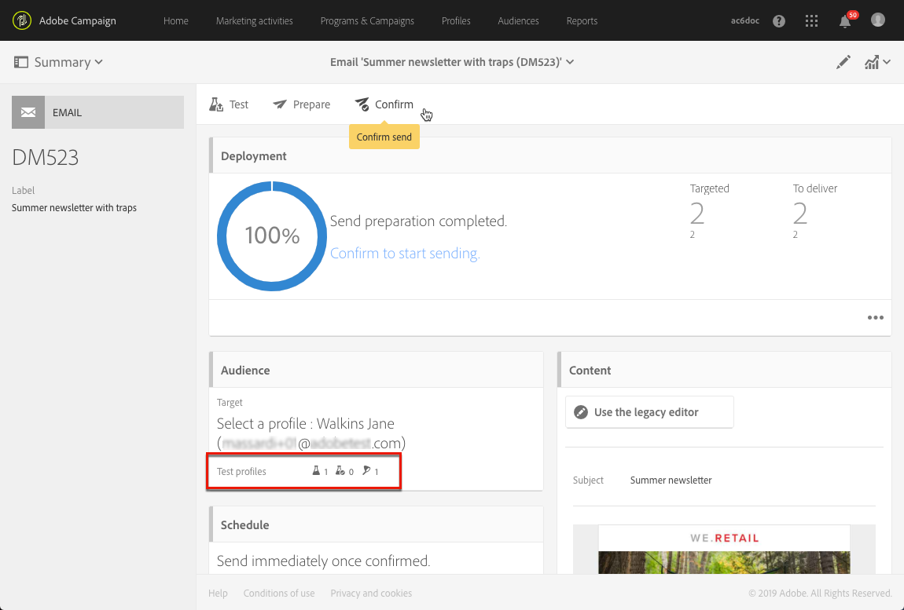

# Uso de trampas {#using-traps}

Cuando se utilizan trampas, el mensaje se envía al [perfil de prueba](../../audiences/using/managing-test-profiles.md) tal como se envía al destinatario principal, como medio para identificar si el archivo cliente se está utilizando de forma fraudulenta.

Las trampas se diseñaron originalmente para los envíos de correo directo. Permiten lo siguiente:

* Compruebe que su proveedor de correo postal realmente está enviando la comunicación.
* Reciba el correo al mismo tiempo y en las mismas condiciones que sus clientes.
* Conserve una copia exacta del correo enviado.
* Compruebe que su proveedor de correo postal no utiliza indebidamente su lista de clientes. De hecho, si se envía cualquier otra comunicación a la dirección del perfil de prueba, es posible que el archivo del cliente se haya utilizado sin su conocimiento. Por este motivo, la dirección del perfil de prueba solo debe utilizarse con este fin.

Para obtener más información sobre cómo agregar trampas a la audiencia de un correo postal, consulte [Agregar perfiles de prueba y trampa](../../channels/using/defining-the-direct-mail-audience.md#adding-test-and-trap-profiles).

Para los demás canales de comunicación, puede agregar perfiles de prueba de trampa al destinatario principal para lo siguiente:

* Compruebe que su mensaje se haya enviado correctamente.
* Obtenga y conserve una copia exacta de su mensaje.
* Rastrear cuándo se envió y recibió.

Para utilizar un perfil de prueba como trampa, debe incluirse en la audiencia del mensaje.

>[!NOTE]
>
>A diferencia de los perfiles de prueba utilizados para [pruebas](../../sending/using/sending-proofs.md) o [procesamiento de correo electrónico](../../sending/using/email-rendering.md), el mensaje se envía al mismo tiempo al destinatario principal y a los perfiles de prueba utilizados como trampas.

Al definir la audiencia de un mensaje:

1. En la ficha **[!UICONTROL Test profiles]**, seleccione un perfil de prueba. Asegúrese de que tiene **[!UICONTROL Trap]** como el uso previsto.

   

1. Cuando el contenido del mensaje esté listo, haga clic en el botón **[!UICONTROL Prepare]**. Ver [Preparando el envío](../../sending/using/preparing-the-send.md).
   >[!NOTE]
   >
   >Asegúrese de seleccionar un objetivo principal. De lo contrario, no se podrá enviar el mensaje.

1. Haga clic en el botón **[!UICONTROL Confirm]**. Consulte [Confirmando el envío &#x200B;](../../sending/using/confirming-the-send.md) .

   

El mensaje se envía al destinatario principal y al perfil de prueba.

Puede utilizar trampas al enviar mensajes transaccionales. En este caso, el perfil de prueba recibe un mensaje por cada configuración de evento. Para obtener más información sobre la mensajería transaccional, consulte esta [sección](../../channels/using/getting-started-with-transactional-msg.md).

>[!NOTE]
>
>Cuando se utiliza un perfil de prueba como trampa, los campos enriquecidos de un mensaje tendrán sus datos adicionales correspondientes seleccionados aleatoriamente de un perfil de destino real y asignados al perfil de prueba de trampa. Sin embargo, tenga en cuenta que si el perfil de destino real se excluye debido a las reglas de tipología aplicadas durante la primera preparación del mensaje, la preparación del envío fallará. Este error se produce porque los valores de los campos enriquecidos no se pueden sustituir por el perfil de captura. Por lo tanto, es posible que las reglas de tipología de exclusión no se apliquen correctamente a los destinatarios reales.
>
>Para evitar esta situación, evite utilizar perfiles de prueba de trampa simultáneamente con reglas de filtrado o fatiga en su tipología transaccional. Más información sobre el enriquecimiento. Para obtener más información sobre el enriquecimiento, vea [este ejemplo](../../automating/using/enriching-profile-data-file.md).
