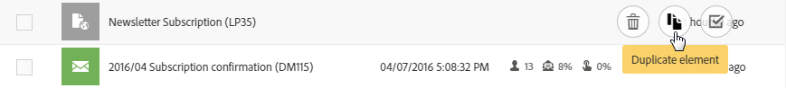

# Personalización de listas{#customizing-lists}

**** Las pantallas de lista permiten mostrar elementos de uno o varios recursos determinados.

Adobe Campaign tiene dos tipos de listas:

* Una lista **homogénea**, que es cuando contiene un solo tipo de recurso. Por ejemplo, la lista de perfiles solo contiene perfiles.
* Una lista **heterogénea**, que es cuando contiene varios tipos de recursos. Por ejemplo, la lista de actividades de marketing contiene páginas de aterrizaje, flujos de trabajo, correos electrónicos, SMS, etc.

Las listas se muestran en columnas. Cada columna se puede ordenar en orden ascendente o descendente de una en una.

Los elementos de una lista tienen una casilla de verificación que permite seleccionarlos. Al seleccionar uno o varios elementos, puede realizar varias acciones, como editar, duplicar y eliminar estos elementos.

Al pasar el ratón por encima de un elemento de la lista, **acciones rápidas**. Estas acciones permiten al usuario realizar varias acciones en el elemento sobre el que se ha colocado el cursor, como editar, seleccionar, eliminar o mostrar detalles.

También puede configurar si las columnas de una lista se van a mostrar o no. Para agregar o quitar columnas:

1. Asegúrese de que la pantalla esté en modo **List**.

   

1. Vaya a la ventana de configuración de la lista seleccionando el botón  en la barra de acciones.

   

1. Añada las columnas que desee incluir en la lista. Para ello, seleccione una columna en la parte izquierda de la ventana y, a continuación, utilice el botón  de la barra de acciones para añadir una columna.

   Las columnas seleccionables corresponden al recurso de lista.

   Para cada columna añadida, especifique si desea aplicar la ordenación de forma predeterminada:

   * **[!UICONTROL NO]**: No ordenar en la columna
   * **[!UICONTROL ASC]**: Aplica un orden ascendente (ascendente) en la columna
   * **[!UICONTROL DESC]**: Aplica un orden descendente (descendente) en la columna.

1. Elimine las columnas que no desee mostrar marcando las casillas correspondientes a las columnas que desea eliminar. A continuación, utilice el botón  de la barra de acciones para confirmar la eliminación.
1. Una vez que la lista contiene las columnas correctas, puede cambiar el orden en que se muestran en la lista comprobando las columnas que desea mover. A continuación, utilice las flechas  y  .
1. Confirme la configuración de la lista seleccionando **[!UICONTROL OK]**.

La lista ahora se muestra tal como la ha configurado.
