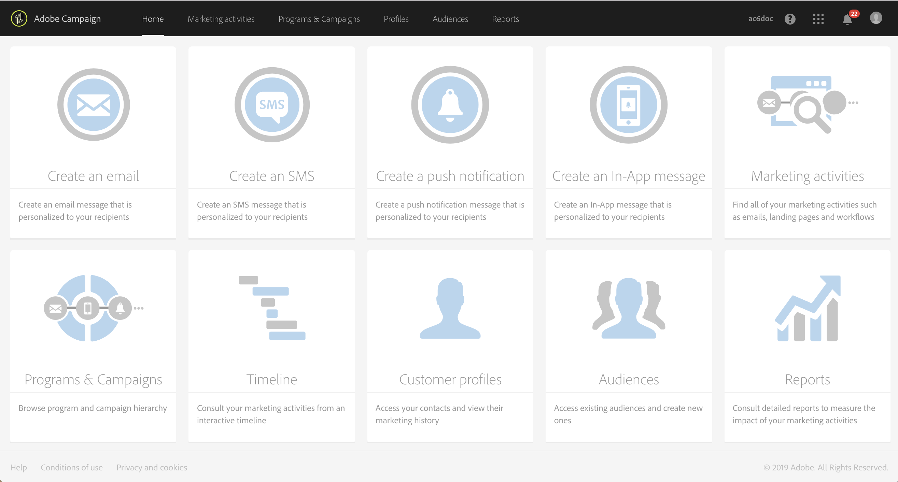

# Descripción de la interfaz{#interface-description}

Adobe Campaign le permite navegar por diferentes menús y pantallas para administrar campañas.

Todas las pantallas de Adobe Campaign están formadas por los siguientes elementos:

* Barra superior para navegación.
* Menú avanzado para acceder a funciones y configuraciones específicas.
* Zona central para trabajar en ciertos elementos.
* Panel lateral, según el contexto, para filtrar o buscar dentro de los elementos mostrados.

## Página de inicio {#home-page}

La página de inicio está formada por un conjunto de tarjetas que le permiten acceder rápidamente a las principales funciones de Adobe Campaign. La lista de funciones que puede ver en la página de inicio de Campaign depende de los permisos y las opciones configuradas para su organización.

* La tarjeta **[!UICONTROL Create an email]** lleva al asistente de creación de correo electrónico. Este asistente le permite elegir un tipo de correo electrónico, seleccionar los destinatarios de los mensajes y definir el contenido. Consulte la sección [Creación de un correo electrónico](../../channels/using/creating-an-email.md).
* La tarjeta **[!UICONTROL Create an SMS]** lleva al asistente de creación de SMS. Este asistente le permite elegir un tipo de SMS, seleccionar los destinatarios de los mensajes y definir el contenido. Consulte la sección [Creación de un SMS](../../channels/using/creating-an-sms-message.md).
* La tarjeta **[!UICONTROL Create a Direct mail]** lleva al asistente de creación de correo postal. Consulte la sección [Creación de un correo postal](../../channels/using/creating-the-direct-mail.md).
* La tarjeta **[!UICONTROL Create a push notification]** lleva al asistente de creación de notificaciones. Este asistente le permite elegir un tipo de notificación push, seleccionar los destinatarios de los mensajes y definir el contenido. Consulte la sección [Creación de una notificación push](../../channels/using/preparing-and-sending-a-push-notification.md).
* El **[!UICONTROL Create an In-App message]** La tarjeta lleva al asistente de creación en la aplicación. Este asistente le permite seleccionar el tipo de mensaje en la aplicación que desea crear, definir sus propiedades, audiencia y contenido. Consulte la [Creación de un mensaje en la aplicación](../../channels/using/about-in-app-messaging.md) sección.
* La tarjeta **[!UICONTROL Marketing activities]** lleva a la lista completa de todas las actividades, programas y campañas, particularmente correos electrónicos, SMS, flujos de trabajo y páginas de aterrizaje. Desde aquí puede filtrar los elementos buscando por nombre, fecha, estado o tipo de actividad. Para obtener más información, consulte la sección [Lista de actividades de marketing](../../start/using/marketing-activities.md#about-marketing-activities).
* La tarjeta **[!UICONTROL Programs & campaigns]** lleva a la lista de programas en los que puede crear y administrar sus campañas. Consulte [Lista de programas](../../start/using/programs-and-campaigns.md#about-plans--programs-and-campaigns).
* La tarjeta **[!UICONTROL Timeline]** lleva directamente a una cronología interactiva de las actividades de marketing, en la que puede consultar los programas en curso y su contenido. Consulte [Cronología](../../start/using/timeline.md).
* La tarjeta **[!UICONTROL Customer profiles]** lleva directamente a la lista de perfiles. Desde aquí puede consultar los eventos relativos a cada uno de los perfiles de la lista. Consulte [Administración de perfiles](../../audiences/using/about-profiles.md).
* La tarjeta **[!UICONTROL Audiences]** lleva directamente a la lista de audiencias. Desde aquí puede acceder a audiencias existentes y crear otras nuevas. Consulte [Administración de audiencias](../../audiences/using/about-audiences.md).

## Barra superior {#top-bar}

La barra superior es visible en todas las pantallas y le permite navegar por las funcionalidades de Adobe Campaign, así como acceder al perfil de Adobe conectado, a las notificaciones, a las soluciones de Adobe Experience Cloud y a la documentación de Campaign.

Los principios de navegación son:

* El **Adobe** en la esquina superior izquierda de la página, le permite acceder a las funciones y configuraciones avanzadas. Los menús dependen del perfil y los permisos.

  El menú avanzado se presenta en la sección de [menú avanzado](#advanced-menu).

* El vínculo **[!UICONTROL Home]** le permite mostrar la página de inicio de Adobe Campaign.
* Los vínculos **[!UICONTROL Marketing activities]**, **[!UICONTROL Programs & Campaigns]**, **[!UICONTROL Profiles]**, **[!UICONTROL Audiences]** y **[!UICONTROL Reports]** permiten acceder a las vistas vinculadas a estas funciones.
* El **Conmutador de soluciones** le permite cambiar entre sus organizaciones o a una aplicación diferente.
* El **[!UICONTROL Help]** se describe el icono [abajo](#help).
* El icono **Notificaciones** muestra la información o las alertas más recientes.
* El icono **Usuario** le permite ver información vinculada a su perfil. Utilice este icono si es necesario **[!UICONTROL Sign out]**.

### Ayuda {#help}

En la esquina superior derecha, la variable **Ayuda** El icono de introduce Adobe Experience League en el producto.

Utilice el **[!UICONTROL Search]** para buscar orientación. Los resultados de búsqueda incluyen documentación y artículos de ayuda, resultados de foros de la comunidad y contenido de vídeo, lo que le facilita el acceso a más contenido para sacar el máximo partido de la aplicación.

Tres pestañas le ayudan a encontrar ayuda y asistencia:

1. La pestaña **[!UICONTROL Help]** contiene:
   * un acceso rápido a la documentación de Adobe Campaign Standard con vínculos contextuales.
   * a **[!UICONTROL Learning]** vínculo que le permite acceder a la biblioteca de cursos de Adobe Campaign.
   * a **[!UICONTROL Community]** para acceder al foro dedicado a sus preguntas sobre Campaign.
   * un acceso directo a: Centro de ayuda, Servicio de atención al cliente, Estado del producto del Experience Cloud, Conexión de desarrolladores, Notas de la versión, Planificación de versiones y **[!UICONTROL About]** pantalla.
1. El **[!UICONTROL Support]** Esta pestaña le permite abrir un caso de asistencia y ponerse en contacto con nosotros por teléfono o X (anteriormente conocido como Twitter).
1. El **[!UICONTROL Feedback]**  le facilita informar sobre problemas o compartir sus ideas.

## Menú avanzado {#advanced-menu}

El menú avanzado se muestra haciendo clic en el **Adobe Campaign** , en la esquina superior izquierda de cada pantalla. El menú avanzado puede variar según el contrato y los permisos de usuario.

Este menú le permite navegar a funciones y configuraciones específicas.

### Planes de marketing {#marketing-plans}

El icono **[!UICONTROL Marketing plans]** le permite acceder a las siguientes funciones:

* **[!UICONTROL Marketing activities]**: para obtener más información, consulte la sección [Lista de actividades de marketing](../../start/using/marketing-activities.md#about-marketing-activities).
* **[!UICONTROL Programs & Campaigns]**: para obtener más información, consulte la sección [Lista de programas](../../start/using/programs-and-campaigns.md#about-plans--programs-and-campaigns).
* **[!UICONTROL Timeline]**: para obtener más información, consulte la sección [Cronología](../../start/using/timeline.md).
* **[!UICONTROL Transactional messages]**, que contiene los submenús **[!UICONTROL Deliveries]** y **[!UICONTROL Event configuration]**: para más información, consulte la sección [Mensajes transaccionales](../../channels/using/getting-started-with-transactional-msg.md).

### Perfiles y audiencias {#profiles-e-audiences}

El icono **[!UICONTROL Profiles & audiences]** le permite acceder a las siguientes funciones:

* **[!UICONTROL Profiles]**: para obtener más información, consulte la sección [Administración de perfiles](../../audiences/using/about-profiles.md).
* **[!UICONTROL Test profiles]**: para obtener más información, consulte la sección [Administración de perfiles de prueba](../../audiences/using/managing-test-profiles.md).
* **[!UICONTROL Audiences]**: para obtener más información, consulte la sección [Administración de audiencias](../../audiences/using/about-audiences.md).
* **[!UICONTROL Services]**: para obtener más información, consulte la sección [Creación de un servicio](../../audiences/using/creating-a-service.md).

### Recursos {#resources}

El icono **[!UICONTROL Resources]** le permite acceder a las siguientes funciones:

* **[!UICONTROL Templates]**, que contiene los submenús para cada tipo de plantilla: para obtener más información, consulte la sección [Administración de plantillas](../../start/using/marketing-activity-templates.md).
* **[!UICONTROL Content blocks]**: para obtener más información, consulte la sección [Añadir un bloque de contenido](../../designing/using/personalization.md#adding-a-content-block).
* **[!UICONTROL Content templates & fragments]**: para obtener más información, consulte la sección [Plantilla de contenido](../../designing/using/using-reusable-content.md#content-templates).

### Administración {#administration}

El icono **[!UICONTROL Administration]** le permite acceder a las funciones avanzadas que solo puede realizar un administrador funcional. Para obtener más información, consulte la sección [Administración](../../administration/using/get-started-campaign-administration.md).

## Zona central {#central-zone}

La zona central de la interfaz de usuario es una zona dinámica que contiene, por ejemplo, una lista de elementos o un conjunto de tarjetas. Permite editar elementos existentes y crear recursos.

El contenido y el formato de visualización de la zona central pueden variar:

* Una **lista** que presenta varios elementos, como programas, campañas, perfiles, etc. Estos elementos se pueden ver en modo **[!UICONTROL Card]** o **[!UICONTROL List]**. Utilice el botón Cambiar modo para cambiar de uno a otro. Cada elemento muestra indicadores.

  

  Un contador permite conocer el número de elementos. Si este número es superior a 30, debe hacer clic en este contador para obtener el número total.

* Un **panel** que presenta una visión general de todos los parámetros vinculados a una actividad. Esta pantalla incluye zonas interactivas que permiten separar y configurar los distintos conceptos de forma independiente.

  

* Si al crear un elemento es posible realizar varias ofertas, una **pantalla de selección** le permite elegir el tipo de elemento que desea añadir (campañas, envíos). Esta pantalla de selección también sirve para acceder a los informes.

  

* Para los flujos de trabajo y el editor de consultas, hay disponible un **espacio de trabajo** con una paleta para diseñar el objeto.

  Puede arrastrar y soltar elementos de la paleta en el espacio de trabajo para configurar el elemento en cuestión.

  

## Barra de acciones {#action-bar}

Según el tipo de pantalla que se muestra, en la parte superior aparece una barra que contiene acciones vinculadas a la pantalla.

Esta barra no solo contiene acciones comunes, como la búsqueda y el filtrado, sino también acciones relacionadas con la pantalla mostrada:

* Para las acciones relacionadas con las pantallas de tipo de **espacio de trabajo**, consulte la sección [Barra de acciones](../../automating/using/workflow-interface.md#action-bar) de los flujos de trabajo.
* Para obtener más información sobre las acciones relacionadas con las pantallas de **panel**, consulte la sección [Panel de mensajes](../../channels/using/message-dashboard.md).
* Para ver las acciones relacionadas con las pantallas de tipo de **lista**, consulte la sección [Personalización de listas](../../start/using/customizing-lists.md) más abajo.
