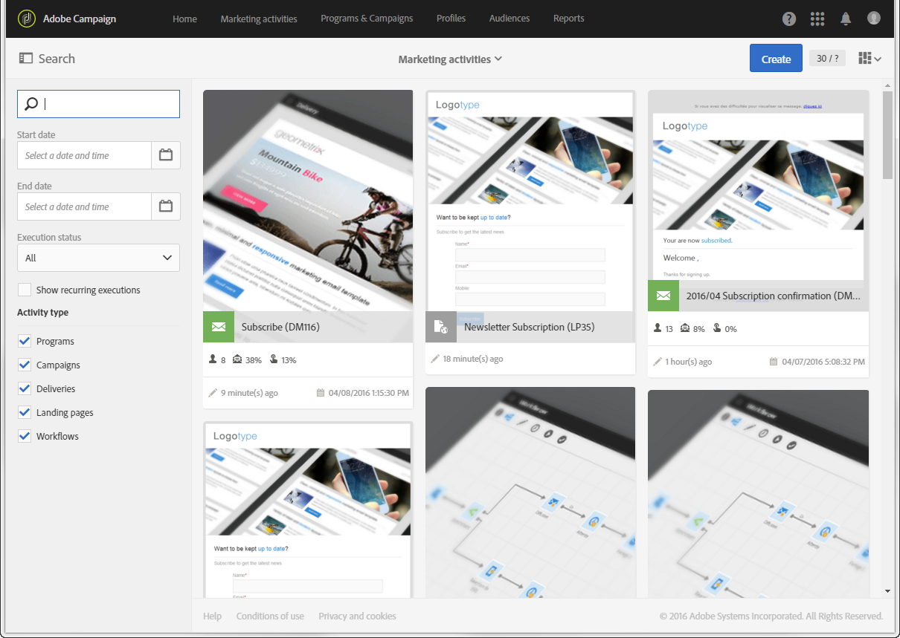

# Descripción de la interfaz{#interface-description}

Adobe Campaign permite navegar por distintos menús y pantallas para administrar las campañas.

Todas las pantallas de Adobe Campaign están formadas por los siguientes elementos:

* Barra superior para navegación
* Un menú avanzado para acceder a funcionalidades y configuraciones específicas
* Zona central para trabajar en ciertos elementos
* Un panel lateral, según el contexto, para filtrar o buscar dentro de los elementos mostrados.

## Página principal {#home-page}

La página principal está formada por un conjunto de tarjetas que le proporcionan un acceso rápido a las funciones principales de Adobe Campaign. La lista de capacidades que puede ver en la página principal de Campaign depende de los permisos y las opciones configuradas para su organización.

* La **[!UICONTROL Create an email]**tarjeta le lleva al asistente de creación de correo electrónico. Este asistente le permite elegir un tipo de correo electrónico, seleccionar los destinatarios del mensaje y definir el contenido. Consulte la sección[Creación de un correo electrónico](../../channels/using/creating-an-email.md).
* La **[!UICONTROL Create an SMS]**tarjeta te lleva al asistente de creación de SMS. Este asistente le permite elegir un tipo de SMS, seleccionar los destinatarios del mensaje y definir el contenido. Consulte la sección[Creación de un SMS](../../channels/using/creating-an-sms-message.md).
* La **[!UICONTROL Create a Direct mail]**tarjeta lo lleva al asistente de creación de correo directo. Consulte la sección[Creación de un correo](../../channels/using/creating-the-direct-mail.md)directo.
* La **[!UICONTROL Create a push notification]**tarjeta lo lleva al asistente de creación de notificaciones. Este asistente le permite elegir un tipo de notificación push, seleccionar los destinatarios del mensaje y definir el contenido. Consulte la sección[Creación de una notificación](../../channels/using/preparing-and-sending-a-push-notification.md)push.
* La **[!UICONTROL Create an InApp message]**tarjeta lo lleva al asistente de creación de InApp. Este asistente le permite seleccionar el tipo de mensaje de InApp que desea crear, definir sus propiedades, audiencia y contenido. Consulte la sección[Creación de un mensaje](../../channels/using/about-in-app-messaging.md)de InApp.
* La **[!UICONTROL Marketing activities]**tarjeta le lleva a la lista completa de todas las actividades, programas y campañas, en particular correos electrónicos, mensajes de texto, flujos de trabajo y páginas de aterrizaje. Desde aquí puede filtrar los elementos buscando por nombre, fecha, estado o tipo de actividad. Para obtener más información sobre esto, consulte la sección Lista[de actividades de](../../start/using/marketing-activities.md#about-marketing-activities)marketing.
* La **[!UICONTROL Programs & campaigns]**tarjeta lo lleva a la lista de programas en los que puede crear y administrar sus campañas. Consulte la listaPrograma.
* La **[!UICONTROL Timeline]**tarjeta le lleva directamente a una línea de tiempo interactiva de sus actividades de marketing, en la que puede consultar los programas en curso y su contenido. Consulte[Línea de tiempo](../../start/using/timeline.md).
* La **[!UICONTROL Customer profiles]**tarjeta le lleva directamente a la lista de perfiles. Desde aquí puede consultar los eventos relacionados con cada uno de los perfiles de su lista. Consulte[Administración de perfiles](../../audiences/using/about-profiles.md).
* La **[!UICONTROL Audiences]**tarjeta le lleva directamente a la lista de audiencias. Desde aquí puede acceder a audiencias existentes y crear otras nuevas. Consulte[Administración de audiencias](../../audiences/using/about-audiences.md).

## Barra superior {#top-bar}

La barra superior está visible en todas las pantallas y le permite navegar por las funciones de Adobe Campaign, así como acceder al perfil de Adobe conectado, las notificaciones, otros servicios y soluciones de Adobe Experience Cloud y la documentación.

Los principios de navegación son:

* El **[!UICONTROL Adobe Campaign]**logotipo en la esquina superior izquierda de la página le permite acceder a las funciones y configuraciones avanzadas. Los menús dependen de su perfil y permisos.

   El menú avanzado se presenta en la sección de menú  Avanzado.

* El **[!UICONTROL Home]**vínculo le permite mostrar la página principal de Adobe Campaign.
* Los vínculos **[!UICONTROL Marketing activities]**,**[!UICONTROL Programs & Campaigns]**, **[!UICONTROL Profiles]****[!UICONTROL Audiences]** y **[!UICONTROL Reports]**permiten acceder a las vistas vinculadas a estas funcionalidades.
* El **[!UICONTROL Help]**botón permite acceder a la documentación del producto y a la ayuda contextual, a las notas de la versión, a los números de versión y a los avisos legales, así como a los vínculos a la comunidad de Adobe Experience Cloud y al servicio de atención al cliente.

   

* El icono **Seleccionar solución** le permite cambiar a otra solución de Adobe Experience Cloud, así como a la configuración de perfil.
* El icono **Notificaciones** muestra la información o las alertas más recientes.
* El icono **Usuario** le permite mostrar información vinculada a su perfil. Permite acceder al **[!UICONTROL Sign out]**botón.

## Menú avanzado {#advanced-menu}

El menú avanzado se muestra haciendo clic en el icono de **Adobe Campaign** , en la esquina superior izquierda de cada pantalla. El menú avanzado puede variar según el contrato y los permisos de usuario.

Este menú le permite navegar a funcionalidades y configuraciones específicas.

### Planes de marketing {#marketing-plans}

El **[!UICONTROL Marketing plans]**icono le permite acceder a las siguientes funciones:

* **[!UICONTROL Marketing activities]**- para obtener más información sobre esto, consulte la sección Lista[de actividades de](../../start/using/marketing-activities.md#about-marketing-activities)marketing.
* **[!UICONTROL Programs & Campaigns]**- para obtener más información al respecto, consulte la sección de la lista[de](../../start/using/programs-and-campaigns.md#about-plans--programs-and-campaigns)programas.
* **[!UICONTROL Timeline]**- para obtener más información sobre esto, consulte la sección[Cronología](../../start/using/timeline.md).
* **[!UICONTROL Transactional messages]**, que contiene los submenús**[!UICONTROL Deliveries]** y **[!UICONTROL Event configuration]**- para más información, consulte la sección de mensajestransaccionales.

### Perfiles y audiencias {#profiles-e-audiences}

El **[!UICONTROL Profiles & audiences]**icono le permite acceder a las siguientes funciones:

* **[!UICONTROL Profiles]**- para obtener más información sobre esto, consulte la sección[Administración de perfiles](../../audiences/using/about-profiles.md).
* **[!UICONTROL Test profiles]**- para obtener más información sobre esto, consulte la sección[Administración de perfiles](../../sending/using/managing-test-profiles-and-sending-proofs.md#managing-test-profiles)de prueba.
* **[!UICONTROL Audiences]**- para obtener más información sobre esto, consulte la sección[Administración de audiencias](../../audiences/using/about-audiences.md).
* **[!UICONTROL Services]**- para obtener más información sobre esto, consulte la sección[Creación de un servicio](../../audiences/using/creating-a-service.md).

### Recursos {#resources}

El **[!UICONTROL Resources]**icono le permite acceder a las siguientes funciones:

* **[!UICONTROL Templates]**, que contiene los submenús para cada tipo de plantilla; para obtener más información sobre esto, consulte la sección[Administración de plantillas](../../start/using/marketing-activity-templates.md).
* **[!UICONTROL Content blocks]**- para obtener más información sobre esto, consulte la sección[Adición de un bloque](../../designing/using/personalization.md#adding-a-content-block)de contenido.
* **[!UICONTROL Content templates & fragments]**- para obtener más información sobre esto, consulte la sección de plantillas[de](../../designing/using/using-reusable-content.md#content-templates)contenido.

### Administración {#administration}

El **[!UICONTROL Administration]**icono le permite acceder a las funciones avanzadas que sólo puede realizar un administrador funcional. For more on this, refer to the[Administration](../../administration/using/about-administrating-adobe-campaign.md)section.

## Zona central {#central-zone}

La zona central de la interfaz de usuario es una zona dinámica que contiene una lista de elementos o un conjunto de tarjetas, por ejemplo. Permite editar elementos existentes y crear recursos.

El contenido y el formato de visualización de la zona central pueden variar:

* Una **lista** que presenta varios elementos como programas, campañas, perfiles, etc. Estos elementos se pueden ver en **[!UICONTROL Card]**modo o**[!UICONTROL List]** . Utilice el botón Cambiar modo para cambiar de uno a otro. Cada elemento muestra indicadores.

   

   Un contador permite conocer el número de elementos. Si este número es superior a 30, debe hacer clic en este contador para obtener el número total.

* Un **tablero** que presenta una descripción general de todos los parámetros vinculados a una actividad. Esta pantalla incluye zonas interactivas que permiten separar y configurar los distintos conceptos de forma independiente.

   

* Si es posible crear varias ofertas al crear un elemento, una pantalla **de** selección permite seleccionar el tipo de elemento que se va a agregar (campañas, envíos). Esta pantalla de selección también se ofrece para acceder a los informes.

   

* Para los flujos de trabajo y el editor de consultas, hay disponible un **espacio de trabajo** con una paleta para diseñar el objeto.

   Puede arrastrar y soltar elementos de la paleta en el espacio de trabajo para configurar el elemento en cuestión.

   

## Barra de acciones {#action-bar}

Según el tipo de pantalla que se muestra, en la parte superior aparece una barra que contiene acciones vinculadas a la pantalla.

Esta barra no sólo contiene acciones comunes como la búsqueda y el filtrado, sino también acciones relacionadas con la pantalla mostrada:

* Para ver las acciones relacionadas con las pantallas de tipo de **espacio de trabajo** , consulte la sección Barra [de](../../automating/using/workflow-interface.md#action-bar) acción de los flujos de trabajo.
* Para obtener más información sobre las acciones relacionadas con las pantallas de **tablero** , consulte la sección del tablero [de](../../channels/using/message-dashboard.md) mensajes.
* Para ver las acciones relacionadas con las pantallas de tipo de **lista** , consulte la sección [Personalización de listas](../../start/using/customizing-lists.md) a continuación.

