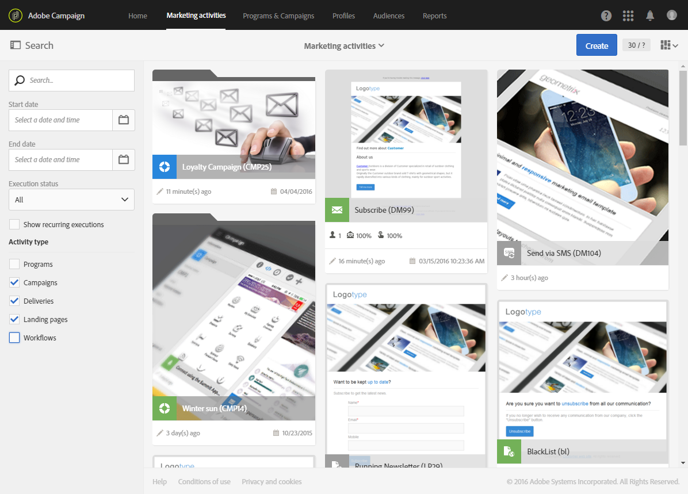

# Marketing activities{#marketing-activities}

## About marketing activities {#about-marketing-activities}

Puede crear y administrar sus actividades de marketing a partir de los programas y campañas a los que pertenecen o a través de la lista de actividades de marketing.

La lista de actividades de marketing centraliza todas las actividades, independientemente de los programas o las campañas en que se crearon. Por lo tanto, los programas, las campañas, los envíos (correos electrónicos, mensajes SMS y notificaciones push), las páginas de aterrizaje y los flujos de trabajo no se aplican en orden jerárquico en particular.

To access the marketing activity list, choose the **[!UICONTROL Marketing activities]** link from the top bar.

>[!NOTE]
>
>The marketing activities can also be accessed by selecting the **[!UICONTROL Marketing activities]** card from the home page.

The **[!UICONTROL Search]** pane allows you to filter elements according to different criteria: name (label and ID), date, status, or activity type. De forma predeterminada, se seleccionan todos los tipos de actividad, excepto los programas.

Para acceder directamente al contenido de cada actividad, elija uno de los elementos de la lista.

The **[!UICONTROL Create]** button can be used to create a new activity. For more on this, refer to the [Creating a marketing activity](../../start/using/marketing-activities.md#creating-a-marketing-activity) section.

## Marketing activity icons and statuses {#marketing-activity-icons-and-statuses}

En la zona principal, cada tipo de actividad de la lista tiene un icono:

*  : Programa
*  : Campaña
*  : Correo electrónico
*  : SMS
*  : Notificación push
*  : Mensaje en la aplicación
*  : Página de aterrizaje
*  : Flujo de trabajo

Según el período de validez y el estado, el color asociado con este icono indica el estado de ejecución de la actividad correspondiente.

* Gray: the activity has not yet started - **[!UICONTROL Editing]** status.
* Blue: the activity is in progress - **[!UICONTROL In progress]** status.
* Green: the activity has finished - **[!UICONTROL Finished]** status.
* Yellow: the activity has received a warning - **[!UICONTROL Warning]** status.
* Red: an error has occurred - **[!UICONTROL Erroneous]** status.

## Creating a marketing activity {#creating-a-marketing-activity}

From an existing campaign, you can create different types of messages (**email**, **SMS**, **push notification**, etc.), workflows, and landing pages.

Desde un programa existente, puede crear otros programas, campañas, flujos de trabajo y páginas de aterrizaje.

>[!NOTE]
>
>Considere la posibilidad de crear flujos de trabajo directamente dentro de una campaña. Si crea un flujo de trabajo dentro de un programa, no podrá moverlo a una campaña posteriormente.

Programs and campaigns are presented in the [Programs and campaigns](../../start/using/programs-and-campaigns.md) section.

1. In the dashboard of a program or a campaign, create a new marketing activity using the **[!UICONTROL Create]** button.

   

1. Seleccione el tipo de actividad que desee crear.

   

Según el contexto, puede:

* [Crear un correo electrónico](../../channels/using/creating-an-email.md)
* [Crear un SMS](../../channels/using/creating-an-sms-message.md)
* [Creación de una notificación Push](../../channels/using/preparing-and-sending-a-push-notification.md)
* [Creación de un mensaje de inapp](../../channels/using/about-in-app-messaging.md)
* [Crear un flujo de trabajo](../../automating/using/building-a-workflow.md#creating-a-workflow)
* [Creación de una página de aterrizaje](../../channels/using/about-landing-pages.md)
* [Crear una campaña](../../start/using/programs-and-campaigns.md#creating-a-campaign)
* [Creación de un programa](../../start/using/programs-and-campaigns.md#creating-a-program)

>[!NOTE]
>
>También puede crear una actividad de marketing desde la lista de actividades de marketing. En este caso, puede crear cualquier tipo de actividad. Puede elegir vincular la actividad de mercadotecnia a una campaña principal (o a un programa principal si crea un programa) a través de las propiedades de la actividad.

