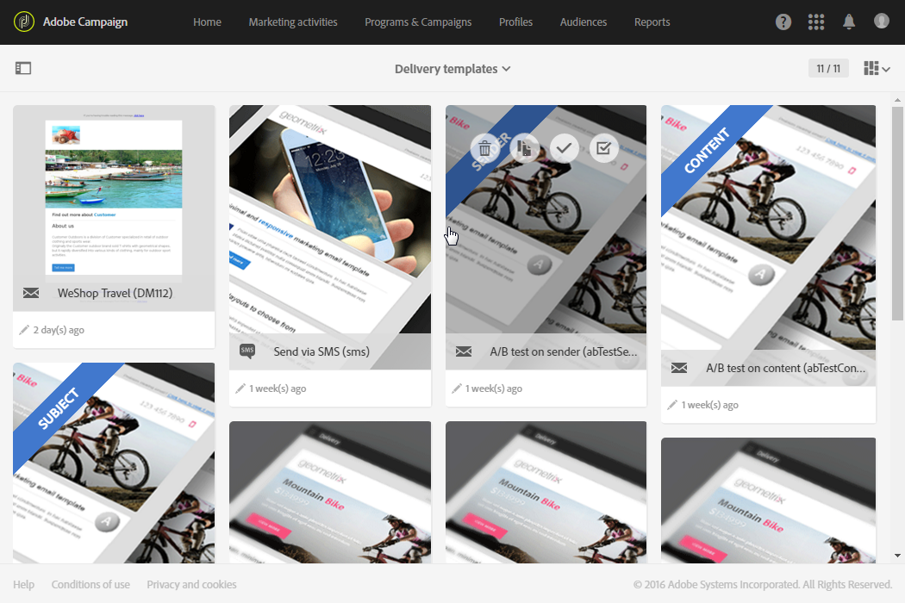
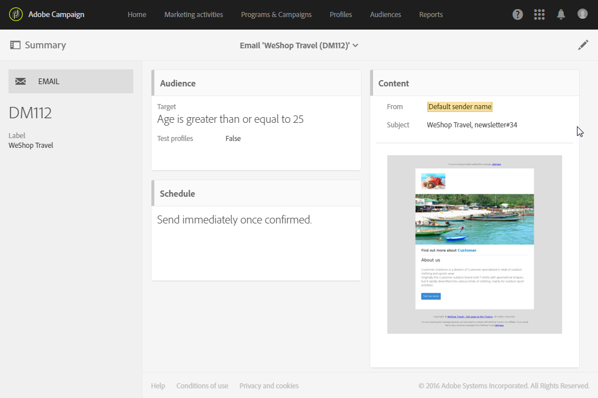

# Plantillas de actividades de marketing {#marketing-activity-templates}

## Acerca de las plantillas {#about-templates}

Cuando se crea una nueva actividad de marketing, la primera pantalla del asistente le pide que seleccione un tipo o una plantilla. Las plantillas le permiten preconfigurar ciertos parámetros según sus necesidades. La plantilla puede incluir una configuración completa o parcial de la actividad de marketing. El administrador funcional es quien administra las plantillas.

El usuario final tiene una interfaz simplificada. Al crear una nueva actividad de marketing, solo tiene que seleccionar la plantilla que desee utilizar. No hay necesidad de preocuparse por configuraciones técnicas. El administrador funcional de la plantilla ya lo ha preconfigurado.

Por ejemplo, en el caso de una plantilla de correo electrónico, puede rellenar previamente el contenido HTML, la audiencia y cualquier otro parámetro del envío: programación, perfiles de prueba, propiedades generales del envío, parámetros avanzados, etc. Esto le permite ahorrar tiempo al crear una nueva actividad.

Para cada tipo de actividad de marketing, hay una o varias plantillas listas para usar cuya configuración es mínima. Estas plantillas listas para usar no se pueden modificar ni eliminar.

Las plantillas están disponibles para las siguientes actividades de marketing:

* Programas
* Campañas
* Envíos de correo electrónico
* Envíos de SMS
* Notificaciones push
* Páginas de aterrizaje
* Flujos de trabajo
* Servicios
* Importación
* Mensajes transaccionales

## Creación de una nueva plantilla {#creating-a-new-template}

El administrador funcional de la plataforma puede administrar las plantillas de mensajes a través del menú **[!UICONTROL Resources > Templates]**. Las plantillas listas para usar no se pueden modificar ni eliminar. Para crear una plantilla nueva, debe crear un duplicado de una existente.

1. Seleccione una plantilla existente. En nuestro ejemplo, hemos elegido una **[!UICONTROL Delivery template]**.

   

1. Pase el ratón sobre ella y, a continuación, seleccione la opción **[!UICONTROL Duplicate element]**.

   

1. Configure las opciones que desee, como lo haría al [crear una nueva actividad de marketing](../../start/using/marketing-activities.md#creating-a-marketing-activity) desde cero.

   

Los usuarios estándar pueden seleccionar las plantillas creadas en la primera pantalla del asistente al crear una actividad de marketing.

## Uso de una plantilla {#using-a-template}

Ahora veremos cómo utilizar una plantilla creada en la sección anterior.

>[!NOTE]
>
>La creación de una actividad de marketing basada en una plantilla se suele hacer a través de un perfil de tipo de usuario estándar.

1. Cree una nueva actividad de marketing.

   

1. En la primera pantalla del asistente, seleccione la plantilla que desea utilizar.

   

   La actividad de marketing está preconfigurada con los parámetros definidos en la plantilla.

   
