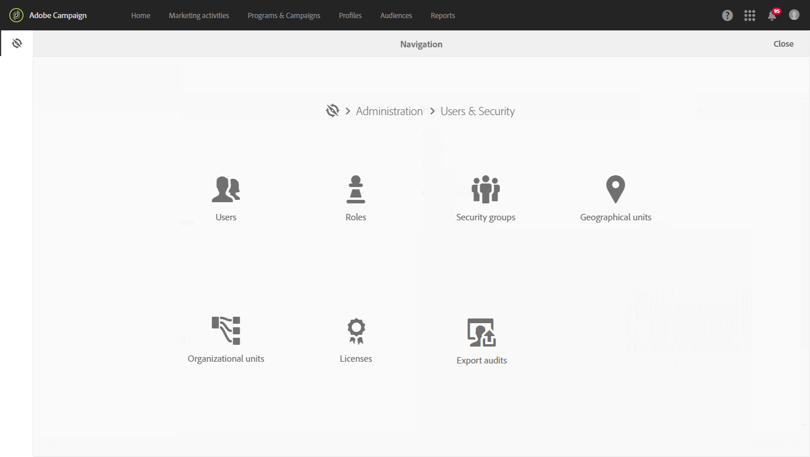

# Administración de la privacidad {#privacy-management}

Adobe Campaign ofrece un conjunto de herramientas para que cumpla con las [normas de privacidad](#privacy-management-regulations) (incluye el RGPD, la CCPA, la PDPA y la LGPD).

Estas son las cinco funciones principales que ofrece Adobe Campaign para garantizar la preparación del RGPD y otras normas de privacidad:

* **Derecho al acceso**

* **Derecho a eliminar**

Para más información, vea [Derecho al acceso y Derecho a ser olvidado](#right-access-forgotten).

* **Gestión de consentimiento**

* **Retención de datos**

* **Gestión de derechos**

Para obtener más información, consulte [Consentimiento, retención y funciones](#consent-retention-roles).

<!--This section presents general information on what Privacy management is and the features provided by Adobe Campaign to manage the [Right to Access and Right to be Forgotten](#right-access-forgotten).

It also contains information on important features to manage Privacy ([consent, data retention and user roles](#consent-retention-roles)), as well as best practices to help you with your Privacy compliance when using Adobe Campaign.-->

## Regulaciones sobre administración de la privacidad {#privacy-management-regulations}

Las capacidades de Adobe Campaign le ayudan a cumplir con las siguientes regulaciones:

* **El RGPD (** Reglamento General de Protección de Datos) es la ley de privacidad de la Unión Europea (UE) que armoniza y moderniza los requisitos de protección de datos de los países de la UE. Siga los vínculos a continuación para información general sobre el RGPD:

   * https://www.adobe.com/es/privacy/general-data-protection-regulation.html
   * https://www.adobe.com/es/marketing-cloud/campaign/general-data-protection-regulation.html

* **La CCPA** ([Ley de Privacidad del Consumidor de California](https://leginfo.legislature.ca.gov/faces/codes_displayText.xhtml?lawCode=CIV&amp;division=3.&amp;title=1.81.5.&amp;part=4.&amp;chapter=&amp;article=)) proporciona a los residentes de California nuevos derechos respecto a su información personal e impone responsabilidades de protección de datos para las entidades que operen en California.
* **La PDPA** ([Ley de Protección de Datos Personales)](https://secureprivacy.ai/thailand-pdpa-summary-what-businesses-need-to-know/) es la nueva ley de privacidad que armoniza y moderniza los requisitos de protección de datos para Tailandia.
* **La LGPD** ([ley general de protección de datos](https://iapp.org/media/pdf/resource_center/Brazilian_General_Data_Protection_Law.pdf)) entrará en vigor a principios de 2021 para todas las compañías que recopilen o procesen datos personales en Brasil.

Todas estas normativas se aplican a los clientes de Adobe Campaign que poseen datos de sujetos de datos residentes en las regiones o países respectivos antes mencionados (UE, California, Tailandia y Brasil).

>[!NOTE]
>
>Para obtener más información sobre los datos personales y las distintas entidades que administran los datos (controlador de datos, procesador de datos y sujeto de datos), consulte [Datos personales y personas](../../start/using/privacy.md#personal-data).

## Derecho de acceso y Derecho a ser olvidado {#right-access-forgotten}

Para ayudarle a facilitar su preparación para la privacidad, Adobe Campaign le permite gestionar solicitudes de **acceso** y **eliminación** .

* El **Derecho al acceso** es el derecho que posee el sujeto de datos a obtener la confirmación por parte del controlador de datos de si se están procesando o no datos relacionados con su persona, dónde y con qué propósito. El controlador de datos proporciona una copia de los datos personales de forma gratuita y en formato electrónico.

* El **Derecho al olvido** (solicitud de eliminación, también conocida como eliminación de datos) otorga al sujeto de datos el derecho a que el controlador de datos borre sus datos personales, interrumpa la diseminación de los datos y la posibilidad de que terceros interrumpan el procesamiento de los datos.

Para obtener información sobre cómo crear solicitudes **de acceso** y **eliminación** y cómo Adobe Campaign las procesa, consulte los [pasos de implementación](../../start/using/privacy-requests.md#about-privacy-requests).

Los tutoriales sobre gestión de la privacidad en Campaign Standard también están disponibles [aquí](https://experienceleague.adobe.com/docs/campaign-standard-learn/tutorials/privacy/privacy-overview.html?lang=es#privacy).

>[!NOTE]
>
>Para obtener más información sobre los datos personales y las distintas entidades que administran los datos (controlador de datos, procesador de datos y sujeto de datos), consulte [Datos personales y personas](../../start/using/privacy.md#personal-data).

## Consentimiento, retención y funciones {#consent-retention-roles}

Además de las capacidades más recientes de **Derecho de acceso** y **Derecho al olvido** , Adobe Campaign oferta otras características importantes que son esenciales para la privacidad:

* [Gestión](#consent-management)de consentimiento: Funcionalidad de suscripción para la administración de preferencias
* [Retención](../../administration/using/data-retention.md)de datos: períodos de retención de datos en todas las tablas de registro estándar, se pueden configurar períodos de retención adicionales con flujos de trabajo
* [Gestión de derechos](#rights-management): acceso a los datos administrado mediante el derecho asignado 

### Gestión de consentimiento {#consent-management}

El consentimiento implica la aceptación por parte del sujeto de datos del procesamiento de los datos personales relacionados con un sujeto de datos. La obtención del consentimiento necesario para ese procesamiento es responsabilidad del controlador de datos. Aunque Adobe Campaign puede proporcionar algunas funciones para ayudar a un cliente a administrar el consentimiento relacionado con el servicio, Adobe no es responsable del consentimiento. Los clientes deben trabajar con sus propios departamentos legales para determinar sus propios procesos y prácticas para cualquier consentimiento necesario.

Las funciones que ayudan a administrar algunos aspectos del consentimiento han sido fundamentales para Adobe Campaign desde el principio. A través del proceso de administración de suscripciones, los clientes pueden rastrear qué destinatarios han elegido qué tipo de suscripciones, ya sean boletines informativos, promociones diarias o semanales, o cualquier otro tipo de programa de mercadotecnia.

Para obtener más información sobre la administración de consentimientos, consulte [Acerca de las suscripciones](../../audiences/using/about-subscriptions.md) y [Introducción a las páginas de aterrizaje](../../channels/using/getting-started-with-landing-pages.md).

Además de las herramientas de Gestión del consentimiento proporcionadas por Adobe Campaign, puede realizar un seguimiento si el consumidor se ha excluido de la venta de Información personal. Consulte [esta sección](../../start/using/privacy-requests.md#sale-of-personal-information-ccpa).

### Gestión de derechos {#rights-management}

Adobe Campaign permite administrar los derechos asignados a los distintos operadores de campaña a través de diferentes funciones creadas previamente o personalizadas.

Una ventaja es que permite administrar que empleados dentro de su empresa pueden acceder a distintos tipos de datos. Por ejemplo, puede tener diferentes especialistas en marketing que abarquen los distintos geos y que cada especialista en marketing solo pueda acceder a los datos de su público.

De igual modo, esta funcionalidad también le permite configurar diferentes funciones para cada usuario, como limitar quién puede enviar envíos o más relevantes para la administración de privacidad, que pueden modificar o exportar datos.

Para obtener más información sobre la administración de acceso, consulte [esta sección](../../administration/using/about-access-management.md).
