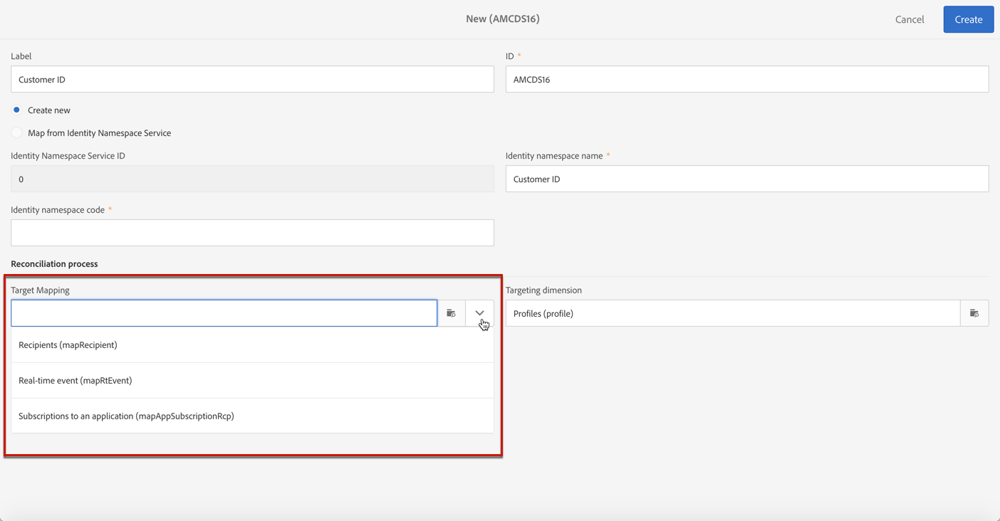
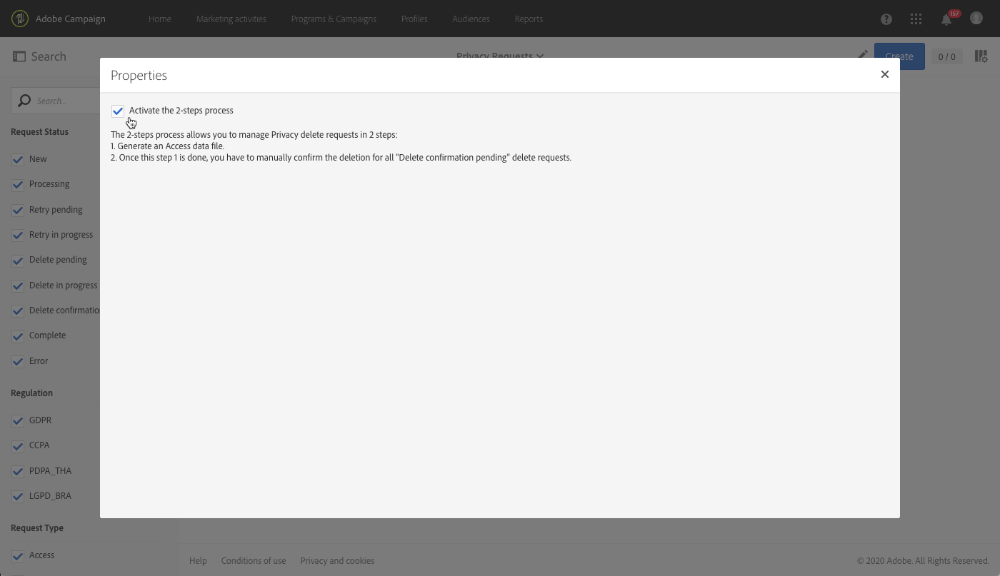

# Administración de solicitudes de privacidad {#privacy-requests}

Para una presentación general sobre la Gestión de la privacidad, consulte esta [sección](../../start/using/privacy-management.md).

Esta información se aplica al RGPD, la CCPA, la PDPA y la LGPD. Para obtener más información sobre estas normativas, consulte [esta sección](../../start/using/privacy-management.md#privacy-management-regulations).

La opción de exclusión de la Venta de información personal, que es específica de la CCPA, se explica en esta [sección](#sale-of-personal-information-ccpa).

<!--Starting 19.4, the use of the Campaign API and interface for Access and Delete requests is deprecated. For any GDPR, CCPA, PDPA, or LGPD Access and Delete requests, you need to use the [Privacy Core Service](#create-privacy-request) integration method.-->

## Acerca de las solicitudes de privacidad {#about-privacy-requests}

Para ayudarle a facilitar su preparación para la privacidad, Adobe Campaign le permite gestionar solicitudes de acceso y eliminación. El **derecho de acceso** y el **derecho a ser olvidado** (solicitud de supresión) se describen en [esta sección](../../start/using/privacy-management.md#right-access-forgotten).

Para realizar estas solicitudes, debe utilizar la integración de **Privacy Core Service**. A través de la integración del Servicio principal de privacidad: Las solicitudes de privacidad enviadas desde el Servicio principal de privacidad a todas las soluciones de Experience Cloud las gestiona Campaign de forma automática a través de un flujo de trabajo dedicado.

### Requisitos previos {#prerequesites}

Adobe Campaign oferta las herramientas de los controladores de datos para crear y procesar solicitudes de privacidad de datos almacenados en Adobe Campaign. Sin embargo, es responsabilidad del controlador de datos administrar la relación con el sujeto de datos (correo electrónico, atención al cliente o un portal web).

Por ello, es responsabilidad del controlador de datos confirmar la identidad del sujeto de datos que realiza la solicitud y confirmar que la información devuelta al solicitante sea sobre el sujeto de datos.

>[!NOTE]
>
>Para obtener más información sobre los datos personales y las distintas entidades que administran los datos (controlador de datos, procesador de datos y sujeto de datos), consulte [Datos personales y personas](../../start/using/privacy.md#personal-data).

### Áreas de nombres {#namesspaces}

Antes de crear solicitudes de privacidad, debe definir el área de nombres que utilizará. El área de nombres es la clave que se utiliza para identificar el sujeto de datos en la base de datos de Adobe Campaign. Hay dos Áreas de nombres disponibles: correo electrónico y teléfono móvil. Si necesita una Área de nombres diferente (por ejemplo, un campo personalizado de perfil), siga estos pasos.

[Consulte también el tutorial](https://experienceleague.adobe.com/docs/campaign-standard-learn/tutorials/privacy/namespaces-for-privacy-requests.html?lang=es#privacy) sobre cómo crear un área de nombres.

>[!NOTE]
>
>Si utiliza varias áreas de nombres, cree una solicitud de privacidad por cada área de nombres.

1. Haga clic en el logotipo de Adobe Campaign, en la esquina superior izquierda, y seleccione **[!UICONTROL Administration]** > **[!UICONTROL Namespaces]**.

   

1. En la lista de Áreas de nombres, haga clic en **[!UICONTROL Create]**.

   

1. Introduzca un **[!UICONTROL Label]**.

   

1. Si desea utilizar una Área de nombres de servicio de identidad existente, elija **[!UICONTROL Map from Identity Namespace Service]** y seleccione una Área de nombres de la **[!UICONTROL Identity Service Namespaces]** lista.

   

   Si desea crear una nueva Área de nombres en **[!UICONTROL Identity Service]** y asignarla en Campaña, seleccione **[!UICONTROL Create new]** e introduzca un nombre en el **[!UICONTROL Identity namespace name]** campo.

   

   Para obtener más información sobre Áreas de nombres de identidad, consulte la documentación del [Experience Platform](https://experienceleague.adobe.com/docs/experience-platform/identity/namespaces.html?lang=es).

1. Un área de nombres de servicio de identidad se asigna a un área de nombres en Campaign. Debe especificar cómo se asignará el área de nombres en Campaign.

   Seleccione una asignación de destino (**[!UICONTROL Recipients]**, **[!UICONTROL Real-time event]** o **[!UICONTROL Subscriptions to an application]**). Si desea utilizar varias asignaciones de destino, cree un área de nombres por asignación de destino.

   

1. Elija la **[!UICONTROL Reconciliation key]**. Este es el campo que se utilizará para identificar el sujeto de datos en la base de datos de Adobe Campaign.

   

1. Haga clic en **[!UICONTROL Create]**. Ahora puede crear solicitudes de privacidad basadas en su nueva Área de nombres. Si utiliza varias áreas de nombres, cree una solicitud de privacidad por cada área de nombres.

### Creación de una solicitud de privacidad {#create-privacy-request}

<!--Starting 19.4, the use of the Campaign API and interface for Access and Delete requests is deprecated. Use the **Privacy Core Service** for any GDPR, CCPA, PDPA, or LGPD Access and Delete requests.-->

La integración de Privacy Core Service le permite automatizar sus solicitudes de privacidad en un contexto de varias soluciones a través de una sola llamada de API JSON. A través de la integración del Servicio principal de privacidad: Las solicitudes de privacidad enviadas desde el Servicio principal de privacidad a todas las soluciones de Experience Cloud las gestiona Campaign de forma automática a través de un flujo de trabajo dedicado.

Consulte la documentación del [Privacy Service de Experience Platform](https://experienceleague.adobe.com/docs/experience-platform/privacy/home.html?lang=es) para obtener información sobre cómo crear solicitudes de privacidad desde el Servicio principal de privacidad.

>[!IMPORTANT]
>
>Para enviar una solicitud utilizando el tipo de área de nombres personalizada, aproveche la variable [método JSON](https://experienceleague.adobe.com/docs/experience-platform/privacy/ui/user-guide.html?lang=es#json){target="_blank"} and add the namespaceId to the request, or use the [API call](https://experienceleague.adobe.com/docs/experience-platform/privacy/api/privacy-jobs.html?lang=es#access-delete){target="_blank"} para realizar la solicitud.
>
>Utilice únicamente la variable [Interfaz de usuario de privacidad](https://experienceleague.adobe.com/docs/experience-platform/privacy/ui/user-guide.html?lang=es#request-builder){target="_blank"} para enviar solicitudes utilizando el tipo de área de nombres estándar.

Cada trabajo del servicio principal de privacidad se divide en varias solicitudes de privacidad en Campaña, en función de cuántas Áreas de nombres se estén utilizando, una solicitud que corresponde a una Área de nombres. Además, un trabajo se puede ejecutar en varias instancias. Por lo tanto, se crean varios archivos para un trabajo. Por ejemplo, si una solicitud tiene dos Áreas de nombres y se está ejecutando en tres instancias, se envía un total de seis archivos. Un archivo por Área de nombres e instancia.

El patrón para un nombre de archivo es: `<InstanceName>-<NamespaceId>-<ReconciliationKey>.xml`

* **InstanceName**: Nombre de instancia de Campaign
* **NamespaceId**: ID de Área de nombres de servicio de identidad de la Área de nombres utilizada
* **Clave de reconciliación**: Clave de reconciliación codificada

### Lista de los recursos {#list-of-resources}

Al realizar una solicitud de privacidad de eliminación o acceso, Adobe Campaign busca todos los datos del sujeto de datos en función del valor de **reconciliación** en todos los recursos que tienen un vínculo al recurso de perfiles (tipo propio).

Esta es la lista de recursos predeterminados que se tienen en cuenta al realizar solicitudes de privacidad:

* Perfiles (destinatario)
* Registros de envío de perfil (broadLogRcp)
* Registros de seguimiento de perfil (trackingLogRcp)
* Registros de envío (Suscripciones a una aplicación) (broadLogAppSubRcp)
* Registros de seguimiento (Suscripciones a una aplicación) (trackingLogAppSubRcp)
* Suscripciones a una aplicación (appSubscriptionRcp)
* Historial de suscripciones de perfiles (subHistoRcp)
* Suscripciones de perfil (subscriptionRcp)
* Visitantes (visitante)

Si ha creado recursos personalizados que tienen un vínculo al recurso de perfiles (tipo propio), también se tendrán en cuenta. Por ejemplo, si tiene un recurso de transacción vinculado al recurso de perfiles y un recurso de detalles de transacción vinculado al recurso de transacción, ambos se tendrán en cuenta.

Consulte también [este tutorial](https://experienceleague.adobe.com/docs/campaign-standard-learn/tutorials/privacy/custom-resources-for-privacy-requests.html?lang=es#privacy) sobre cómo modificar los recursos personalizados.

Para que esto funcione, debe seleccionar la opción **[!UICONTROL Deleting the target record implies deleting records referenced by the link]** en el recurso personalizado:

1. Haga clic en el logotipo de Adobe Campaign, en la esquina superior izquierda, y seleccione **[!UICONTROL Administration]** > **[!UICONTROL Development]** > **[!UICONTROL Custom resources]**.

1. Seleccione un recurso personalizado que tenga un vínculo al recurso de perfiles (tipo propio).

1. Haga clic en la sección **[!UICONTROL Links]**.

1. Para cada vínculo, haga clic en el icono de lápiz (**[!UICONTROL Edit properties]**).

1. En la sección **[!UICONTROL Behavior if deleted/duplicated]**, seleccione la opción **[!UICONTROL Deleting the target record implies deleting records referenced by the link]**.

   

### Estados de solicitud de privacidad {#privacy-request-statuses}

Estos son los distintos estados de las solicitudes de privacidad:

* **[!UICONTROL New]** / **[!UICONTROL Retry pending]**: en curso, el flujo de trabajo aún no ha procesado la solicitud.
* **[!UICONTROL Processing]**/**[!UICONTROL Retry in progress]**: el flujo de trabajo está procesando la solicitud.
* **[!UICONTROL Delete pending]**: el flujo de trabajo ha identificado todos los datos de destinatario que se van a eliminar.
* **[!UICONTROL Delete in progress]**: el flujo de trabajo está procesando la eliminación.
   <!--**[!UICONTROL Delete Confirmation Pending]** (Delete request in 2-steps process mode): the workflow has processed the Access request. Manual confirmation is requested to perform the deletion. The button is available for 15 days.-->
* **[!UICONTROL Complete]**: el procesamiento de la solicitud ha finalizado sin error.
* **[!UICONTROL Error]**: el flujo de trabajo ha encontrado un error. El motivo se muestra en la lista de las solicitudes de privacidad de la **[!UICONTROL Request status]** columna. Por ejemplo, **[!UICONTROL Error data not found]** significa que en la base de datos no se han encontrado datos de destinatario que coincidan con los del sujeto de datos **[!UICONTROL Reconciliation value]** .

<!--### Disabling the 2-step process {#disabling-two-step-process}

The Core Privacy Service does not support the 2-step process.

>[!IMPORTANT]
>
>Before using the Core Privacy Service integration to manage your Privacy requests, you must disable the 2-step process for Delete requests from the Campaign Standard interface.

If this option is not disabled, all Delete requests managed with the Privacy Core Service will remain in pending state and will not complete.

By default, the 2-step process is activated.

To change this mode, click **[!UICONTROL Edit properties]**, in the top right corner of the **[!UICONTROL Privacy Requests]** screen, then uncheck the **[!UICONTROL Activate the 2-step process]** option.

-->

## Exclusión para la venta de información personal (CCPA) {#sale-of-personal-information-ccpa}

La **CCPA** (Ley de Privacidad del Consumidor de California) proporciona a los residentes de California nuevos derechos respecto a su información personal e impone responsabilidades de protección de datos para las entidades que operen en California.

La configuración y el uso de las solicitudes de Acceso y Eliminación son comunes para el RGPD, la y la CCPA. Esta sección presenta la exclusión de la venta de datos personales, que es específica de la CCPA.

Además de las herramientas de [Gestión del consentimiento](../../start/using/privacy-management.md#consent-management) proporcionadas por Campaign, puede realizar un seguimiento si el consumidor se ha excluido de la venta de Información personal.

Cuando los usuarios decidan, a través de su sistema, que no permiten que su información personal se venda a terceros, usted podrá almacenar y rastrear esta información.

>[!NOTE]
>
>Puede aprovechar la exclusión para la venta de información personal a través de la interfaz de Campaña y de la API. No puede utilizarlo a través del servicio principal de privacidad.

>[!IMPORTANT]
>
>Como controlador de datos, es su responsabilidad recibir la solicitud del sujeto de datos y realizar un seguimiento de las fechas de solicitud para CCPA. Como proveedor de tecnología, solo ofrecemos una manera de optar por la exclusión. Para obtener más información sobre su función como controlador de datos, consulte Datos [personales y Personas](../../start/using/privacy.md#personal-data).

### Requisito previo para tablas personalizadas {#ccpa-prerequisite}

El campo **[!UICONTROL CCPA Opt-Out]** se proporciona listo para usar en la interfaz y la API de Campaign. De forma predeterminada, el campo está disponible para el recurso de **[!UICONTROL Profile]** estándar.

Si utiliza un recurso de perfil personalizado, debe extender el recurso y agregar el campo. Le recomendamos que utilice un nombre distinto al del campo predeterminado, por ejemplo: **[!UICONTROL Opt-Out for CCPA]** (optoutccpa). Cuando se crea un nuevo campo, se vuelve compatible con la API de Campaign de forma automática.

Para obtener información más detallada sobre cómo ampliar el recurso de perfil, consulte [esta sección](../../developing/using/extending-the-profile-resource-with-a-new-field.md).

>[!NOTE]
>
>La modificación de recursos es una operación delicada que solo deben realizar los usuarios expertos.

1. Vaya a **[!UICONTROL Administration]** > **[!UICONTROL Development]** > **[!UICONTROL Custom Resources]**. Haga clic en el recurso de perfil personalizado. Para obtener más información sobre cómo ampliar un recurso, consulte [esta sección](../../developing/using/creating-or-extending-the-resource.md).

   

1. Haga clic en **[!UICONTROL Add field]** o **[!UICONTROL Create Element]**, agregue la etiqueta, ID y elija el **[!UICONTROL Boolean]** tipo. Para el nombre, utilice **Opción de exclusión para CCPA**. Para el ID, utilice: **optOutCcpa**.

   

1. En la **[!UICONTROL Screen definition]** ficha, debajo de **[!UICONTROL Detail screen configuration]**, agregue el campo y seleccione **[!UICONTROL Input field]**. Esto hará que el campo esté disponible en la lista y los detalles de perfiles.  Para obtener más información sobre la configuración de la definición de pantalla, consulte [esta sección](../../developing/using/configuring-the-screen-definition.md).

   

1. Vaya a **[!UICONTROL Administration]** > **[!UICONTROL Development]** > **[!UICONTROL Publishing]**, prepare la publicación y publique las modificaciones. Para obtener más información sobre cómo publicar un recurso, consulte [esta sección](../../developing/using/updating-the-database-structure.md).

   

1. Compruebe que el campo está disponible en los detalles de un perfil. Para obtener más información, consulte [esta sección](#usage).

### Uso {#usage}

Rellenar el valor del campo y seguir las reglas y directrices de la CCPA relacionadas con la venta de datos es responsabilidad del cliente.

Para rellenar estos valores, se pueden usar varios métodos:

* Usar la interfaz de Campaign al editar los detalles de los destinatarios (a continuación).
* Usar la API de privacidad de Campaign (consulte la [documentación de la API](../../api/using/managing-ccpa-opt-out.md)).
* a través de un flujo de trabajo de importación de datos.

A continuación, debe asegurarse de que nunca vende a terceros la información personal de los perfiles que han optado por la exclusión.

1. En la interfaz de la Campaña, edite un perfil para cambiar el estado de exclusión.

   

1. Cuando el valor del campo es **[!UICONTROL True]**, la información se muestra en los detalles del perfil.

   

1. Puede configurar la lista perfiles para que muestre la columna de salida. Para obtener información sobre cómo configurar listas, consulte [esta sección](../../start/using/customizing-lists.md).

   

1. Puede hacer clic en la columna para ordenar los destinatarios según la información de exclusión.

   
