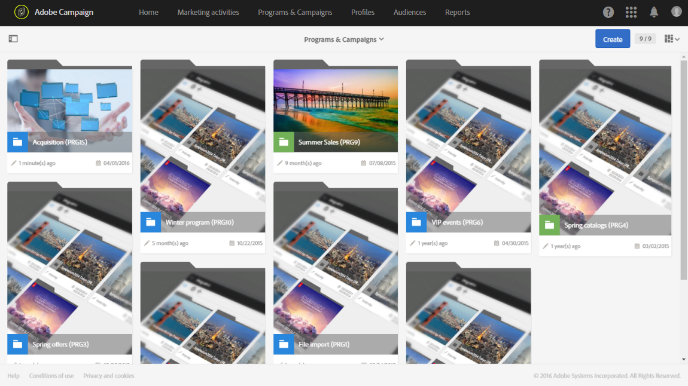

# Programas y campañas{#programs-and-campaigns}

## Acerca de los planes, los programas y las campañas {#about-plans--programs-and-campaigns}

Adobe Campaign le permite planificar campañas de marketing en las que puede crear y administrar diferentes tipos de actividades: correos electrónicos, mensajes SMS, notificaciones push, flujos de trabajo o páginas de aterrizaje. Estas campañas y su contenido se pueden reunir en programas.

Los programas y campañas le permiten agrupar y ver las diferentes actividades de marketing que están vinculadas a ellos.

* Un **programa** puede contener otros programas, así como campañas, flujos de trabajo y páginas de aterrizaje. Aparece en la línea de tiempo y le ayuda a organizar sus actividades de marketing: puede separarlos por país, marca, unidad, etc.
* Una **campaña** le permite recopilar todas las actividades de marketing de su elección en una sola entidad. Una campaña puede contener correos electrónicos, SMS, notificaciones push, correos directos, flujos de trabajo y páginas de aterrizaje.

Para organizar mejor sus planes de marketing, Adobe recomienda la siguiente jerarquía: Programa > Programas secundarios > Campañas > Flujos de trabajo > Envíos.

Los informes sobre programas y campañas le permiten analizar su impacto. Por ejemplo, puede generar informes en el nivel de campaña para obtener datos acumulados sobre todos los envíos contenidos en esa campaña.

**Temas relacionados:**

* [Cronología](../../start/using/timeline.md)
* [Acerca de los informes dinámicos](../../reporting/using/about-dynamic-reports.md)

## Creación de un programa {#creating-a-program}

El programa es el primer nivel de organización. Puede contener programas secundarios, campañas, flujos de trabajo o páginas de aterrizaje.

1. En la página de inicio de Adobe Campaign, seleccione la tarjeta **[!UICONTROL Programs & Campaigns]**.
1. Haga clic en el botón **[!UICONTROL Create]**.
1. En la pantalla **[!UICONTROL Creation mode]**, seleccione un tipo de programa.

   

   Los tipos de programas disponibles se basan en las plantillas definidas en la sección **[!UICONTROL Resources]** > **[!UICONTROL Templates]** > **[!UICONTROL Program templates]**. Para obtener más información, consulte la sección [Administración de plantillas](../../start/using/marketing-activity-templates.md).

1. En la pantalla **[!UICONTROL Properties]**, introduzca el nombre y el ID del programa.

   

1. Seleccione una fecha de inicio y de finalización del programa. Estas fechas solo se aplican al programa en sí.

   Puede crear el programa dentro de un programa principal. Para ello, seleccione el programa principal de los programas existentes.

1. Haga clic en **[!UICONTROL Create]** para confirmar la creación del programa.

El programa se crea y aparece. Utilice el botón **[!UICONTROL Create]** para añadir programas secundarios, campañas, flujos de trabajo o páginas de aterrizaje.

>[!NOTE]
>
>También puede crear un programa a partir de la lista de actividades de marketing.

## Creación de una campaña {#creating-a-campaign}

Puede añadir campañas en programas y programas secundarios. Las campañas pueden contener actividades de marketing como correos electrónicos, SMS, notificaciones push, flujos de trabajo y páginas de aterrizaje.

1. En la página de inicio de Adobe Campaign, seleccione la tarjeta **[!UICONTROL Programs & Campaigns]** y acceda a un programa o programa secundario.
1. Haga clic en el botón **[!UICONTROL Create]** y seleccione **[!UICONTROL Campaign]**.
1. En la pantalla **[!UICONTROL Creation mode]**, seleccione un tipo de campaña.

   

   Los tipos de campaña disponibles se basan en plantillas definidas en **[!UICONTROL Resources]** > **[!UICONTROL Templates]** > **[!UICONTROL Campaign templates]**. Para obtener más información, consulte la sección [Administración de plantillas](../../start/using/marketing-activity-templates.md).

1. En la pantalla **[!UICONTROL Properties]**, introduzca el nombre y el ID de la campaña.
1. Seleccione una fecha de inicio y de finalización de la campaña. Estas fechas solo se aplican a la campaña en sí.

   

1. Haga clic en **[!UICONTROL Create]** para confirmar la creación de la campaña.

La campaña se crea y aparece. Utilice el botón **[!UICONTROL Create]** para añadir actividades de marketing a la campaña.

>[!NOTE]
>
>Según el contrato de licencia, puede acceder solo a algunas de estas actividades.

También puede crear una campaña desde la lista de actividad de marketing. Puede elegir vincular la actividad de marketing a un programa principal o a un programa secundario mediante la ventana de propiedades de la campaña.

## Iconos y estados de programas y campañas {#programs-and-campaigns-icons-and-statuses}

Cada programa y cada campaña de la lista tiene un símbolo visual y un icono cuyo color indica el estado de ejecución. Este estado depende del periodo de validez del programa o de la campaña.

* Gris: el programa o la campaña aún no ha comenzado (estado **[!UICONTROL Editing]**).
* Azul: el programa o la campaña está en curso (estado **[!UICONTROL In progress]**).
* Verde: el programa o la campaña ha finalizado (estado **[!UICONTROL Finished]**). De forma predeterminada, la fecha actual se muestra automáticamente como la fecha de inicio de validez y la fecha de finalización se calcula según la fecha de inicio (**D+186 días**). Puede cambiar estas fechas en las propiedades del programa o de la campaña.

