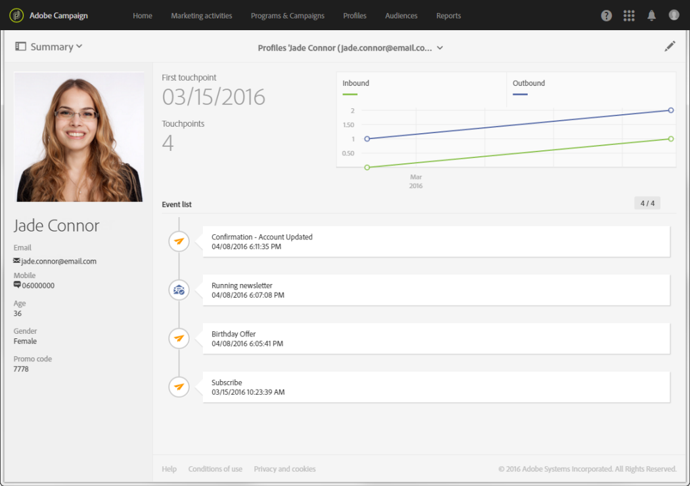

# Segmentación y segmentación{#segmentation-and-targeting}

## Profiles {#profiles}

Utilice el modelo de datos flexible de Adobe Campaign para enriquecer los datos de perfil del cliente y agregar atributos o tablas nuevos. A continuación, utilice estos perfiles de cliente para una segmentación, personalización e informes más precisos.

Los perfiles de Adobe Campaign representan todos los contactos almacenados en la base de datos. Cada perfil corresponde a una entrada de la base de datos que contiene la información necesaria para que ese perfil sea segmentado, cualificado y rastreado individualmente. Esto significa que un perfil puede ser: un cliente, un posible cliente, un individuo suscrito a un boletín, un destinatario, un usuario o cualquier otra denominación según la organización.

La función de perfiles de cliente integra todos los datos de cliente en un solo lugar:

Adobe Campaign propone varios mecanismos para la adquisición de perfiles: recopilar datos en línea a través de páginas [de](../../channels/using/about-landing-pages.md)aterrizaje, mecanismos [de importación manuales o](../../automating/using/about-data-import-and-export.md)automatizados, entrada  directa en la interfaz de Adobe Campaign, creación masiva a través de las API [de](https://final-docs.campaign.adobe.com/doc/standard/en/api/ACS_API.html)Campaign.

**Temas relacionados:**

* Obtenga información sobre los distintos tipos de perfiles en la sección [Perfiles](../../audiences/using/about-profiles.md) .
* Acceda al número de perfiles **activos** de su organización en [esta sección](../../audiences/using/active-profiles.md).
* Obtenga información sobre cómo personalizar los datos, administrar tareas complejas de administración de datos, como cálculos, agregados, deduplicación y combinaciones, mediante funciones de objetivo de [flujo de trabajo](../../automating/using/about-targeting-activities.md)

## Audiences {#audiences}

Para permitirle entregar mensajes relevantes y eficaces y captar a sus clientes de manera eficaz, Adobe Campaign integra funcionalidades de análisis y objetivos avanzados. Gracias a los flujos de trabajo y al editor de consultas, puede crear audiencias que serán segmentadas por sus diferentes campañas, en función de la información que tenga sobre ellos, sus actividades, su idioma, sus preferencias o su historial de marketing. Esto le permite filtrar perfiles suscritos, por ejemplo, o crear audiencias de destino según un número ilimitado de criterios.

Las audiencias se presentan [en esta página](../../audiences/using/about-audiences.md) y se detallan en la sección [Audiencias](../../audiences/using/creating-audiences.md) .

**Temas relacionados:**

* Obtenga información sobre cómo llegar a audiencias multilingües en varias regiones mediante el envío de notificaciones [push](../../channels/using/creating-a-multilingual-push-notification.md) multilingües o correos electrónicos [multilingües](../../channels/using/creating-a-multilingual-email.md)
* Aprenda a [crear consultas](../../audiences/using/creating-audiences.md#creating-query-audiences) para crear audiencias
* Aprenda a [crear audiencias](../../audiences/using/creating-audiences.md#creating-list-audiences) de lista en un flujo de trabajo
* Obtenga información sobre cómo [importar una audiencia desde un archivo](../../audiences/using/creating-audiences.md#creating-file-audiences) en un flujo de trabajo
* Descubra cómo [compartir audiencias](../../audiences/using/creating-audiences.md#creating-experience-cloud-audiences) con soluciones de Experience Cloud

## General Data Protection Regulation {#general-data-protection-regulation}

El Reglamento General de Protección de Datos (GDPR) es la nueva normativa sobre privacidad de la Unión Europea que unifica y moderniza los requisitos de protección de datos. El RGPD se aplica a los clientes de Adobe Campaign que albergan datos de sujetos de datos que residan en la UE. Además de las funciones de privacidad ya disponibles en Adobe Campaign (incluida la administración de consentimiento, la configuración de retención de datos y las funciones de usuario), aprovechamos esta oportunidad en nuestra función de procesador de datos para incluir funciones adicionales, a fin de facilitar su preparación como controlador de datos para determinadas solicitudes de RGPD.

Consulte esta [guía](https://docs.campaign.adobe.com/doc/standard/getting_started/en/ACS_GDPR.html) para obtener más información sobre las herramientas y funcionalidades que proporciona Adobe Campaign para ayudarle a cumplir con el RGPD.

## Gestión de la fatiga {#fatigue-management}

Las reglas de fatiga permiten a los especialistas en mercadotecnia establecer reglas comerciales globales entre canales que excluyen automáticamente los perfiles solicitados en exceso de las campañas.

Para implementar reglas de fatiga, debe definir un número máximo de mensajes por perfil y seleccionar un período en el que se aplicará la regla. Durante la preparación de la entrega, los perfiles se excluyen de la entrega, si procede, en función del número de mensajes que ya se les hayan enviado.

**Temas relacionados:**

* Aprenda a [diseñar reglas](../../administration/using/fatigue-rules.md#examples) de fatiga mediante un conjunto de muestras
* Aprenda a crear reglas [de tipología](../../administration/using/about-typology-rules.md)
* Usar reglas [de](../../administration/using/filtering-rules.md) filtro para reducir la audiencia de los mensajes
