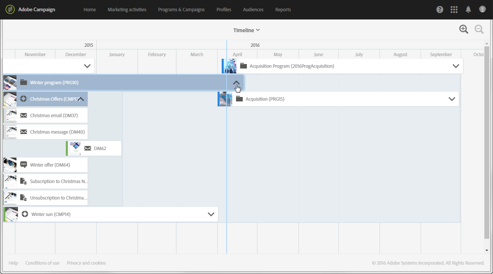

# Cronología{#timeline}

La **[!UICONTROL Timeline]** permite visualizar programas en curso y su contenido.

Para acceder a la cronología, haga clic en la tarjeta correspondiente de la página de inicio.

De forma predeterminada, la cronología solo detalla los programas, que se muestran cronológicamente entre las fechas de inicio y las fechas de finalización definidas.

Cada programa está representado por un cuadro que contiene la miniatura y la etiqueta correspondientes. Según el tamaño de pantalla y el número de elementos que se van a mostrar, la etiqueta puede reemplazarse por el ID de programa.

La línea vertical azul es un marcador cronológico para resaltar la fecha actual. De forma predeterminada, se encuentra en medio de la pantalla. Puede desplazarse hacia la derecha o izquierda dentro de la pantalla para modificar el periodo mostrado.

Utilice los iconos para;

*  reduce el perímetro o aumenta el nivel de detalle durante un período más limitado, hasta que se muestren los días
*  aumenta el perímetro o muestra un periodo de tiempo mayor

Haga clic en la flecha a la derecha del nombre de cada programa para mostrar el contenido correspondiente. Un programa puede contener programas secundarios, campañas y páginas de destino. Una campaña se implementa del mismo modo que un programa y puede contener correos electrónicos, SMS y páginas de destino.

>[!NOTE]
>
>Como los flujos de trabajo no tienen una noción particular de una fecha, no aparecen en la cronología.

Cuando se muestra el contenido de un programa o una campaña, el cuadro correspondiente se vuelve de color azul y la flecha del lado derecho se vuelve hacia arriba. Vuelva a hacer clic en la flecha para ocultar el contenido.

Cada elemento tiene un icono que corresponde a su tipo:

* Programa 
*  campaña
*  página de aterrizaje
*  correo electrónico
*  SMS
*  notificación push

La línea de color del borde izquierdo de cada cuadro indica el estado del elemento en cuestión.

* Cuando un elemento aún no se ha iniciado, la línea aparece en gris.
* Si un elemento está en curso, la línea aparece en azul.
* Tan pronto como un elemento ha terminado, la línea se vuelve verde.

Haga clic en un programa o en cualquier otro elemento mostrado para que aparezca la tarjeta correspondiente. A continuación, haga clic en la tarjeta para ir directamente al contenido del elemento seleccionado y modificarlo.

Haga clic en cualquier otra parte de la pantalla para que la tarjeta desaparezca.
